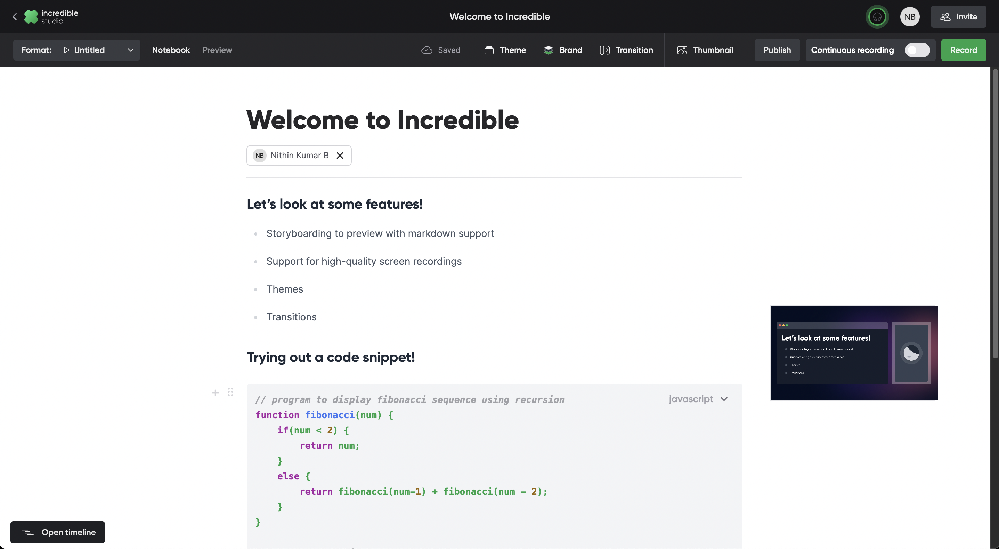

  

 

  
  
  
  
   

## 👋 &nbsp;Introduction

Incredible drastically simplifies creation of developer video content. It offers a unified workflow to storyboard, record, collaborate and produce the video.

The main branch is hosted at [oss.incredible.dev](https://oss.incredible.dev). Do give it a try and please report the issues [here](https://github.com/IncredibleDevHQ/Incredible/issues). 

 The [legacy branch](https://github.com/IncredibleDevHQ/Incredible/tree/legacy) is hosted at [https://incredible.dev](https://incredible.dev) and it'll be deprecated soon!
 

## ✨ &nbsp;Features

1. Storyboarding to preview with markdown support
2. Huddle and Collaborative editing
3. Support for high-quality screen recordings
4. Support for portraits
5. Themes
6. Transitions
7. Watch page you can share
8. Series

## 🏃🏽‍♂️ Instructions to Run
Due to the proprietary components, it'll be hard to run Incredible unless you create an account in each of them. 
Refer to the wiki for the full list of third-party proprietary services and instructions to run.

We are committed to the complete OSS porting of Incredivle without the third-party proprietary services. We'll be annoucing a roadmap soon!

## 📚 &nbsp;Tech stack

|                  Basic Blocks                  |                Collaboration                 |                 Hosting                  |                ENV                 |
| :--------------------------------------------: | :------------------------------------------: | :--------------------------------------: | :--------------------------------: |
|  [Nextjs](https://github.com/vercel/next.js)   | [Hocuspocus](https://tiptap.dev/hocuspocus/) |         [Mux](https://mux.com/)          |  [Doppler](https://doppler.com/)   |
|   [Prisma](https://github.com/prisma/prisma)   |     [Liveblocks](https://liveblocks.io/)     |      [Vercel](https://vercel.com/)       | [KMS](https://aws.amazon.com/kms/) |
|      [Trpc](https://github.com/trpc/trpc)      |          [Agora](https://agora.io/)          | [Planetscale](https://planetscale.com/)  |                                    |
| [Tiptap](https://github.com/ueberdosis/tiptap) |                                              |      [AWS](https://aws.amazon.com/)      |                                    |
|  [Konvajs](https://github.com/konvajs/konva)   |                                              | [Firebase](https://firebase.google.com/) |                                    |

## ✏️ &nbsp;License

[AGPL-3.0 license](https://github.com/IncredibleDevHQ/Incredible/blob/main/LICENSE)
