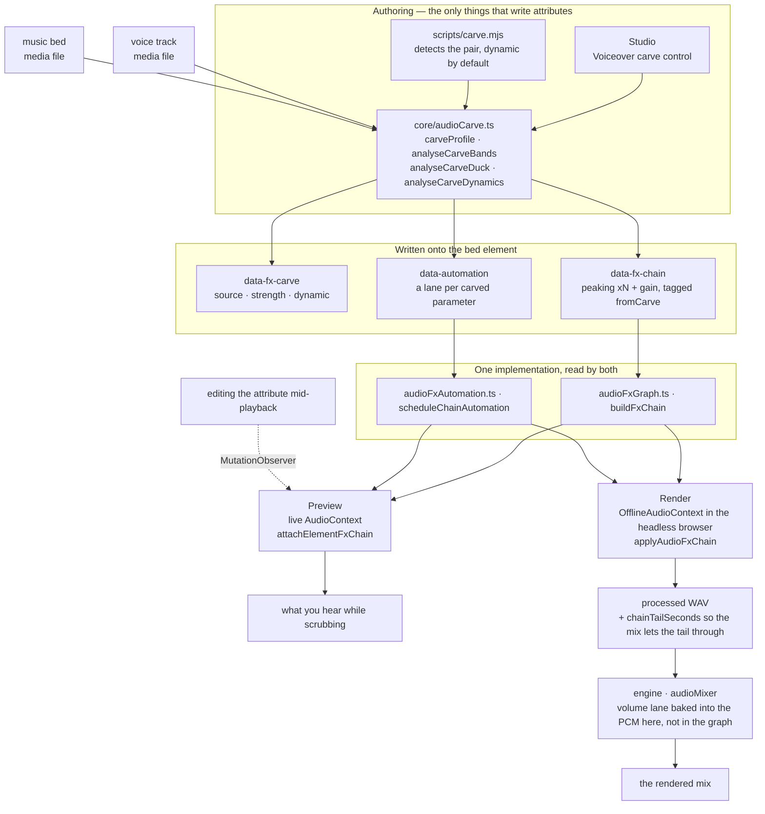
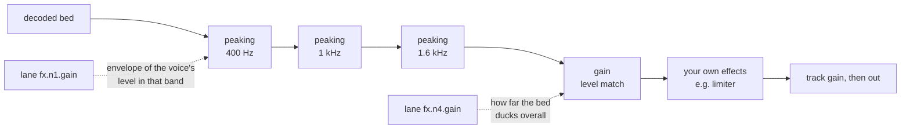

# HyperFrames Audio

A mix is a set of relationships, not a stack of processors. Two tracks that each
sound right alone can be unlistenable together, and the fix is almost never "turn
one down" — it is finding what they are fighting over and giving it to whichever
one needs it. Every tool here exists to express one of those relationships.

Effects live on the element as `data-fx-chain`, and preview and render run the
same Web Audio graph — the studio in a live context, the engine in an offline one
inside the browser it already drives. There is one implementation of each effect,
so what you hear while scrubbing is what gets written. You never tune twice.

Clip timing remains `/hyperframes-core`: audio/video trims and source ranges use
`data-start`, `data-duration`, and `data-media-start`, and crossfades overlap
clips on different tracks. This skill owns placed-track fade-in/fade-out,
crossfade envelopes, track gain/track volume, volume and effect automation,
ducking/voiceover carve, and the effect chain. `/media-use` owns sourcing,
generation, and preprocessing.

Constant `data-playback-rate` (`0.1..10`) is render-safe for picture and
pitch-preserved sound when matching audio/video elements use the same timing,
source offset, and rate. A speed ramp is a `rate` lane in `data-automation`
(see `docs/reference/speed-ramps`); it wins over the constant and keeps pitch
in preview and render. HyperFrames does not
provide automatic waveform sync or drift correction.
For copyable cut/crossfade/retime recipes, use `/hyperframes-core` → `references/creator-editing-recipes.md`.

Three attributes carry everything, on the audio/video element itself — or, for
the first two, on an `<hf-audio-group>` bus (see "One bus for many tracks"):

| Attribute         | Holds                                                     |
| ----------------- | --------------------------------------------------------- |
| `data-fx-chain`   | the effects, in signal order                              |
| `data-automation` | envelopes on this track's volume or its effect parameters |
| `data-fx-carve`   | the carve's own settings, so it can be re-derived         |

The shipped effect families are gain, EQ (highpass, lowpass, peaking, shelves),
compressor, limiter, gate, saturate, delay, reverb, chorus, phaser, and bitcrush.

Exact JSON for each, and the rules a lane must satisfy: `references/attributes.md`.
Every effect with its parameters, ranges and units: `references/fx-registry.md`.
How to work out what is wrong with a file you cannot hear:
`references/diagnosis.md`.
**Presets, named jobs and one-knob profiles, plus a symptom-to-fix table:
`references/presets.md`** — read that before hand-building a chain, because one
of the presets or named jobs usually already names the problem.

## How it fits together

Two authoring surfaces write those attributes; two runtimes read them through the
same builders. That shared middle is why preview predicts the render.



The carve's own settings are never read at playback — the chain and lanes it
produced are what play. `data-fx-carve` exists so strength can be changed on an
existing carve instead of guessed back out of the filters.

Inside a carved bed the signal runs through the dips first, then the level match,
then anything you built yourself — which is why a limiter you add still acts as
the last ceiling:



A static carve is the same graph with fixed values and no lanes at all.

## First, work out what is wrong

The table below starts from "it sounds boomy" — which presumes somebody already
listened and said so. Handed a file and "fix this", you have no such sentence
and you cannot listen, so you have to measure. One rule governs all of it:

> **The absolute spectrum of a single unknown voice cannot be diagnosed.**
> Formants are ±10 dB, fundamentals run 85–255 Hz, and sentences decline 5–6 dB
> as they end. Every one of those reads as a defect on its own, and every one of
> them is the speaker.

So compare, and compare against something **inside the same file**: the clean
original if it exists, otherwise the pauses — whatever is audible in a gap is
additive, and the gap's spectrum is the channel rather than the voice. Comparing
against a published average spectrum or a synthesised control voice does not
work: two speakers differ by more than most defects, and both wrong answers in
the evaluation behind this guidance came from exactly that.

When there is no original and no usable silence, a static tonal defect is
genuinely under-determined. Say so and offer the readings that fit, rather than
picking one and building a chain on it.

Commands, traps and worked recipes: **`references/diagnosis.md`**. Read it
before diagnosing a file nobody has described.

## Start from the symptom

Once you know the band and the kind, name what is wrong with the audio. Most bad audio is
one or two of these, and each has a shipped answer:

| It sounds like                     | Reach for                                          |
| ---------------------------------- | -------------------------------------------------- |
| Hum or thump underneath            | `rumble-cut`, or a `highpass` at 80 Hz             |
| Boomy, chesty                      | **Tame Boominess** job (200 Hz)                    |
| Muffled, behind cardboard          | **Reduce Mud** job (250 Hz)                        |
| Words hard to make out             | **Add Clarity** job (3 kHz), or carve the bed      |
| Harsh and tiring                   | **Soften Harshness** job (3.2 kHz)                 |
| Some words much louder than others | **Evenness** on a compressor, or Even Out Levels   |
| Room tone between sentences        | `room-gate`                                        |
| Voice and music fighting           | **Voiceover carve** — not an EQ on either          |
| Dry, recorded nowhere              | `room-tight` or `room-natural`                     |
| Just "amateur"                     | `voice-clean`, which is four of the above in order |

Full catalogue, what each preset contains, the band vocabulary, and what is
deliberately NOT covered (de-essing, noise removal, tone match):
`references/presets.md`.

Subtract before you add, level after you filter, relationships after level,
character and ceiling last. Each step changes what the next one hears — a
compressor set before a high-pass spends its time chasing rumble.

## Reach for a family by the problem, not the name

**Filters** (`highpass`, `lowpass`, `peaking`, `lowshelf`, `highshelf`) decide
which frequencies a track is allowed to occupy. This is the first tool for two
sources colliding, because collisions happen in bands: a bed and a voice both
want 1–3 kHz, and taking that from the bed costs the bed far less than turning
the whole thing down costs the mix. A high-pass on a voice is the standard fix
for rumble; a low-pass darkens or muffles deliberately.

**Dynamics** (`gain`, `compressor`, `limiter`, `gate`) decide how a track's level
behaves over time. Compression narrows the distance between loud and quiet so the
quiet parts can come up. A limiter is a ceiling — it does not shape anything, it
guarantees nothing gets past. A gate removes what is below a threshold, which is
how you silence room tone between phrases. `gain` is a plain level stage, and it
is what an automation lane rides when a track has to move out of the way.

**Nonlinear** (`saturate`, `bitcrush`) changes the waveform's shape, which adds
harmonics that were not there. Reach for it when a track needs character or
grit rather than correction — and remember it is generative: it makes a thin
source denser, not cleaner.

**Time** (`delay`, `reverb`, `chorus`, `phaser`) puts a track in a space or gives
it width. These are the ones that most easily wreck a mix, because a tail or a
detuned copy occupies the same room a voice needs. Use them on the thing that
should sit _behind_ something else, and keep the wet amount lower than sounds
right in isolation.

The chain is serial: each effect processes what the one before it produced. So
corrective filtering goes early, character in the middle, and a limiter last
where it can actually act as a ceiling.

## Voiceover carve

**The problem it solves.** A music bed under a voice makes the voice hard to
follow. The reflex is to duck the whole bed, which works and costs the bed all of
its presence — the music goes limp for the entire voiceover. But the voice does
not need the whole spectrum. It needs the few bands it actually occupies. Carve
takes only those, and the bed keeps its low end and its top, so it is still music
while the voice is still intelligible.

**It is a relationship, not an effect.** The settings live on the _bed_ — the
track that gets processed — and they name the voices to listen to, exactly as a
sidechain compressor does: you select the track that gets quieter and pick what
makes it quieter. **Never put a carve on a voice track.** A voice carved against
itself is a bug, not a subtle mix choice.

**Every voice, not one of them.** `sources` is a list, because a bed usually runs
under a whole sequence — a narrator, an interview answer, a second presenter. They
are summed onto the bed's own clock before anything is measured (`mixCarveSources`),
so one analysis covers all of them: the bands come from all the speech there is, and
the envelopes rise wherever any of it is happening. Voices that never play while the
bed does are left out; they cannot mask it.

**A carve against more than one clip id is wrong. Group the clips and carve
against the group.** This is an invariant, not a tip. Naming clips one by one has
to be exhaustively right and stays right only until the next edit — a fourth
narration clip added later plays outside the carve's awareness, and the bed
fails to duck under it silently. Naming the group instead resolves membership at
analysis time, so a clip added to the group later is covered without touching
`sources` at all:

```html
<!-- group the narration, then carve the bed against the group -->
<audio id="vo-intro" data-audio-group="voiceover" …></audio>
<audio id="vo-middle" data-audio-group="voiceover" …></audio>
<audio id="vo-outro" data-audio-group="voiceover" …></audio>

<audio id="music" data-fx-carve='{"enabled":true,"sources":["voiceover"],"strength":0.8}' …></audio>
```

A `sources` list naming two or more plain clip ids instead of a group is caught
by the `audio_carve_ungrouped_sources` lint rule — it still works, but it is the
version that silently rots when a clip is added.

**Keep the carve group a voice group: no bed, no SFX, no music.** A group id in
`sources` resolves to every _current_ member on _every_ analysis, so the group
you name is the group you get later — not the tracks that were measured when it
was written. Two ways that bites:

- **The bed in its own source group.** It is handed to itself as a voice and
  carved against its own content — the "never carve a track against itself" rule
  arriving one re-analysis later.
- **An SFX or music clip in the voice group.** It enters the sidechain on the
  next analysis and the bed starts ducking under a whoosh, even though the run
  that wrote the attribute never measured it.

Both are invisible at the moment the carve is written: the analysis sums the
voices it detected and never round-trips through group resolution, so the first
pass is genuinely correct and only the next one is wrong. So give each role its
own group — `music` for the bed, `voiceover` for the narration, `sfx` for the
hits — and keep the group named in `sources` holding nothing but voices.

`carve.mjs` refuses to write the group form when it sees either case, records
clip ids, and says on stderr which member blocked it. The
`audio_carve_ungrouped_sources` rule then points at the arrangement instead of
the CLI quietly persisting a wider carve than it measured.

A voice that this run left out is **not** one of these cases and does not block
the group form: `carve.mjs` only analyses voices that overlap the bed, and
picking up a clip that plays later without an edit to `sources` is the whole
reason to name the group.

### One bus for many tracks

Membership alone is enough to carve against, as above — but add an
`<hf-audio-group>` element with that id and the group becomes a real submix bus:
one chain, one fader, one automation clock for every member.

```html
<hf-audio-group
  id="voiceover"
  data-label="Voiceover"
  data-volume="0.9"
  data-fx-chain='{"version":1,"nodes":[
    {"type":"compressor","id":"g1","params":{"threshold":-18,"ratio":3}},
    {"type":"peaking","id":"g2","params":{"frequency":3000,"gain":2,"q":1}}]}'
></hf-audio-group>

<audio id="vo-intro" data-audio-group="voiceover" …></audio>
<audio id="vo-middle" data-audio-group="voiceover" …></audio>
```

**Reach for the bus when the same treatment belongs on several tracks.** Four
narration clips that each want the same compressor is four chains to keep in
step, and they drift the moment one is edited; on the bus it is one chain, and
the compressor sees the whole voice rather than each clip in isolation — which is
the point, since a compressor cannot ride a sequence it only hears a third of.
Per-clip chains remain right for what is genuinely per-clip: one noisy take that
needs its own de-esser.

| On the bus        | Does                                      |
| ----------------- | ----------------------------------------- |
| `data-fx-chain`   | one chain over the summed members         |
| `data-automation` | envelopes on the bus, in COMPOSITION time |
| `data-volume`     | one fader for every member (default 1)    |
| `data-label`      | the display name; falls back to the id    |
| `data-hidden`     | drops every member from the mix           |

**Group automation is composition time, not clip time.** A bus has no
`data-start` — members are already at their composition positions when they
reach it — so `t: 0` in a group lane is the start of the composition, not of any
clip. A lane on a clip is clip-local; the same numbers mean different instants on
the two, which is the one thing to get right when moving an envelope from a clip
up onto its bus.

**A carve stays on the clip.** `data-fx-carve` is not a group attribute. The bed
being carved is a single track, and it is that track which carries
`data-fx-carve` — pointed AT a group, per the rule above. Group and carve meet in
`sources`, not on one element. A carve written onto a bus is half an effect
applied twice: the level half measures the bed's own audio, which a bus has none
of, so only the filters survive — and a bus and its members are one signal path,
so the bed then runs through the bus's filters AND its own. The
`audio_group_carve_attr` lint rule catches it.

**One clip is not a bus.** A group exists to give several tracks one chain, one
fader and one clock. Wrapping a single clip in a bus buys nothing the clip's own
`data-fx-chain` does not already do, and it doubles the places a later edit has
to land. The one reason to do it anyway: a bus's automation clock is composition
time, so a single-member bus is how a lane on that clip gets composition-time
timing.

**One knob.** `strength` is 0..1 and derives everything: how deep to cut, how
many bands, how wide, how far to favour intelligibility over raw voice energy,
how far the level may drop, how far under the voice to aim. Those six move
together in any real mix — a gentle carve is a shallow cut in few bands with
little ducking, a hard one is deeper in more bands with more — so they are one
relationship written once, in `carveProfile`. `carve.mjs` defaults to `0.8` —
six bands from 250 Hz to 2.5 kHz cut about 7 dB each and 15 dB at 1.6 kHz, with
19 dB of level room — because a bed under narration has to get out of the way
first and be music second; `0.25` (a 6 dB dip in three bands, 6 dB of room) kept
the bed present but still let it fight the voice, and was judged too weak in
practice. At `0.5` the dip reaches 10 dB, which is where a carve starts being
heard as an effect rather than as room for the voice. Drop the strength when the
bed is the point and the voice is sparse. `0` is spectral only — one band, no
level match at all.

**Carve by default — required whenever music plays under a voice.** A bed
under any voice track (narration, avatar speech, interview, voiceover) gets a
carve as part of finishing the mix, not as a polish step to get to if there is
time. Place both tracks, run the command below (default strength `0.8`; add
`--bed` / `--voice` when detection picks wrong), confirm the written
`data-fx-carve`, `data-fx-chain` and `data-automation` with `npx hyperframes check`,
and only then render. A volume duck on its own is not a finished mix: it leaves
the voice and the bed fighting in the 1–3 kHz band and costs the bed all of its
presence for the whole voiceover. Skip the carve only when there is no voice for
the music to sit under — a music video, a title card, a montage cut to the track.

**It always follows the voice.** There is no static mode: a fixed depth thins the
bed through every pause, and once you have heard both there is no reason to want it.
Every value becomes an envelope of the speech's own level — silence leaves the bed
alone, a loud passage pushes the carve to full depth — written as ordinary automation,
which is why the lanes show up in the timeline and can be edited afterwards.

**Level matching is part of it.** Spectral carving cannot fix a bed that is
simply louder than the voice. So the carve also measures how far over the voice
the bed sits and writes a `gain` stage: held at one value for a static carve,
driven by an envelope for a dynamic one. That envelope releases slowly on
purpose — music that snaps back to full the instant a word ends sounds like a
machine doing it.

**Running it.** In Studio the carve is one module at the top of a track's effect
rack — voice, strength, dynamic, and the analysis it produced, in one card. It is
there whenever another track could be the voice, and a bed with exactly **one**
candidate above it is carved by default, dynamically, at the default strength:
that is what a bed under narration wants, and the module is where you change or
switch it off. Several candidates leaves the picker waiting rather than guessing.
Headless —
which is the path when you are authoring a composition rather than editing one:

```bash
node <SKILL_DIR>/scripts/carve.mjs --comp index.html
```

That is the whole command. It finds the voice and the bed itself, carves
dynamically at the default strength, and prints what it decided:

```
bed    music-bed (name looks like music)
voice  narration (only track left)
carve  strength 0.8 dynamic
bands  250Hz -7.4dB q2.06, 400Hz -7.4dB q2.06, 630Hz -7.4dB q2.06, 1000Hz -7.4dB q2.06, 1600Hz -14.8dB q2.06, 2500Hz -7.4dB q2.06
level  273-point envelope, floor -19.2 dB
```

Name the tracks with `--bed` / `--voice` (repeatable) when the automatic choice is
wrong, `--strength` to push it, `--dry-run` to see that report and write nothing.

**How it picks the tracks.** Names first, because that is what you already told it
and the answer is explainable — `classifyAudioName` in core, the same classifier
Studio's own picker uses, so the two cannot disagree. A track whose id or filename
looks like music (`music`, `bgm`, `bed`, `score`…) is the bed; everything else that
plays over it and is not SFX-shaped is a voice. Audio elements are preferred: video
counts only when no audio track is left to be the voice, or every B-roll clip in the
composition would read as somebody talking. **It refuses when it cannot tell which
track is the bed** rather than carving the wrong one — typing one id is cheap.

Same analysis functions as the panel, so the result is identical. Needs `ffmpeg`
on PATH and `@hyperframes/core` installed in the project (`npm i -D
@hyperframes/core`) — the CLI inlines core rather than shipping it, so it cannot
be borrowed from there.

**What it writes** is an ordinary chain of peaking filters plus a gain stage,
tagged `fromCarve`. That tagging is the whole trick: a re-run replaces the
previous carve and leaves every effect you built by hand — and every lane you
drew by hand — exactly where it was. So re-carving at a new strength is safe and
repeatable, and `data-fx-carve` exists so the settings can be read back rather
than guessed from the filters.

## Automation

A lane is a set of breakpoints on one parameter: `{t, v}` in clip-local seconds
and the parameter's own units. Targets are `volume` for the track's level, or
`fx.<nodeId>.<param>` for an effect's knob.

**Only some parameters can be automated, and a lane on the others is silently
inert.** A knob is automatable when a Web Audio `AudioParam` backs it. The four
worklet-based effects — `compressor`, `limiter`, `gate`, `bitcrush` — expose
none at all, so no lane on any of their parameters will ever move: to make a
compressor's behaviour change over time, automate a `gain` stage before it
instead. `references/fx-registry.md` marks every parameter.

## Verify

Almost no static gate covers the mix. The linter reads `data-automation` for
exactly one conflict — `audio_volume_double_automation`, a volume lane on a track
that also has a GSAP tween on `volume`, where the lane wins and the tween is
ignored — plus `audio_volume_tween_overrides_gain`, an authored `data-volume`
on a track whose `volume` is tweened, where the tween's values are absolute and
replace that gain instead of scaling it. Nothing validates the
chain or the effect lanes at all. What
enforces those is the render: a chain it cannot parse fails the whole mix rather
than quietly writing the dry signal, because a mix that sounds plausible and is
wrong is worse than a refusal. Preview is the opposite by design: an unreadable
chain plays dry so the composition stays workable.

A lane pointing at a node the chain does not have is pruned on read, not an
error — so a typo'd `nodeId` costs you the envelope silently. Read the ids back
out of the chain rather than assuming what was minted.

Effects with a tail (`reverb`, `delay`) make the rendered track **longer** than
its source, and the mix is told how much by the chain. So a bed with reverb no
longer ends exactly at its `data-duration`; that is expected, not a bug.

Beyond that, a mix is verified by rendering and listening. For a carve: the voice
should be legible without the bed sounding hollowed, and with `dynamic` the bed
should come back up between phrases rather than staying flat. If the bed sounds
notched rather than simply quieter under the voice, the strength is too high —
that is the one failure mode with an obvious sound.
