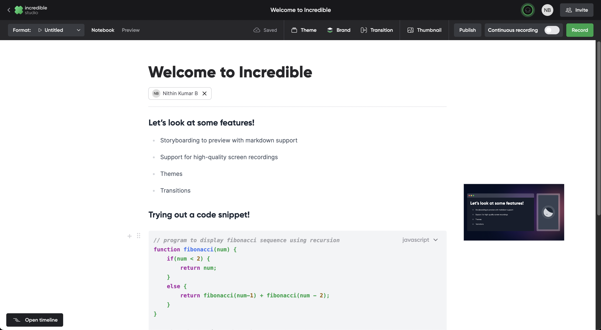

# The legacy Incredible app

This page keeps what the repository's README said about the original
Incredible app: the hosted product, its features and its stack. The studio
the README now describes — projects of Text, Wireframe, Presentation and
Video notebooks, in `apps/studio-v2` and `apps/studio-desktop` — is a
different application and does not need any of the services below.

## 👋 &nbsp;Introduction

Incredible drastically simplifies creation of developer video content. It offers a unified workflow to storyboard, record, collaborate and produce the video.

👉 &nbsp;For those who are new to Incredible, here's the tour of the core experience. 
🚀 &nbsp;[Product Tour](https://www.loom.com/share/d5fd69a0d70f4dfd921bd4798bdb938c)

👉 &nbsp;To get a glimpse of what Incredible is capable of here's a playlist of videos on Rust produced using Incredible. 
🦀 &nbsp;[Rust series made using Incredible](https://bit.ly/rust-series)

👉 &nbsp;Here's an example with Replit integration where you can watch the video and even run the code snippet 
👩🏻‍💻 &nbsp;[Rust tutorial with Repl.it integration](https://incredible.dev/watch/enm-qyp-zks)

👉 &nbsp;For portrait fans, here's a list of Youtube shorts, and Instagram reels produced using Incredible 
📺 &nbsp;[Youtube shorts made using Incredible](https://bit.ly/yt-ml-shorts)
🎞 &nbsp;[Instagram Reels made using Incredible](https://www.instagram.com/incredibledevhq/)

👉 &nbsp;One of the top videos made using Incredible 
📺 &nbsp;[Next.JS 12.2 release video](https://youtu.be/bQqN0fK3Gjg)

## ᛘ Branches

The main branch is hosted at [oss.incredible.dev](https://oss.incredible.dev). Do give it a try and please report the issues [here](https://github.com/IncredibleDevHQ/Incredible/issues).

The [legacy branch](https://github.com/IncredibleDevHQ/Incredible/tree/legacy) is hosted at [https://incredible.dev](https://incredible.dev) and it'll be deprecated soon!

## ✨ &nbsp;Features

1. Storyboarding to preview with markdown support
2. Huddle and collaborative editing
3. Support for high-quality screen recordings
4. Support for portraits
5. Themes
6. Transitions
7. Watch page you can share
8. Series

## Running the legacy app

Due to the proprietary components, it'll be hard to run Incredible unless you create an account in each of them.
Refer to the [wiki](https://github.com/IncredibleDevHQ/Incredible/wiki) for the full list of third-party proprietary services and instructions to run.

We are committed to the complete OSS porting of Incredible without the third-party proprietary services. We'll be announcing a roadmap soon!

## 📚 &nbsp;Tech stack

|                  Basic Blocks                  |                Collaboration                 |                 Hosting                  |                ENV                 |
| :--------------------------------------------: | :------------------------------------------: | :--------------------------------------: | :--------------------------------: |
|  [Nextjs](https://github.com/vercel/next.js)   | [Hocuspocus](https://tiptap.dev/hocuspocus/) |         [Mux](https://mux.com/)          |  [Doppler](https://doppler.com/)   |
|   [Prisma](https://github.com/prisma/prisma)   |     [Liveblocks](https://liveblocks.io/)     |      [Vercel](https://vercel.com/)       | [KMS](https://aws.amazon.com/kms/) |
|      [Trpc](https://github.com/trpc/trpc)      |          [Agora](https://agora.io/)          | [Planetscale](https://planetscale.com/)  |                                    |
| [Tiptap](https://github.com/ueberdosis/tiptap) |                                              |      [AWS](https://aws.amazon.com/)      |                                    |
|  [Konvajs](https://github.com/konvajs/konva)   |                                              | [Firebase](https://firebase.google.com/) |                                    |
