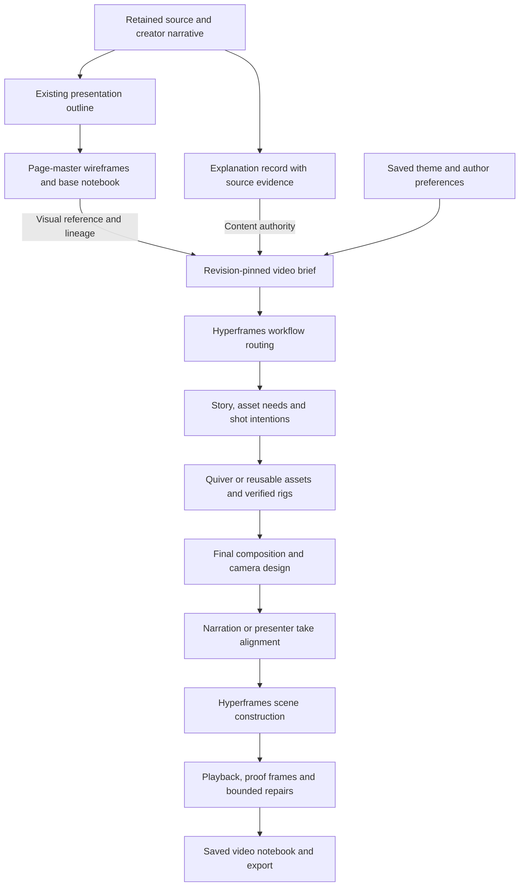

# Rethinking the explainer pipeline around Hyperframes

23 September 2026 · Architecture proposal · Explainers first

Inspected repository: `feat/hyperframes-markdown-mvp`, HEAD `42806b5d`, including the existing uncommitted repairs. Installed Hyperframes core/player/producer: `0.7.106`. Upstream skills were inspected on 23 September; the latest inspected tree was `b73df3549eb52744fe54dac2728a2f9d0fb6a9c7`. This document proposes work; it does not establish implementation or output-quality acceptance.

Implementation stays on `feat/hyperframes-markdown-mvp`. Commit coherent, validated slices with author and committer `Karthic <Kartronics85@gmail.com>`, staging only the slice's files and preserving other work.

## 1. The architectural decision

Presentation categories belong exclusively to the presentation workflow. The video planning contract must not use `title/list/diagram/numbers/quote/close`, the part categories `box/step/note/number`, the eight-part limit, or one-page-per-scene as its foundation. Keeping the presentation path does not carry those constraints into video.

Derive a source-grounded explanation record directly from the source and creator's narrative. This record supplies the video's meaning. The saved theme and base notebook supply visual references and provenance. The video planner designs an unfolding explanation with its own objects, shots, camera, artwork and timing.

| Presentation-only planning | Video planning |
| --- | --- |
| Page `kind` such as `diagram` or `numbers` | Viewer question, intended understanding and observable evidence |
| Parts classified as `box`, `step`, `note` or `number` | Entities with technical roles, interactions and relevant state |
| Page relationships expressed as labelled edges | Source-supported interactions and the sequence that demonstrates them |
| At most eight parts on a page | As many or as few entities as the explanation needs, staged for readability |
| Page duration estimate | Timing resolved from the chosen narration/take and readable actions |
| Page roster and geometry | Independently authored shots with explicit source lineage |

Existing labels and object IDs can be reconciled with the explanation record to preserve identity. A part's presentation `kind` must never be treated as its technical role. Existing wireframe metadata may remain in the archived reference artifact; it is not a video planning instruction.

Hyperframes supplies production knowledge, reusable visual components and the composition runtime. Incredible supplies the explanation, durable project state, Quiver asset library, recording experience, local harness selection and editable authoring records.

The video output is a composed Hyperframes scene with independently controlled objects and layers. A video scene is no longer required to be one page SVG played through the existing slide driver. Existing SVG/program scenes remain supported during migration.

This proposal supersedes earlier assumptions that the video must retain one scene per wireframe, use only the current scene-program action vocabulary, or fit every performance into an SVG-only contract. It also carries forward the user's later decisions: delivery is chosen per scene; users can select their local harness and see provider status. Earlier documents' compulsory whole-project delivery choice is superseded.

## 2. Two authoring paths, one retained source

For a new source, the explanation record is derived directly from the retained source and authored narrative. It can run alongside presentation planning so it does not delay a presentation-only user. The existing presentation generator need not change its input schema in the first implementation.

For an existing base, retrieve its pinned source snapshot, current narration and source references. Reconcile the explanation with intentional author edits. If only fragments are available, record that limitation and build only the supported explanation; never claim to have read the full article or silently re-fetch a changed page as the same revision.

The base notebook retains the original presentation and links to the explanation revision. The video child pins both. One base page can support several shots; several pages can support one continuous scene. Explicit many-to-many origin references preserve edit and split/merge lineage. A source edit offers selective adoption into the child and never silently rewrites accepted video work.

## 3. What the explanation record contains

This is a content model, independent of drawing technology and screen layout. It should use open prose for ideas and explicit data where correctness can be checked. It should not introduce another exhaustive scene-type enum.

| Field | Purpose |
| --- | --- |
| Viewer question and takeaway | What the viewer is trying to understand and should leave knowing |
| Evidence | Source revision, exact passage locations and claim-to-passage links; creator statements identified separately |
| Entities | Stable identities, technical roles, interactions, inputs and outputs |
| Conditions and state | Only the state needed for this explanation, with units, limits and relevant conditions |
| Demonstration | A concrete example, its starting conditions, actions and resulting observations |
| Observation targets | What must visibly change for the explanation to make sense |
| Narrative constraints | Approved wording, audience, terminology and intentional omissions |
| Uncertainty | Unsupported claims, ambiguous mechanisms and gaps needing resolution |

Keep sourced facts, creator claims and illustrative parameters distinguishable. A three-token demonstration is an illustrative choice unless the source specifies three. A citation beside a scene is insufficient proof that every relationship in it follows from the source.

Definitions, comparisons, code walkthroughs and summaries use observation targets suited to their content. They do not need invented state machines or a crisis. Examples: preserve an aligned baseline for a comparison; connect a highlighted code statement to its described effect; reveal membership for a definition.

### Example: a token bucket

- **Question:** Why can a burst pass while the next request is rejected?
- **Role:** The bucket stores admission capacity; an admitted request consumes one token.
- **Illustrative starting state:** Three tokens, requests A through D, no refill during those arrivals.
- **Sequence:** A, B and C arrive and each consume one token; D reaches an empty bucket and is rejected; a refill then makes a later request eligible.
- **Conditions:** No negative inventory; an accepted request consumes exactly one token; rejection does not consume an unavailable token.
- **Observations:** The same requests can be followed, depletion is legible, and rejection is visibly connected to the empty state.

These conditions become supported assertions over scheduled events and rendered bindings. The open description can express more than the currently implemented validators; unsupported assertions must be identified rather than reported as checked.

The current `ExplanationModelV1` already provides an identity/provenance starting point. Extend its persistence with versioned records instead of creating a competing store. Its outline-derived `kind` and part categories remain legacy presentation metadata; the new explanation schema is defined independently of them. Reuse existing behavior definitions, event identities and cue-occurrence alignment where their contracts fit; repair their known scheduling/state defects before treating them as authoritative.

## 4. Handoff to Hyperframes: a prepared brief and one workflow owner

Incredible prepares a durable video brief containing the explanation revision, pinned base and theme, audience, wording policy, approximate duration, available assets, per-scene delivery choices, reference style and user overrides. It writes the agreed fields into the upstream brief format through an adapter, with product-specific fields retained in a versioned companion record.

The adapter explicitly selects these inputs; it does not forward the presentation outline wholesale. Presentation `kind`, part `kind`, page limits and page timing are excluded from the video's planning controls. Missing explanation data must be derived from the source, not replaced by a mapping such as `diagram → diagram animation` or `numbers → count-up`. A user-selected total video duration is a separate input from a presentation page's estimated seconds.

The Hyperframes router chooses an owning production workflow from the deliverable. It should not infer the route from a slide's `kind` or from the mere presence of a blog URL. A technical article on a product website is still an explanation request unless the user requests promotion. Existing brief and run state support resumption without a second intake interview. [Router](https://github.com/heygen-com/hyperframes/blob/main/skills/hyperframes/SKILL.md)

| Requested work | Proposed route and adaptation |
| --- | --- |
| Narrated explainer using existing Quiver objects, recorded takes, or mixed scene delivery | `general-video` as the upstream owner, wrapped by Incredible's explainer workflow and constraints |
| Entirely generated topic explainer within the upstream workflow's scope | `faceless-explainer` is eligible; use `general-video` when existing assets, length or delivery requirements conflict with that workflow |
| One short unnarrated graphic or overlay | `motion-graphics` can produce that bounded component |
| Graphic overlays for an existing presenter clip | `talking-head-recut` only when preserving that footage meets the request; broader edits stay in the general workflow |
| An edit to an accepted composition | Resume its existing route, apply the edit and rerun affected checks |

There is one top-level workflow owner per build. Domain skills can be combined within it. Do not launch several independent workflows that each rewrite the script, theme, files or approvals. The current general workflow explicitly supports borrowing relevant genre guidance while retaining one production owner. [General video](https://github.com/heygen-com/hyperframes/blob/main/skills/general-video/SKILL.md)

The product's local Kimi, Claude Code or Codex harness runs the adapted workflow. Self-contained run packets include the brief, source records, selected references, tool contracts and accepted artifacts. The development assistant builds this machinery; it does not hand-author the production video to make a demonstration pass.

## 5. Skills become an implementation library

| Responsibility | Hyperframes material to use | Product-specific addition |
| --- | --- | --- |
| Visual direction | `hyperframes-creative`: video design, typography, story and beat planning | Translate the saved theme into a video design document, preserve factual colour meanings and the creator's voice |
| Shot design | Animation rules and blueprints; the two-stage director method in `motion-graphics` | Choose observations and object roles before assets; finalise framing after verified artwork exists |
| Camera | Viewport, target zoom, tracking, camera-journey and optional 3D recipes | Choose the reason and subject of each move; coordinate camera targets with current object states and presenter safe space |
| Object performance | Internal SVG animation, paths, masks, shape changes, keyframes and Lottie adapters | Bind named Quiver parts and ports to the technical behavior and its allowed state changes |
| Layout and continuity | Shared-element movement, coordinated layout changes, sub-compositions | Preserve actor identity and world state across shots and scene boundaries |
| Media and presenter | Core clip timing, composition patterns and suitable presenter guidance | Recording coach, take selection, human voice authority, per-scene delivery and caption placement |
| Reusable visuals | Registry blocks and components | Check source fidelity, style, supported controls and installed-version compatibility before adoption |
| Audio | Audio mixing and automation, where the selected version supports them | Existing narration providers, measured cues, speech clarity and intentional use of sound |
| Verification | CLI checks, snapshots, keyframe diagnostics and animation maps | Source correctness, behavior assertions, export parity and persisted quality decisions |

Sources: [creative](https://github.com/heygen-com/hyperframes/blob/main/skills/hyperframes-creative/SKILL.md), [animation](https://github.com/heygen-com/hyperframes/blob/main/skills/hyperframes-animation/SKILL.md), [keyframes](https://github.com/heygen-com/hyperframes/blob/main/skills/hyperframes-keyframes/SKILL.md), [registry](https://github.com/heygen-com/hyperframes/blob/main/skills/hyperframes-registry/SKILL.md), [audio](https://github.com/heygen-com/hyperframes/blob/main/skills/hyperframes-audio/SKILL.md), [CLI](https://github.com/heygen-com/hyperframes/blob/main/skills/hyperframes-cli/SKILL.md).

Ship a tested bundle with its upstream commit, license/provenance, local adaptations and compatible CLI/runtime versions. Load references by need. Do not place the entire library into every prompt or update dependencies halfway through an accepted run. Catalog components selected for a run are frozen with its artifacts. Verify each newer feature locally before advertising it; `0.7.106` cannot be assumed to implement current upstream audio and diagnostic features.

Adapt upstream provider setup, approval language, skill refresh and filesystem assumptions explicitly to product contracts. Users' existing build/export authorization and preferences should survive the handoff. Provider credentials stay in the product gateway. A missing provider or required component is a visible run issue, with retry/switch options and the last provider status; a plain fallback is not reported as a successful rich-object build.

## 6. The video production sequence

1. **Explain.** Derive or reuse the explanation record and resolve material evidence gaps. Draft spoken ideas and intended visible observations together. Preserve the author's wording when requested.
2. **Direct.** Plan the story's progression, persistent objects, approximate shots and attention changes. Select a video visual treatment from the saved theme. Estimate time without freezing it to the presentation's `seconds` fields.
3. **Acquire.** Search the product's accepted asset library. Generate or edit Quiver artwork when needed. Keep native text, graphs, code and exact geometry where they explain best. Store originals, normalised variants, previews, rig definitions and provenance durably.
4. **Inspect and stage.** Verify actual SVG parts, bounds, ports, clipping and paint. Build the key visible states with that artwork before detailed motion. A request for named groups is not proof that Quiver delivered a controllable rig.
5. **Resolve speech timing.** Automatic scenes use the selected generated audio. Human scenes use the selected recorded take; before recording they have explicitly provisional rehearsal timing and coaching. Resolve cue occurrences and causal dependencies together; flag conflicts instead of reversing event order or silently rushing a critical action.
6. **Construct.** The local harness selects matching Hyperframes components/rules and builds the composition, using the scene's resolved timing and editable controls. New gaps can be authored with supported runtimes after validating their bindings and seek behavior.
7. **Review and repair.** Check the exact composition, inspect meaningful frames and play the scene with audio. Repair the smallest responsible layer. Persist evidence and keep the best accepted candidate. Stop with an explicit unresolved result when the bounded budget is exhausted.
8. **Assemble and export.** Join accepted scenes with verified continuity, captions, audio and presenter tracks. Export the same revision that was reviewed. Inspect the resulting movie and persist delivery acceptance separately from encoder success.

Audio generation/alignment can overlap asset work after its text is fixed. Final event timing depends on measured speech. Layout changes can require a new shot plan without regenerating the explanation or all artwork.

## 7. The scene plan must describe time and attention

The scene plan is editable data plus creative direction. It carries stable event and shot IDs, origin references, object/asset bindings, intended observations, cue/dependency timing, camera intent, presenter presence, captions and transitions. It does not restrict the creative vocabulary to existing `ProgramAction` names.

| Moment | Object performance | Camera and focus | Presenter and speech |
| --- | --- | --- | --- |
| Establish capacity | Three visible tokens and the request route | Stable overview | Presenter may introduce the question |
| Spend the last token | Request C arrives; one token leaves; count reaches zero | Follow C, then settle close enough to read depletion | Graphics take the frame; the human voice can continue |
| Show the consequence | D arrives at the empty bucket and follows the rejection path | Frame the empty bucket and D's outcome together | Outcome lands on the corresponding spoken phrase |
| Restore capacity | Refill produces a token; a later request proceeds | Pull back if the wider relationship helps | Presenter can return after the result is readable |

This is an illustrative shot sequence, not a fixed template or factual assertion about any article. Camera motion should clarify spatial or causal relationships. Holding still is a valid authored camera choice. Pitch-like whip pans, forced pattern changes and continuous object wobble are not explainer defaults.

Keep the mechanism's world camera separate from the screen-space presenter and caption layers. Moving the world must not accidentally scale the presenter's face or move a caption out of its safe region. A shot can deliberately move both through an explicit higher-level composition choice.

## 8. Meaning, animation and runtime ownership

Use a hybrid contract:

- The explanation and schedule describe what must happen and what is true before and after.
- The local harness authors the visual treatment using supported Hyperframes recipes and components.
- The composition artifact exports bindings from semantic identities to elements, controls and time intervals so the product can edit and verify the result.

For example, `consume one token` remains a semantic event with a precondition and result. Its visuals may combine a token trajectory, a count update and a reaction inside the bucket. Those implementation choices can vary while the claim stays the same. A new motion recipe should not require adding a new story category.

Each scene publishes a versioned composition manifest: entry HTML, local dependencies, asset versions, dimensions/fps/duration, exposed editable controls, object/part selectors, event milestones, camera segments, media/take references, continuity entry/exit state, runtime requirements and quality evidence references. The specific field names are a proposed contract to validate in the pilot, not an existing API.

The canonical editable records are the explanation, shot plan, selected assets/takes and exposed controls. The generated bundle is versioned too, but normal UI edits regenerate only affected outputs. An advanced direct edit to generated HTML becomes a new artifact revision and requires binding validation; it cannot silently diverge from the saved authoring records.

Hyperframes owns clip presence, media seeking and the render clock. Registered timelines/adapters own visual properties at a given time. One owner writes each transform/state channel. A retained legacy driver is permitted behind an adapter, but must not compete with a GSAP camera or animate the same property twice. Custom callbacks must derive from absolute time so backward and out-of-order seeks reproduce the same state.

Scene preview, proof capture and export consume one manifest, the same actual runtime and media readiness rules. The current composed-review path strips the runtime and recreates clip/media control; replace that divergence for the new route. Test the fully assembled view with its real captions and selected presenter take.

## 9. Scene-level delivery and user experience

The user starts with their source, narrative and theme. They do not have to choose a whole-project delivery mode. Each video scene can use the creator's recorded voice/presenter, generated narration, or an explicitly silent treatment when appropriate.

Presenter visibility is independently directed within a scene: full camera, shared frame, graphics-only, then a return. Hiding the presenter never changes the chosen voice source. A generated-only scene reserves no empty presenter area. Scene delivery changes invalidate the affected timing and proofs, not the base notebook or every asset.

The director card explains the scene's question, planned demonstration, recording lines, pauses/cues and where the person will appear. Human timing remains provisional until an accepted take is aligned. A user can revise wording, retake, select another take, request a camera change or choose a different delivery for that scene.

Expose useful progress: understanding the story, preparing objects, designing shots, waiting for a take, composing, checking and ready for review. Show provider errors and resumable actions. Technical skill names can be visible in diagnostics without being choices a creator must understand to make a video.

## 10. Durable state and reproducibility

Extend existing PostgreSQL persistence for source/narrative/explanation revisions, notebook lineage, scene/shot plans, delivery settings, take selections, asset metadata, run stages and quality decisions. Extend MinIO storage for SVGs, rigs, audio/video, composition bundles, snapshots and exports. Local harness directories are materialised working copies.

Each accepted scene pins: base/explanation/theme revisions, selected asset versions, script/audio or take revision, composition and binding hashes, skill bundle and runtime versions, and review evidence. A frame proof belongs to that complete revision. A camera, caption, audio or presenter change invalidates the affected proof even if the SVG bytes did not change.

Bundle dependencies use stable internal paths/identifiers resolved by the host; expiring download URLs are not persisted as the sole identity of media. Reopen and export materialise the pinned bundle and inputs from durable storage. Saving accepted metadata is atomic and uses expected project revisions so a stale browser cannot overwrite it. Failed candidates remain separate from accepted scene state.

## 11. Concrete implementation seams

| Existing location | Proposed change |
| --- | --- |
| `apps/studio-v2/server/source.ts` and `story-master` | Preserve the presentation outline; retain source references for the new explanation pass |
| `apps/studio-v2/server/story-model.ts` | Add versioned evidence, roles, demonstration and observation records alongside existing IDs |
| `apps/studio-v2/src/main.ts` Build Explainer handoff | Supply the full brief and pinned records, permit many-to-many source lineage and scene delivery |
| `apps/studio-desktop/skills/explainer-master` | Adapt into the product coordinator with a pinned Hyperframes workflow/domain bundle and explicit product overrides |
| Desktop `harness/run-manager.ts` and skill installer | Materialise complete packets, record fingerprints, resume stages, surface provider failures and verify outputs |
| Desktop `mcp/explainer-tools.ts` | Extend asset tools and candidate/preview/finish contracts to accept a Hyperframes composition bundle |
| `scene-program.ts`, `object-behavior.ts`, `event-schedule.ts` | Reuse stable events, behavior checks and cue alignment; separate semantic scheduling from a slide-only render target |
| `shot-plan.ts` and coaching UI | Represent authored camera/attention and per-scene delivery; extend existing shot and coaching records |
| `packages/markdown-composition` types/compiler | Add a discriminated composition-artifact scene beside legacy SVG/program scenes and assemble its media consistently |
| `composed-review.ts` and server render routes | Review and export through the same manifest/runtime with producer-compatible seeking |
| Persistence interfaces, PostgreSQL migrations and MinIO storage | Persist new revisions and bundles using existing durable run and asset infrastructure |

These are integration points, not a claim that all new types should be added to the existing large files. Extract dedicated modules for explanation planning, brief adaptation, capability resolution and composition manifests as each slice is implemented.

## 12. Implementation order and acceptance

| Slice | Deliverable | Acceptance evidence |
| --- | --- | --- |
| H0: capability baseline | Tested/pinned runtime, selected skill dependencies and schema adapters | Known small fixtures demonstrate camera, Quiver part animation, clip/media seeking and required diagnostics; unsupported capabilities are explicit |
| H1: explanation layer | Derivation from full retained source plus current author intent | Claims link to evidence; illustrative choices are marked; mechanism and non-mechanism examples fit; the video brief excludes presentation categories and limits, and those categories cannot select the video route |
| H2: router and asset handoff | Brief adapter, saved route, verified rig and library reuse | Product local harness creates the plans and assets; reopen resumes; Quiver failure is visible and cannot silently satisfy rich-art acceptance |
| H3: one new composition | End-to-end narrated reference scene using the selected Hyperframes skills | Objects perform a correct mechanism, a motivated camera move works, timing follows real audio, no presenter placeholder in generated mode |
| H4: presenter and edits | Same scene with an actual selected take and directed presenter shots | Coaching → recording → alignment → preview → export; voice continues during graphics takeover; speaker return remains readable |
| H5: notebook integration | Multiple connected scenes, selective rebuild, durable versions and export | One-to-many origin mapping, split/merge identity, backward seek, repeated instances, refresh/reopen and old SVG scene compatibility |

Use one retained blog and a matched mechanism from it for the first new run. Keep a baseline export and source/theme/asset versions for comparison. Where testing recipe quality, hold narration and artwork fixed; where testing the new explanation planner, allow planned changes and record them so the comparison is interpretable.

The development assistant supplies the software and tests. The product's selected local harness must generate the production artifacts from a clean run. A hand-authored demo by the development assistant is only an engineering fixture and cannot satisfy H2–H5 production acceptance.

Acceptance includes source accuracy, visible before/action/after states, meaningful internal object changes, purposeful camera, readable holds, narrative alignment, correct presenter/audio composition and identical reviewed/exported inputs. Inspect playback with sound and the key frames; runtime success and static screenshots alone cannot establish delightful output. Human presenter acceptance requires real footage and remains unproven until exercised.

The prior [repair re-review](../reviews/2026-09-21-motion-repair-rereview.md) remains a regression input. New workflows do not excuse unresolved source/identity/timing/persistence defects. Apply relevant tests to each implementation slice; documentation-only changes need link and structure checks.

## 13. Boundary of this proposal

The first implementation proves one excellent scene and the same scene with human presentation. It does not add pitch mode, rebuild the presentation designer, implement an arbitrary physics engine, or promise quality from skill installation alone. Expansion follows evidence from product-generated output.

The central change is the handoff: source meaning and intended observations drive a video brief; Hyperframes' skills turn that brief into authored performances and compositions. The wireframe stays a useful, separately saved reference throughout.
