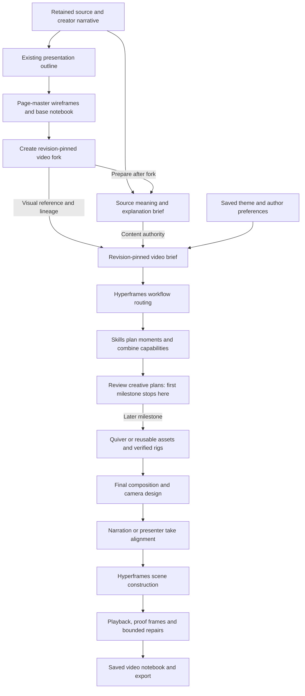

# Rethinking the explainer pipeline around Hyperframes

24 September 2026 · Architecture proposal · Explainers first · Immediate milestone: creative-plan review

Initial repository inspection: `feat/hyperframes-markdown-mvp`, HEAD `42806b5d`, including the existing uncommitted repairs. Installed Hyperframes core/player/producer: `0.7.106`. The initial upstream inspection used `b73df3549eb52744fe54dac2728a2f9d0fb6a9c7`; the follow-up brief/packet audit pins `99221c50a5e5927ca243454b4e4f02f9adf7cfc6`. The 24 September revision adds the planning-only milestone and composition-engine integration contract. This document proposes work; it does not establish implementation or output-quality acceptance.

**Next-stage extension:** [A visual scene notebook, from creative plan to production](scene-creative-review-and-production.md) specifies the richer visual-cast handoff, Markdown scene review beside the original wireframe, independent approvals, an explicit rough-preview route, presenter coaching and code-bound timeline editing. Follow its P0–P3 visual-review milestone next, together with the [updated MVP roadmap](m0-to-rendered-explainer-mvp.md). The M0 planning-only boundary below remains the definition of that earlier stage; a preview is a separate construction action, not a side effect of generating or approving a plan.

Implementation stays on `feat/hyperframes-markdown-mvp`. Commit coherent, validated slices with author and committer `Karthic <Kartronics85@gmail.com>`, staging only the slice's files and preserving other work.

## 1. The architectural decision

Presentation categories belong exclusively to the presentation workflow. The video planning contract must not use `title/list/diagram/numbers/quote/close`, the part categories `box/step/note/number`, the eight-part limit, or one-page-per-scene as its foundation. Keeping the presentation path does not carry those constraints into video.

Derive a source-grounded explanation record directly from the source and creator's narrative. This record supplies the video's meaning. The saved theme and base notebook supply visual references and provenance. The video planner designs an unfolding explanation with its own objects, shots, camera, artwork and timing.

The video handoff is a lightweight **ExplanationBrief**: a reduction of the source into what needs explaining, the relevant entities and facts, how the idea develops, and the creator's constraints. It does not require a concrete shot plan, a fixed video-kind taxonomy, camera choices or selected recipes. Hyperframes' creative and production skills perform that planning afterward. A concrete **VideoScenePlan** is a downstream output of those skills and supplies editable execution details only once those decisions have been made. These names describe proposed product records, not existing Hyperframes APIs.

| Presentation-only planning | Source reduction for video |
| --- | --- |
| Page `kind` such as `diagram` or `numbers` | The question or idea to communicate, expressed in ordinary language |
| Parts classified as `box`, `step`, `note` or `number` | The entities and concepts involved, their roles and useful relationships |
| Page relationships expressed as labelled edges | What happens, why it happens, or what needs to be compared or understood |
| At most eight parts on a page | Relevant source content without an inherited page-size limit |
| Page duration estimate | The requested video length and any existing narration/take; detailed pacing comes later |
| Page roster and geometry | A provisional progression of ideas; skills decide scenes, moments and shots |
| Page styling and static checks | Theme, visual references and the evidence that the eventual explanation must preserve |

Existing labels and object IDs can be reconciled with the explanation record to preserve identity. A part's presentation `kind` must never be treated as its technical role. Existing wireframe metadata may remain in the archived reference artifact; it is not a video planning instruction.

Hyperframes supplies production knowledge, reusable visual components and the composition runtime. Incredible supplies the explanation, durable project state, Quiver asset library, recording experience, local harness selection and editable authoring records.

The video output is a coded Hyperframes composition with independently controlled objects and layers. The product's local harness writes the composition HTML, CSS and JavaScript using compatible Hyperframes conventions, recipes and adapters. The Hyperframes runtime plays that artifact on the Studio canvas, and the producer renders the same pinned artifact for export. Using the skills for advice alone does not satisfy this architecture. A video scene is no longer required to be one page SVG played through the existing slide driver. Existing SVG/program scenes remain supported during migration.

This proposal supersedes earlier assumptions that the video must retain one scene per wireframe, use only the current scene-program action vocabulary, or fit every performance into an SVG-only contract. It also carries forward the user's later decisions: delivery is chosen per scene; users can select their local harness and see provider status. Earlier documents' compulsory whole-project delivery choice is superseded.

## 2. Two authoring paths, one retained source



For the first milestone, produce the presentation wireframes first. They give the creator a useful storyboard and initial division of the material. After the creator forks the base into a video notebook, prepare its Explanation Brief from the retained source and authored narrative. Do not make presentation-only users wait for video planning. The existing presentation generator need not change its input schema.

For an existing base, retrieve its pinned source snapshot, current narration and source references. Reconcile the explanation with intentional author edits. If only fragments are available, record that limitation and build only the supported explanation; never claim to have read the full article or silently re-fetch a changed page as the same revision.

The base notebook retains the original presentation and links to the explanation revision. The video child pins both. One base page can support several shots; several pages can support one continuous scene. Explicit many-to-many origin references preserve edit and split/merge lineage. A source edit offers selective adoption into the child and never silently rewrites accepted video work.

The initial review UI anchors one planning card to each inherited slide so the creator can understand the correspondence. That is a navigation convenience, not a final composition constraint. Skills can propose splitting, combining or resequencing material with explicit origin references and a reason. Review those proposals before changing the roster; never silently change the base deck.

## 3. What the explanation record contains

This is a content model, independent of drawing technology and screen layout. It uses prose for ideas and explicit data where correctness can be checked. The initial brief may leave demonstration, visual observation and scene segmentation decisions open for the skills to develop. Source-supported conditions and user decisions are constraints; illustrative choices proposed during reduction remain candidates. There is no mandatory intent-category enum. The downstream VideoScenePlan records the creative and execution decisions produced by the skills.

| Field | Purpose |
| --- | --- |
| Viewer question and takeaway | What the viewer is trying to understand and should leave knowing |
| Evidence | Source revision, exact passage locations and claim-to-passage links; creator statements identified separately |
| Entities | Stable identities, technical roles, interactions, inputs and outputs |
| Conditions and state | Only the state needed for this explanation, with units, limits and relevant conditions |
| Demonstration, when already available | A source example or creator-requested example; otherwise the skills develop a suitable demonstration later |
| Observation targets, when already specified | What the creator requires the viewer to notice; otherwise the skills develop these with the visual treatment |
| Narrative constraints | Approved wording, audience, terminology and intentional omissions |
| Uncertainty | Unsupported claims, ambiguous mechanisms and gaps needing resolution |

Keep sourced facts, creator claims and illustrative parameters distinguishable. A three-token demonstration is an illustrative choice unless the source specifies three. A citation beside a scene is insufficient proof that every relationship in it follows from the source.

Definitions, comparisons, code walkthroughs and summaries use observation targets suited to their content. They do not need invented state machines or a crisis. Examples: preserve an aligned baseline for a comparison; connect a highlighted code statement to its described effect; reveal membership for a definition.

### Example: a token bucket after a demonstration has been proposed

The following shows how the record can be enriched during skill-led planning. This level of detail is not required in the initial handoff.

- **Question:** Why can a burst pass while the next request is rejected?
- **Role:** The bucket stores admission capacity; an admitted request consumes one token.
- **Illustrative starting state:** Three tokens, requests A through D, no refill during those arrivals.
- **Sequence:** A, B and C arrive and each consume one token; D reaches an empty bucket and is rejected; a refill then makes a later request eligible.
- **Conditions:** No negative inventory; an accepted request consumes exactly one token; rejection does not consume an unavailable token.
- **Observations:** The same requests can be followed, depletion is legible, and rejection is visibly connected to the empty state.

These conditions become supported assertions over scheduled events and rendered bindings. The open description can express more than the currently implemented validators; unsupported assertions must be identified rather than reported as checked.

The current `ExplanationModelV1` already provides an identity/provenance starting point. Extend its persistence with versioned records instead of creating a competing store. Its outline-derived `kind` and part categories remain legacy presentation metadata; the new explanation schema is defined independently of them. Reuse existing behavior definitions, event identities and cue-occurrence alignment where their contracts fit; repair their known scheduling/state defects before treating them as authoritative.

## 4. Handoff to Hyperframes: a prepared brief and one workflow owner

The [Explanation Brief contract audit](hyperframes-explanation-brief-contract.md) traces the upstream brief, storyboard and packet readers. It proposes the input sections and adapter needed to turn source meaning into scenes with overlapping narration, presenter, graphics and text. The top-level router selects the production workflow; skill-led planning selects capabilities within it.

Incredible prepares a durable video brief containing the explanation revision, pinned base and theme, audience, wording policy, approximate duration, available assets, per-scene delivery choices, reference style and user overrides. It writes the agreed fields into the upstream brief format through an adapter, with product-specific fields retained in a versioned companion record.

Only existing choices belong in this handoff. Undecided scene boundaries, camera moves, actor appearances, presenter framing and recipe selection remain open. The local harness uses the selected Hyperframes skills to propose those decisions, source assets and refine them. The source-reduction stage does not pre-plan every effect for the skills to execute.

The adapter explicitly selects these inputs; it does not forward the presentation outline wholesale. Presentation `kind`, part `kind`, page limits and page timing are excluded from the video's planning controls. Missing explanation data must be derived from the source, not replaced by a mapping such as `diagram → diagram animation` or `numbers → count-up`. A user-selected total video duration is a separate input from a presentation page's estimated seconds.

The Hyperframes router chooses an owning production workflow from the deliverable. It should not infer the route from a slide's `kind` or from the mere presence of a blog URL. A technical article on a product website is still an explanation request unless the user requests promotion. Existing brief and run state support resumption without a second intake interview. [Router](https://github.com/heygen-com/hyperframes/blob/main/skills/hyperframes/SKILL.md)

| Requested work | Proposed route and adaptation |
| --- | --- |
| Narrated explainer using existing Quiver objects, recorded takes, or mixed scene delivery | `general-video` as the upstream owner, wrapped by Incredible's explainer workflow and constraints |
| Entirely generated topic explainer within the upstream workflow's scope | `faceless-explainer` is eligible; use `general-video` when existing assets, length or delivery requirements conflict with that workflow |
| One short unnarrated graphic or overlay | `motion-graphics` can produce that bounded component |
| Graphic overlays for an existing presenter clip | `talking-head-recut` only when preserving that footage meets the request; broader edits stay in the general workflow |
| An edit to an accepted composition | Resume its existing route, apply the edit and rerun affected checks |

There is one top-level workflow owner per build. Domain skills can be combined within it. Do not launch several independent workflows that each rewrite the script, theme, files or approvals. The current general workflow explicitly supports borrowing relevant genre guidance while retaining one production owner. [General video](https://github.com/heygen-com/hyperframes/blob/main/skills/general-video/SKILL.md)

The product's local Kimi, Claude Code or Codex harness runs the adapted workflow. Self-contained run packets include the brief, source records, selected references, tool contracts and accepted artifacts. The development assistant builds this machinery; it does not hand-author the production video to make a demonstration pass.

## 5. Skills own creative planning as well as construction

| Responsibility | Hyperframes material to use | Product-specific addition |
| --- | --- | --- |
| Visual direction | `hyperframes-creative`: video design, typography, story and beat planning | Translate the saved theme into a video design document, preserve factual colour meanings and the creator's voice |
| Shot design | Animation rules and blueprints; the two-stage director method in `motion-graphics` | Choose observations and object roles before assets; finalise framing after verified artwork exists |
| Camera | Viewport, target zoom, tracking, camera-journey and optional 3D recipes | Choose the reason and subject of each move; coordinate camera targets with current object states and presenter safe space |
| Object performance | Internal SVG animation, paths, masks, shape changes, keyframes and Lottie adapters | Bind named Quiver parts and ports to the technical behavior and its allowed state changes |
| Layout and continuity | Shared-element movement, coordinated layout changes, sub-compositions | Preserve actor identity and world state across shots and scene boundaries |
| Media and presenter | Core clip timing, composition patterns and suitable presenter guidance | Recording coach, take selection, human voice authority, per-scene delivery and caption placement |
| Reusable visuals | Registry blocks and components | Check source fidelity, style, supported controls and installed-version compatibility before adoption |
| Audio | Audio mixing and automation, where the selected version supports them | Existing narration providers, measured cues, speech clarity and intentional use of sound |
| Verification | CLI checks, snapshots, keyframe diagnostics and animation maps | Source correctness, behavior assertions, export parity and persisted quality decisions |

Sources: [creative](https://github.com/heygen-com/hyperframes/blob/main/skills/hyperframes-creative/SKILL.md), [animation](https://github.com/heygen-com/hyperframes/blob/main/skills/hyperframes-animation/SKILL.md), [keyframes](https://github.com/heygen-com/hyperframes/blob/main/skills/hyperframes-keyframes/SKILL.md), [registry](https://github.com/heygen-com/hyperframes/blob/main/skills/hyperframes-registry/SKILL.md), [audio](https://github.com/heygen-com/hyperframes/blob/main/skills/hyperframes-audio/SKILL.md), [CLI](https://github.com/heygen-com/hyperframes/blob/main/skills/hyperframes-cli/SKILL.md).

Ship a tested bundle with its upstream commit, license/provenance, local adaptations and compatible CLI/runtime versions. Load references by need. Do not place the entire library into every prompt or update dependencies halfway through an accepted run. Catalog components selected for a run are frozen with its artifacts. Verify each newer feature locally before advertising it; `0.7.106` cannot be assumed to implement current upstream audio and diagnostic features.

Adapt upstream provider setup, approval language, skill refresh and filesystem assumptions explicitly to product contracts. Users' existing build/export authorization and preferences should survive the handoff. Provider credentials stay in the product gateway. A missing provider or required component is a visible run issue, with retry/switch options and the last provider status; a plain fallback is not reported as a successful rich-object build.

## 6. The video production sequence

1. **Explain.** Derive or reuse the lightweight explanation brief and identify material evidence gaps. Retain the source meaning, current narrative and creator constraints. Preserve the author's wording when requested; leave visual treatment open unless already specified.
2. **Direct with the selected skills.** Let the local harness read the relevant Hyperframes creative/workflow guidance and develop the brief into a story. Draft spoken ideas and intended visible observations together. Break scenes into meaningful moments, consider combinations of capabilities for each moment and layer, and propose assets, shots and attention changes. Select a video treatment from the saved theme. Estimate time without freezing it to the presentation's `seconds` fields.
3. **Acquire.** Search the product's accepted asset library. Generate or edit Quiver artwork when needed. Keep native text, graphs, code and exact geometry where they explain best. Store originals, normalised variants, previews, rig definitions and provenance durably.
4. **Inspect and stage.** Verify actual SVG parts, bounds, ports, clipping and paint. Build the key visible states with that artwork before detailed motion. A request for named groups is not proof that Quiver delivered a controllable rig.
5. **Resolve speech timing.** Automatic scenes use the selected generated audio. Human scenes use the selected recorded take; before recording they have explicitly provisional rehearsal timing and coaching. Resolve cue occurrences and causal dependencies together; flag conflicts instead of reversing event order or silently rushing a critical action.
6. **Construct.** The local harness selects matching Hyperframes components/rules and builds the composition, using the scene's resolved timing and editable controls. New gaps can be authored with supported runtimes after validating their bindings and seek behavior.
7. **Review and repair.** Check the exact composition, inspect meaningful frames and play the scene with audio. Repair the smallest responsible layer. Persist evidence and keep the best accepted candidate. Stop with an explicit unresolved result when the bounded budget is exhausted.
8. **Assemble and export.** Join accepted scenes with verified continuity, captions, audio and presenter tracks. Export the same revision that was reviewed. Inspect the resulting movie and persist delivery acceptance separately from encoder success.

Audio generation/alignment can overlap asset work after its text is fixed. Final event timing depends on measured speech. Layout changes can require a new shot plan without regenerating the explanation or all artwork.

## 7. A lightweight handoff; many recipes within a scene

### 7.1 Reduce the meaning before planning the production

The brief can be short structured prose. It must preserve enough source detail for the skills to reason, with references back to the retained material when a summary omits context. The goal is to make the explanation legible to the planning harness, not to decide its cinematography in advance.

Organize that prose around purpose, source meaning, provisional explanation units, communication needs, available material/delivery, and constraints/open decisions. Communication needs describe what the viewer should hear, see or read and why; they do not preselect a skill or force each channel into a separate scene. The [audited handoff proposal](hyperframes-explanation-brief-contract.md) specifies which consumers must receive these fields and how the skills enrich them.

An illustrative input form:

```yaml
question: Why can a burst pass while a later request is rejected?
takeaway: Available tokens allow requests through; exhaustion causes rejection until refill.
involved:
  - Requests consume admission capacity.
  - The token bucket stores and replenishes that capacity.
  - The service receives admitted requests.
progression:
  - Explain available capacity and ordinary admission.
  - Show how a burst exhausts it.
  - Connect the empty state to rejection, then explain refill.
preserve:
  - Rejection must follow exhaustion.
  - Invented token counts must be identified as illustrative.
references: Retained source passages, current narrative, saved theme and available artwork.
```

The entries above are illustrative, not quotations from a particular article. A real brief links to exact source revisions and evidence. It can also carry audience, desired length, existing audio, wording constraints and user decisions. It does not need `kind`, a preselected camera recipe, a rig, coordinates, exact seconds or a final scene boundary. An explicit user request for one of those decisions remains binding.

The progression is a suggested explanation order, with causal dependencies distinguished from editorial ordering. The skills may split, merge or restage it while preserving the source meaning and creator constraints. A comparison or definition uses the same lightweight form without inventing events or state changes.

### 7.2 The skills develop the brief into moments and capabilities

The top-level router selects one owning workflow. Within it, the local harness uses creative guidance to decide how the idea unfolds, then loads relevant animation, camera, composition, media and registry capabilities for individual moments. It can revise those choices after seeing the real assets. A single scene can use many recipes; a single moment can combine several simultaneously.

| Meaningful moment inside one bucket scene | Capabilities the skills could combine |
| --- | --- |
| Establish available capacity | Quiver artwork, restrained text introduction and presenter composition |
| Follow an admitted request | Path travel plus camera tracking, with an internal SVG response at the inlet |
| Make depletion understandable | Target zoom plus token/fill animation and a coordinated count change |
| Show rejection | A changed request trajectory, object-state treatment and a short outcome label |
| Explain refill and return to context | Refill animation, a camera pull-back and an optional presenter return |

These are candidate treatments illustrating the planning freedom, not a mandatory recipe list. The skill might find a clearer alternative. It chooses named recipes from the pinned library/catalog and reads their actual instructions before building. A blueprint can supply part of a scene, or the harness can compose smaller rules where a full blueprint does not fit. Unsupported combinations must be adapted and checked rather than assumed to work.

"Parts" here has two useful senses: successive moments in the story, and simultaneous visual/audio layers within a moment. Neither requires a screen change. Following a request, animating a token and moving the camera can happen in one continuous world. This preserves the explainer's calm spatial continuity while using several Hyperframes techniques.

### 7.3 Compose recipes into one coherent performance

- Keep shared object identities, world state, theme and narration across all moments. A later recipe receives the state produced earlier; it must not reset the bucket or substitute a new request unnoticed.
- Resolve each recipe's time interval against the scene's shared clock and measured speech. Preserve dependencies and hold time when recipes overlap.
- Give each property one owner. Object-local motion, world camera transforms, presenter framing and caption layout are distinct channels; multiple recipes cannot independently overwrite the same transform.
- Keep the mechanism camera separate from screen-space presenter/caption layers unless the shot deliberately moves both.
- Scope a reused catalog block's selectors, dimensions and timeline before composing it with other elements. A standalone block is not automatically a safe layer; use a sub-composition or adapt the relevant internal rule.
- Review the transitions between recipe segments and the complete scene, including sound and readable settled states. Passing each isolated recipe does not prove the combined explanation works.

Holding still is a valid authored choice. Do not add a camera move or effect merely to demonstrate that a capability was loaded. Unnecessary scene cuts, forced pattern changes and perpetual wobble remain inappropriate explainer defaults.

### 7.4 Save the concrete plan after the skills make it

The skills' output becomes a versioned VideoScenePlan with actual actors/asset bindings, beats/events, shots, camera targets, presenter choices, timing, selected recipe references and required proof moments. These fields are produced progressively; they are not prerequisites for entering the router.

In particular, record which recipes serve each moment and layer, what observation each supports, which actors/properties they control, their dependencies and their entry/exit state. This enables focused editing: changing a camera treatment need not regenerate the source understanding, the narration or every object.

At the construction boundary, unresolved event targets, missing rig parts, recipe dependencies and timing conflicts are actionable errors. The plan must become concrete enough to execute and verify at that point. The initial reduction remains free of those implementation obligations.

## 8. Meaning, animation and runtime ownership

Use a hybrid contract:

- The explanation and schedule describe what must happen and what is true before and after.
- The local harness authors the visual treatment using supported Hyperframes recipes and components.
- The composition artifact exports bindings from semantic identities to elements, controls and time intervals so the product can edit and verify the result.

For example, `consume one token` remains a semantic event with a precondition and result. Its visuals may combine a token trajectory, a count update and a reaction inside the bucket. Those implementation choices can vary while the claim stays the same. A new motion recipe should not require adding a new story category.

Each scene publishes a versioned composition manifest: entry HTML, local dependencies, asset versions, dimensions/fps/duration, exposed editable controls, object/part selectors, event milestones, camera segments, media/take references, continuity entry/exit state, runtime requirements and quality evidence references. The specific field names are a proposed contract to validate in the pilot, not an existing API.

The canonical editable records are the explanation, shot plan, selected assets/takes and exposed controls. The generated bundle is versioned too, but normal UI edits regenerate only affected outputs. An advanced direct edit to generated HTML becomes a new artifact revision and requires binding validation; it cannot silently diverge from the saved authoring records.

Hyperframes owns clip presence, media seeking and the render clock. Registered timelines/adapters own visual properties at a given time. One owner writes each transform/state channel. A retained legacy driver is permitted behind an adapter, but must not compete with a GSAP camera or animate the same property twice. Custom callbacks must derive from absolute time so backward and out-of-order seeks reproduce the same state.

Scene preview, proof capture and export consume one manifest, the same actual runtime and media readiness rules. The current composed-review path strips the runtime and recreates clip/media control; replace that divergence for the new route. Test the fully assembled view with its real captions and selected presenter take.

### Hyperframes is the composition engine on the Studio canvas

The application already imports `@hyperframes/player` and uses its playback/seek API. Extend that integration to load the new authored composition bundles. The installed player's documented entry point is `<hyperframes-player src="...">`, which hosts the HTML composition in an iframe. Here, "canvas" means Studio's visible composition stage; this does not require rasterizing everything into an HTML canvas element.

The implementation boundary is:

1. **Author with code.** The selected local harness uses the accepted treatment, skills, verified assets and measured audio to write the actual composition. SVG groups, HTML text, presenter video, masks, paths, camera transforms and supported adapters can participate in the same scene. Quiver SVGs are assets within that composition, rather than mandatory containers for the whole scene.
2. **Publish a complete bundle.** Validate and version the entry HTML, scripts/styles, asset references, runtime requirements and editable bindings. Persist the bundle in MinIO and its revision/manifest in PostgreSQL. Materialize dependencies through the product's artifact service; preview must not depend on a provider's temporary URL or an abandoned harness directory.
3. **Load it into the Studio stage.** Use the embedded Hyperframes player for playback and scrubbing. The host owns project navigation, editor controls and selections; the composition owns its internal drawing and animation. Scope generated code to the composition surface and expose an explicit host bridge for declared edits and diagnostics. Do not grant generated code access to provider credentials or broad project mutation APIs.
4. **Share time and state.** The composition runtime coordinates registered animation timelines and media; a scene's local time maps explicitly to the notebook timeline. Camera/world layers, object-local animation, presenter and captions have deliberate ownership. A continuous mechanism can remain one composition across several moments; scene/shot count does not dictate one file per moment.
5. **Review and export the artifact that was played.** Player preview, proof capture and producer export use the same pinned bundle, fonts, media, runtime version and time mapping. Verify forward and backward seeks, cold loads, object continuity, presenter/audio synchronization and export frames. Do not rebuild an approximation with a second slide renderer for review.

Use the engine's supported composition, timing, camera recipes, media and adapter capabilities where they serve the explanation. Capability selection is motivated by the scene; using the engine fully does not mean adding every effect. The installed player supports embedding, but parity and advanced capabilities still need the H0/H3 integration proofs below. No application integration is claimed by this document.

## 9. Scene-level delivery and user experience

The user starts with their source, narrative and theme. They do not have to choose a whole-project delivery mode. Each video scene can use the creator's recorded voice/presenter, generated narration, or an explicitly silent treatment when appropriate.

Presenter visibility is independently directed within a scene: full camera, shared frame, graphics-only, then a return. Hiding the presenter never changes the chosen voice source. A generated-only scene reserves no empty presenter area. Scene delivery changes invalidate the affected timing and proofs, not the base notebook or every asset.

The director card explains the scene's question, planned demonstration, recording lines, pauses/cues and where the person will appear. Human timing remains provisional until an accepted take is aligned. A user can revise wording, retake, select another take, request a camera change or choose a different delivery for that scene.

Expose useful progress: understanding the story, preparing objects, designing shots, waiting for a take, composing, checking and ready for review. Show provider errors and resumable actions. Technical skill names can be visible in diagnostics without being choices a creator must understand to make a video.

### Composition workspace inspired by Motionity

Use Motionity as a reference for editor interaction, with our own implementation connected to the product's authoring records and Hyperframes engine. Its source exposes a central canvas, asset browser, properties panel, layer list, timeline, playhead, playback controls and undo/redo. Those are useful patterns for making overlapping activity inspectable. [Motionity editor source](https://github.com/alyssaxuu/motionity/blob/main/src/index.html), [feature overview](https://github.com/alyssaxuu/motionity#features).

The workspace should answer both **what happens when** and **why the viewer needs to see it**:

| Workspace area | Planning milestone | Constructed composition, later |
| --- | --- | --- |
| Scene navigation | Inherited scene cards, source-slide links, brief/plan status, proposed split/merge changes | Same identities with playable composition versions |
| Centre stage | Retained wireframe clearly labelled as a reference, alongside the selected moment's proposed treatment | Actual Hyperframes playback with selections and optional camera/safe-area guides |
| Bottom sequence | Ordered moments and overlapping narration, graphics, text, presenter and camera lanes; estimated timing only where supplied | Time-scaled clips, measured narration cues, playhead and range playback tied to the runtime |
| Inspector | Selected moment's purpose, visible change, narration, evidence, recipe rationale and unresolved decisions | Those explanations plus the composition's declared editable properties |
| Assets and versions | Existing references, required objects/takes, candidate-versus-reviewed plans | Reusable Quiver assets, selected takes, composition versions and affected review status |

These lanes describe simultaneous communication channels, not a new closed list of scene types or a compulsory number of layers. A scene can use just the channels it needs, and one moment can span several lanes. A later advanced view can expand objects and supported animation properties without requiring every creator to work with raw keyframes.

For example, selecting **Last token consumed** reveals the proposed spoken phrase, the token's disappearance, the bucket's resulting state, the count change and the camera's intended focus. It also states the observation: the following rejection is caused by depleted capacity. Once constructed, selecting that same moment seeks to its bound interval in the actual composition. A track labelled only `opacity 0 → 1` would omit the explanation that the creator needs to assess.

**M0 stays a planning workspace.** Selecting moments reveals the plan; it does not pretend to play an animation that has not been built. Where duration is unresolved, show an ordered sequence instead of fabricated second marks. Any supplied timings are visibly provisional. Do not generate new images, animatics or composition code just to populate this view. Keep the briefs and raw planning artifacts accessible. Begin with selection, inspection, comments and regeneration; review the creative direction before adding a full keyframe editor.

The next-stage specification adds **Preview plan** as an explicit, bounded sketch route after M0. The original wireframe remains the reference, a coded sketch is labelled provisional, and final production is separately requested. **Approve plan** records scene-level direction without starting production. This extension does not relax the planning route's tool restrictions.

**The later editing contract must be explicit.** An arbitrary generated HTML/JavaScript composition cannot reliably be reverse-engineered into a complete editable timeline. Require its authored manifest to bind stable scene/moment/object IDs to time intervals, assets, exposed properties, cue dependencies and runtime targets. The manifest records what the bundle exposes; the canonical authoring revisions remain authoritative for intended edits. Validate those bindings against the bundle and reject stale/missing ones instead of displaying fictitious controls.

An editor action changes the corresponding authoring parameter or direction, validates dependencies, and either updates a supported runtime control or asks the local harness to rebuild the affected candidate. Persist the resulting authoring and bundle revisions together; do not mutate the preview DOM and call that a saved edit. A changed camera parameter can update through an exposed control; a changed visual metaphor generally needs planning/construction again. Regeneration must carry forward accepted user edits. Unsupported controls remain inspectable with a clear regeneration path rather than being falsely advertised as draggable keyframes. The control catalog limits direct UI editing, not creative expression: supported custom composition code can remain an authored component with a harness-edit path.

Retiming is equally deliberate: moving an action must preserve causal order and any binding to a narration cue. A request to add a hold may require changed narration or a pickup; it must not silently stretch an accepted human recording. Undo/redo restores coherent revisions of parameters and artifacts, including review status. Every preview control seeks the Hyperframes runtime; the editor does not introduce another animation clock or rebuild the scene in Motionity's drawing system.

After M0, deliver this in small steps: (1) playback with synchronized read-only tracks and selection; (2) declared text, placement and camera controls with persistence and export verification; (3) constrained clip timing and selected keyframe controls where the bindings support them. Check click-to-seek, backward scrubbing, edit → reopen → export consistency, and regeneration preserving manual direction. The editor makes plans and compositions understandable and correctable; better output still depends on creative planning, asset performance and rendered review.

## 10. Durable state and reproducibility

Extend existing PostgreSQL persistence for source/narrative/explanation revisions, notebook lineage, scene/shot plans, delivery settings, take selections, asset metadata, run stages and quality decisions. Extend MinIO storage for SVGs, rigs, audio/video, composition bundles, snapshots and exports. Local harness directories are materialised working copies.

Each accepted scene pins: base/explanation/theme revisions, selected asset versions, script/audio or take revision, composition and binding hashes, skill bundle and runtime versions, and review evidence. A frame proof belongs to that complete revision. A camera, caption, audio or presenter change invalidates the affected proof even if the SVG bytes did not change.

Bundle dependencies use stable internal paths/identifiers resolved by the host; expiring download URLs are not persisted as the sole identity of media. Reopen and export materialise the pinned bundle and inputs from durable storage. Saving accepted metadata is atomic and uses expected project revisions so a stale browser cannot overwrite it. Failed candidates remain separate from accepted scene state.

## 11. Concrete implementation seams

| Existing location | Proposed change |
| --- | --- |
| `apps/studio-v2/server/source.ts` and `story-master` | Preserve the presentation outline; retain source references for the new explanation pass |
| `apps/studio-v2/server/story-model.ts` | Add versioned evidence, roles, demonstration and observation records alongside existing IDs |
| `apps/studio-v2/src/main.ts` Build Explainer handoff | Supply the full brief and pinned records, permit many-to-many source lineage and scene delivery |
| `apps/studio-desktop/skills/explainer-master` | Adapt into the product coordinator with a pinned Hyperframes workflow/domain bundle and explicit product overrides |
| Desktop `harness/run-manager.ts` and skill installer | Materialise complete packets, record fingerprints, resume stages, surface provider failures and verify outputs |
| Desktop `mcp/explainer-tools.ts` | Extend asset tools and candidate/preview/finish contracts to accept a Hyperframes composition bundle |
| `scene-program.ts`, `object-behavior.ts`, `event-schedule.ts` | Reuse stable events, behavior checks and cue alignment; separate semantic scheduling from a slide-only render target |
| `shot-plan.ts` and coaching UI | Represent authored camera/attention and per-scene delivery; extend existing shot and coaching records |
| `packages/markdown-composition` types/compiler | Add a discriminated composition-artifact scene beside legacy SVG/program scenes and assemble its media consistently |
| `composed-review.ts` and server render routes | Review and export through the same manifest/runtime with producer-compatible seeking |
| Persistence interfaces, PostgreSQL migrations and MinIO storage | Persist new revisions and bundles using existing durable run and asset infrastructure |

These are integration points, not a claim that all new types should be added to the existing large files. Extract dedicated modules for explanation planning, brief adaptation, capability resolution and composition manifests as each slice is implemented.

## 12. Implementation order and acceptance

### M0: inspect the briefs and skill-led creative plans

This is the immediate product milestone, before artwork generation, animation construction, narration generation or video export. It exercises the actual selected local harness and pinned Hyperframes creative-planning instructions through the visible product UI. A development-assistant-written plan is a fixture, not acceptance evidence.

**Creator flow**

1. Paste a blog and create the existing themed wireframe deck. Keep the generated presentation brief/outline and source references alongside each slide.
2. Choose **Create video fork**. Save the child and pinned base/source/theme revisions first, then start a durable preparation run to derive the video Explanation Brief. Show progress; provider failure leaves a usable fork with a retry action.
3. Inspect each inherited scene with **Presentation brief**, **Video explanation brief**, and **Creative plan** views. Both notebook modes expose these references: the base shows the original presentation input and a linked, read-only view of the selected child's video records; the video shows its pinned presentation input and its own video records. Multiple forks require an explicit fork selector. Before a video brief exists, show that state rather than synthesizing a fake saved brief. Edits to video records belong to the child.
4. In the video notebook, choose **Generate creative plan** for a scene. Run the adapted owning workflow's planning stage with the video-wide brief/design context, that scene's explanation, adjacent scene summaries, existing decisions and the selected skill references. The owning workflow remains consistent across the video while each scene can combine different capabilities. Access from the base opens the corresponding child scene.
5. Read the result, add direction, regenerate a candidate, compare revisions and mark a plan reviewed. Preserve the last reviewed revision while a new candidate runs or fails. Reviewing a plan does not automatically start asset or video generation.

**What the creative-plan view must make understandable**

| Visible output | Review question |
| --- | --- |
| Viewer question, takeaway and evidence | Is the planned explanation correct and worth showing? |
| Narrative progression and proposed example | Does it develop the idea rather than recite the slide? Are invented demonstration values labelled? |
| Ordered moments with overlapping channels | What is spoken, what visibly changes, why, and where should attention go? |
| Object roles, proposed appearance and performance | Does the object do explanatory work beyond appearing as an icon or card? |
| Presenter, text and camera treatment | When is each useful, what remains visible, and what stays still long enough to understand? |
| Selected skills/recipes and their purpose, in expandable detail | Why is each capability suitable, and how do simultaneous actions share the scene? |
| Asset/take requirements, continuity and unresolved choices | What must be acquired or decided before this plan can be executed? |
| Optional roster-change proposals and source-slide links | Would a split, merge or resequence improve the explanation without losing its origin? |

Use the Motionity-inspired planning workspace in section 9: a readable moment sequence with overlapping channels and an inspector, with the raw saved artifacts available for inspection. Do not require an executable state machine, exact selectors, generated artwork or frame-accurate timing yet. Durations and speech cues remain estimates until audio/takes exist. Delivery can remain undecided per scene; a presenter suggestion does not mandate a recording or switch the voice source.

**Implementation slices and stop boundary**

- Add explicit fork-preparation and scene-planning routes, separate from the current full `Build Explainer` route in `main.ts` and `explainer-master`. Give planning its own completion contract: a persisted brief/treatment candidate with source coverage and open decisions. The current build's "built, reviewed and exported" success message is invalid here.
- Vendor the required, pinned Hyperframes router/creative/workflow references and adapt the workflow to stop after planning. Expose only the planning artifact/read capabilities for this route; the application must not dispatch Quiver generation, TTS, recording, composition construction, finish or export on planning completion. Enforce this in dispatch/tool capabilities as well as instructions. A route without a restricted execution environment must not claim that arbitrary shell actions are technically prevented.
- Reuse durable run/stage infrastructure with scene identity and input fingerprints. Persist canonical brief/treatment revisions in PostgreSQL and materialized artifacts in MinIO. Record provider/model, skill version, selected workflow and input revisions. Make queueing idempotent, survive refresh, and reject stale results after a source, brief, theme or direction edit.
- Show preparing, ready to plan, planning, candidate ready, reviewed, stale and failed states, with an actionable provider error and last provider status. Retrying or switching provider retains the fork and existing accepted work. Scene failures must not discard successful scene plans.
- Keep video-wide direction in every scene packet. Plan a few different scenes through the same product flow, including a mechanism, a text/comparison-led explanation and a possible presenter scene, rather than proving only that one token-bucket prompt succeeds.

**M0 acceptance:** a fresh blog can reach inspectable, source-grounded creative plans through the visible UI and the selected local harness; both brief views have correct lineage; a scene can combine multiple skills with a coherent reason; refresh/reopen and retry preserve the result; stale output cannot overwrite current work; no downstream generation starts. Test with recorded run/artifact evidence and capture the UI states. Interpret the plans against the original wireframes and source, then revise the brief/router before expanding.

M0 demonstrates whether the handoff produces convincing creative direction. It cannot prove smooth motion, speech synchronization, rendering parity or delightful final output. Next, deliver the visual review loop in the [scene-review specification](scene-creative-review-and-production.md): actual assets and theme in the packet, an adjacent wireframe/plan UI and a rough coded preview. The subsequent production-quality milestone is one scene authored as code by the product harness, played through Hyperframes on the Studio canvas and exported for comparison.

### Subsequent engineering and production milestones

M0 takes the brief and planning portions of H1/H2 first, with the minimum pinned capability catalog needed to avoid unsupported promises. The remaining H0 tests, asset work and construction follow the planning review; they are not prerequisites for simply viewing a creative plan.

| Slice | Deliverable | Acceptance evidence |
| --- | --- | --- |
| H0: capability baseline | Tested/pinned runtime, selected skill dependencies and schema adapters | Known small fixtures demonstrate camera, Quiver part animation, clip/media seeking and required diagnostics; unsupported capabilities are explicit |
| H1: explanation layer | Lightweight ExplanationBrief from retained source and creator intent, following the audited consumer contract | Claims link to evidence; requirements and suggestions stay distinct; mechanism and non-mechanism examples are expressible without a kind enum, shots or recipes; presentation categories cannot select the route |
| H2: skill planning and asset handoff | Native brief adapter and explicit companion reader, saved workflow, scene/moment/channel treatment, complete recipe packets, verified rig and library reuse | Product local harness combines capabilities within one scene; meaning, global constraints and delivery survive the packet boundary; missing recipes/bindings are reported before construction; reopen resumes; Quiver failure cannot silently satisfy rich-art acceptance |
| H3: one new composition | End-to-end narrated reference scene using the selected Hyperframes skills | Objects perform a correct mechanism, a motivated camera move works, timing follows real audio, no presenter placeholder in generated mode |
| H4: presenter and edits | Same scene with an actual selected take and directed presenter shots | Coaching → recording → alignment → preview → export; voice continues during graphics takeover; speaker return remains readable |
| H5: notebook integration | Multiple connected scenes, selective rebuild, durable versions and export | One-to-many origin mapping, split/merge identity, backward seek, repeated instances, refresh/reopen and old SVG scene compatibility |

Use one retained blog and a matched mechanism from it for the first new run. Keep a baseline export and source/theme/asset versions for comparison. Where testing recipe quality, hold narration and artwork fixed; where testing the new explanation planner, allow planned changes and record them so the comparison is interpretable.

The development assistant supplies the software and tests. The product's selected local harness must generate the production artifacts from a clean run. A hand-authored demo by the development assistant is only an engineering fixture and cannot satisfy M0 or H2–H5 production acceptance.

Acceptance includes source accuracy, visible before/action/after states, meaningful internal object changes, purposeful camera, readable holds, narrative alignment, correct presenter/audio composition and identical reviewed/exported inputs. Inspect playback with sound and the key frames; runtime success and static screenshots alone cannot establish delightful output. Human presenter acceptance requires real footage and remains unproven until exercised.

The prior [repair re-review](../reviews/2026-09-21-motion-repair-rereview.md) remains a regression input. New workflows do not excuse unresolved source/identity/timing/persistence defects. Apply relevant tests to each implementation slice; documentation-only changes need link and structure checks.

## 13. Boundary of this proposal

The initial M0 implementation stops at inspectable explanation briefs and creative plans for the forked video's scenes. Its next-stage extension adds rich visual context, a scene review notebook and a rough coded preview before final production. Then prove one excellent coded Hyperframes scene on the Studio canvas and in export, the same scene with human presentation, and supported edits carried through both. This proposal does not add pitch mode, rebuild the presentation designer, implement an arbitrary physics engine, or promise quality from skill installation alone. Expansion follows evidence from product-generated output.

The central change is the handoff: reduce source meaning into an explanation brief; let Hyperframes' skills plan how to tell it, combining multiple recipes across moments and layers within each scene; then construct and verify the concrete composition. The wireframe stays a useful, separately saved reference throughout.
