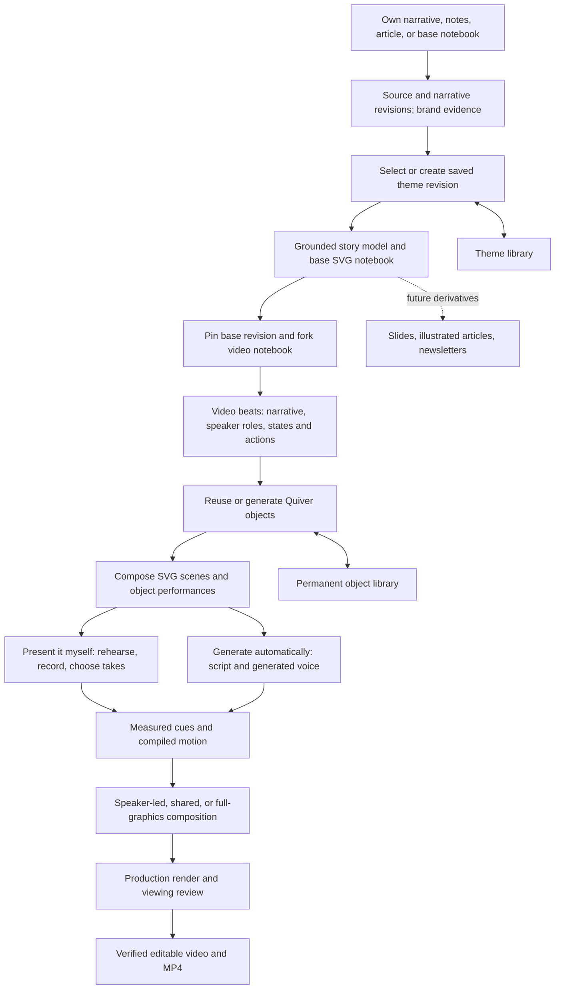

# Technical storytelling studio: human presentation and automatic video

Product specification, current gaps, architecture, and development plan

19 September 2026 · Proposed · Explainer scope only

> **23 September architecture proposal:** [Rethinking the explainer pipeline around Hyperframes](hyperframes-explainer-pipeline.md) retains the presentation path, adds a source-grounded explanation record, and defines a local-harness handoff to Hyperframes workflows and domain skills. It proposes composed video scenes beyond the SVG-only route and carries forward scene-level delivery and selectable local providers. Its delivery decisions supersede this document's earlier mandatory whole-project choice; the architecture remains proposed work.

> **21 September repair priority:** Follow the [live-review repair plan and motion-quality packages](../reviews/2026-09-21-explainer-video-root-causes.md#architecture-and-implementation-order) for the next implementation slices. It adds the inspected Lottie repository's choreography, object continuity, safe controls and production-player review practices to the existing SVG/SMIL architecture. Protect accepted work and fix export/target/timing defects first; then prove reusable behaviors in one excellent scene before expanding the video. The detailed findings distinguish current failures from already-repaired candidates. This update changes the plan only.

## Working branch and commit conventions

- **Implementation branch:** `feat/hyperframes-markdown-mvp` in `/Users/think/Documents/code/dev-video-creator-main`. Continue this plan on that branch; verify the checkout before editing or committing. Change branches only when the user requests it.
- **Commit identity:** use `Karthic <Kartronics85@gmail.com>` for both author and committer. Apply this identity per commit or in this repository only; do not change global Git configuration.
- **Commit continuously:** commit each coherent, validated implementation slice as it is completed, including relevant tests and plan/progress updates. Do not accumulate the entire roadmap into one final commit. A development phase may contain several reviewable commits.
- **Before each commit:** inspect the working tree and staged diff, stage explicit task files/hunks, run checks appropriate to the change, and preserve unrelated pre-existing edits. Documentation-only changes need document/link checks rather than application tests.
- **Commit messages and handoffs:** describe the concrete change; record completed acceptance checks and remaining work in the relevant progress notes. Include the commit hash when reporting a completed slice and verify the recorded author/committer identity.
- **Checkpoint work:** create a commit after a validated slice and before a substantial handoff whenever the current changes form a coherent checkpoint. Keep incomplete work explicitly identified rather than representing it as a passed milestone.

## 1. Product direction and decisions

**Product promise:** Help people explain technical ideas through their own narrative, a visible human speaker, and rich objects that perform the explanation—or generate the narrated video automatically. Both are first-class ways to create a finished story from the same reusable base.

The creator can start with their own narrative, notes, an existing notebook, or an article. Blog import is one input path. The speaker's voice, perspective, delivery, and presence can lead the experience from the beginning; they are not a camera overlay added to an already generated video.

This is a good product direction because the reusable base separates understanding the material from presenting it. The creator invests once in source grounding, object identities, relationships, and visual language. Video is the first rich derivative; slides, illustrated articles, and newsletters can later consume that same base.

The difficult part is coordinating the narrative, the speaker's delivery when present, and a visible sequence of causes and consequences. Brand extraction, SVG generation, and animation are supporting capabilities. A successful video helps a viewer understand and predict what the system does while retaining the creator's intended voice and point of view.

### Decisions for this release

1. **One studio, two equal creation paths:** `Present it myself` and `Generate automatically`, available together at the start of `Create explainer`. Both share source, theme, base, assets, motion, and export infrastructure. The old diagram wizard is explicitly a basic diagram tool and cannot satisfy either rich journey's completion checks.
2. **Two distinct saved artifacts:** a reusable **Base notebook** and a separately editable **Video notebook**. The base stays editable; the video pins the base revision it used. Video generation never overwrites it.
3. **Wireframes establish the explanation, not the final video composition.** The video may remove chrome, enlarge objects, change positions, combine pages, or split a page into multiple scenes while retaining source lineage.
4. **Use the existing `page-master` adaptation of `ppt-master` for the base SVG deck.** This is the repository skill referred to here by “ppt-master-derived skill.” Keep its composition discipline; correct the downstream tendency to treat every concept as a card.
5. **Quiver is part of the rich-object workflow.** Generate or reuse compatible accepted SVG artwork for the important physical/metaphorical subjects. Ordinary arrows, graphs, code, labels, and mathematically exact primitives can remain native SVG.
6. **Local Kimi is the authoring harness.** The application supplies self-contained, versioned skills and tools. Codex builds and tests the software; it does not manually author the production video's scenes as a substitute for this workflow.
7. **Human presentation and automatic generation are peers.** In `Present it myself`, the creator shapes the narrative, rehearses, records, and presents alongside synchronized graphics. In `Generate automatically`, the product authors or uses the selected script, generates narration, and composes without an on-screen speaker. Neither is labeled the default or the advanced add-on; remember an explicit previous choice without assuming it for a new creator.
8. **A renderable MP4 is not the quality bar.** Completion requires the reviewed source, theme, artwork, performances, narration, composition, and export to agree.
9. **Explainers first.** No pitch mode, rapid promotional scene switching, synthetic presenter, or new format-specific product in this release.
10. **Local PostgreSQL and MinIO are required durable storage.** PostgreSQL owns structured records, revisions, and job state; MinIO owns source/scene/media objects. Browser storage and local harness directories are caches or working copies, never the only saved copy of accepted work.
11. **The AI director actively directs and coaches.** It chooses the scene's shot sequence, speaker placement/presence, emphasis text, camera treatment, animation takeovers, returns, and transitions; then guides the person through recording one scene at a time. A layout gallery is an override tool, not the main directing experience.

### Initial customer and job

For a technical author, developer educator, product engineer, or founder who wants to communicate an idea clearly, either by presenting it personally or by producing an automatic narrated explanation, without manually constructing an animation timeline.

Two equally important jobs:

- **“Help me tell this story.”** Preserve my argument and voice, help me organize it, show what I mean, and let the graphics follow my recorded delivery.
- **“Make an explainer from this material.”** Build the story, visuals, and narration automatically, retaining an editable result and reusable base.

Initial output target: a 60–180 second English technical explainer, 16:9, 1080p, 30 fps, with a small number of coherent scenes. The first engineering proof is the same 30–45 second mechanism delivered both by a real recorded speaker and by generated narration. These are product targets, not measured current capabilities or promised generation times. Recording and rehearsal are in scope; real-time speech-following animation for live broadcasts is a separate future capability.

## 2. What “delightful” means

A viewer should be able to answer: **what changed, what caused it, and why the resulting behavior makes sense.** Motion directs attention and makes that change legible.

| Dimension | Desired experience | Evidence to inspect |
| --- | --- | --- |
| Understanding | The viewer sees the mechanism, including the important constraint | Before, action, and consequence are visible; quantities and outcomes agree with the source |
| Object behavior | Objects perform their job | A request enters, a token is consumed, a gate rejects, a worker becomes occupied; a label is not the entire demonstration |
| Visual richness | A few substantial objects have coherent silhouettes, fills, parts, and states | Accepted artwork is large enough at playback size and belongs to one visual family |
| Timing | The important change lands with the spoken explanation | Narration cues, dependencies, anticipation, action, settling, and reading time are reviewed together |
| Human storytelling | The speaker's argument, personality, emphasis, and pauses remain intact | Authored language is preserved; graphics follow the selected take; a presenter can lead a framing or interpretive moment |
| Continuity | The viewer can follow the same object through the explanation | Persistent positions and identities; scene changes happen at conceptual boundaries |
| Restraint | One important action leads attention at a time | No perpetual wobble, decorative traffic, or camera movement competing with the mechanism |
| Composition | Speaker-led, shared, and object-led moments each feel deliberate | Speaker presence and graphics have useful roles; text remains readable and no face or moving actor obscures the explanation |
| Trust | The creator can understand and revise the result | Source references, theme revision, asset provenance, and editable actions remain available |

For example, “jitter prevents retry storms” is not demonstrated by revealing three boxes named Backoff, Jitter, and Recovery. Show several clients failing together, retrying in synchrony, then receiving different wait intervals and returning at staggered times. Show the service handling those arrivals. Label invented counts or intervals as illustrative when the source does not specify them.

Not every scene requires a causal simulation. A definition, comparison, code walkthrough, or summary should use the visual form that best explains it. Do not add arbitrary Quiver objects or motion merely to pass a quota.

## 3. End-to-end product experience

### 3.1 Start: choose how to tell the story and supply the material

Entry point: **Create explainer**. Show two equally prominent choices before any narration is generated:

| Choice | What the creator is choosing |
| --- | --- |
| **Present it myself** | “Help me shape and deliver my narrative, with rich graphics timed to me.” |
| **Generate automatically** | “Produce the visuals and narration from my material, with an editable result.” |

Both accept an authored narrative, pasted notes, a blog URL/article, or an existing base notebook. No article is required. A human can use a script drafted from a blog; an automatic video can use the creator's exact words. Source choice and delivery choice are independent.

- For a URL, capture the readable article, headings, code, figures and captions where supported, canonical URL, source locations, and visible brand evidence.
- For the creator's narrative or pasted notes, retain their words and intended point. Let them choose **Keep my wording**, **Help shape my story**, or **Draft from these notes**; do not silently replace a personal account with generic explanatory prose. Preserve the supplied content as its own source revision and identify unsupported factual claims separately from stylistic edits.
- For pasted text, offer an optional **Brand website** field; text alone cannot reveal the website's colors. A saved theme or entered palette is also sufficient.
- Keep the content source and brand source separate. An author may publish on a shared platform but want their own brand, or use one site's article with an already selected brand.
- Show the story title, approximate reading length, narrative/source preview, and missing sections or failed extraction. Let the creator correct the source and state the audience and intended takeaway.
- Capture an immutable source revision before generating dependent artifacts. Later re-fetching creates a new revision.
- Treat content, SVG metadata, and web-page instructions as input data, not instructions for the local harness.

Setup asks only for choices that change the outcome: delivery path, audience/depth, approximate duration, and theme. Defaults for secondary controls support proceeding immediately. **Review each stage** is independent of delivery choice: a human presenter can automate visual production, and an automatically narrated video can be carefully edited stage by stage.

### 3.2 Brand: find, create, save, and reuse

The brand step offers three explicit choices:

| Choice | Behavior |
| --- | --- |
| Use saved theme | Show matching themes for the chosen brand/site and the full library; preserve the exact saved revision |
| Create from website | Extract candidate colors, fonts, and logo; show the evidence and generate a small set of coherent treatments |
| Create from colors | Accept primary, secondary, and accent colors; derive backgrounds, text, surfaces, and semantic colors; save as a new theme or a new version |

**Matching:** prefer an explicit brand assignment or site alias, then show same-site suggestions. Do not automatically assume every subdomain or hosted blog belongs to the same visual identity. Website similarity is a suggestion, not permission to replace an existing selection.

**Extraction:** rank painted page regions, CSS variables, text colors, and logo colors as evidence. Ignore transient cookie banners and advertising where detectable. Distinguish observed values from suggested video adaptations. Offer light and dark treatments instead of forcing dark mode.

**Preview:** each candidate shows the same small sample: a wireframe mechanism, a filled object treatment, typography, captions, and both a speaker-led and a full-graphics composition. This tests usability beyond a palette swatch. Record local font availability and visible fallback choices.

**Save and reuse:** the selected theme is saved to the application library before the base is drawn. A notebook pins `themeId + revision` and a resolved snapshot. Opening the app under a different local server port must not make saved themes disappear. A palette edit creates a revision or a named variant; existing notebooks retain their original appearance until explicitly updated.

**New color combinations:** preserve the chosen primary/secondary/accent relationship while deriving support tokens and checking readability. Do not replace semantic warning/success colors with arbitrary brand accents. Store which variations are deliberate adaptations rather than extracted brand facts.

### 3.3 Story and base wireframe notebook

The application constructs a source-grounded explanation outline before drawing, preserving the creator's selected wording policy and narrative intent. An authored story can lead with a personal observation, question, example, or argument; it need not mimic a blog's headings. Each planned page has:

- One viewer question and a clear answer or takeaway.
- Source references, any illustrative assumptions, and the concepts needed to understand the page.
- Stable object and relationship identities, independent of labels and SVG coordinates.
- An explanation form: mechanism, comparison, sequence, quantitative view, code walkthrough, definition, or summary.
- The creator's authored passage or an explicitly generated narration draft, plus rough duration. Draft speaker notes can be distinct from verbatim teleprompter text.

The local `page-master` workflow receives the source model, resolved theme, and outline. It uses the vendored `ppt-master` design-spec and review workflow to create editable, basic SVG pages with semantic groups and stable IDs.

**Wireframe requirements:** readable visual hierarchy, meaningful topology, generous space, limited text, and accurate relationships. Use a pool of slots to explain capacity, a timeline to explain waiting, a chart to explain a rate, or aligned panels for a comparison. A rectangle is acceptable when it represents a genuine container or is an honest wireframe placeholder. Do not make card-and-arrow diagrams the universal layout.

The base stores source, concept model, theme snapshot, outline, wireframe SVGs, and draft narration. It is useful as a structural deck without rich artwork. The user can edit it, reorder pages, or stop here.

**Automatic mode:** save a base checkpoint and continue when checks pass. **Review mode:** show the deck and let the creator edit it before continuing. Neither mode requires a manual approval for each page or asset.

### 3.4 Fork into a video notebook

`Create video` makes a separate derivative from a specific saved base revision. Retrying the operation returns the same requested derivative; **Create another version** deliberately makes a new one.

The library shows the base and its videos together. Each video offers **Open base**, its pinned theme, and **Base changed** when applicable. Base edits never silently propagate into finished video work. Initially, offer a comparison and a new derivative from the updated base; automatic merging is outside this release.

Video structure may differ from the base. One wireframe can become two video scenes; two adjacent wireframes can become one sustained explanation. Save explicit many-to-many scene lineage and source coverage so this transformation does not lose meaning.

### 3.5 Plan the video: dialogue and visible action together

Build a beat storyboard before expensive artwork. For each beat, record:

| Field | Example |
| --- | --- |
| Spoken meaning | “Once no tokens remain, the next request is rejected.” |
| Starting state | Bucket has zero tokens; service is still available |
| Trigger | A new request reaches the bucket |
| Visible performance | Request approaches; gate closes; request turns toward the rejection path |
| Resulting state | Zero tokens remain; rejected request is visible; service receives nothing |
| Timing intent | Rejection lands on the spoken word “rejected,” after arrival and the empty check |
| Layout intent | Full mechanism visible; no presenter over the route |

Dialogue and visual actions are co-authored. They are not completed independently and glued together afterward. The initial plan can use estimated timing, but final motion is compiled only against measured narration or the chosen recording.

For human-led stories, the creator's narrative intent and chosen wording govern the draft. The product proposes visuals and suggested edits alongside the original; it does not require the speaker to deliver a machine-written script or follow an immutable animation clock. Framing, interpretation, examples, and transitions can be speaker-led beats without a mandatory object action.

Maintain a video-wide design treatment: palette roles, object proportions, perspective, fill/shadow language, typography, motion rhythm, and transitions. Keep main objects stable through a mechanism and across neighboring scenes when useful.

### 3.6 Acquire rich Quiver objects

Show an **Objects** panel that makes the artwork stage visible:

- `Server · reused from library`
- `Client · generating`
- `Retry scheduler · checking animation parts`
- `Request packet · accepted`

For each focal object, the same role metadata drives both the artwork brief and later behavior bindings:

- What it is and what job it performs.
- Inputs, outputs, relationships, and state variables.
- Named parts, ports, visible states, and required behaviors.
- Theme/style revision, intended on-screen size, and any illustrative conventions.

Search the reusable library first. Reuse requires compatible role, controls, visual family, and readability—not just a matching name. An approved compatible cached Quiver asset fulfills the requirement without another provider call.

For missing artwork, call the existing server-side Quiver adapter through product tools. Validate the returned SVG, inspect its appearance, repair bounded issues, and store accepted artwork permanently. Import the real SVG paths into the scene; do not replace it with a screenshot, tiny badge, or hand-retyped approximation.

Accepted SVGs, role records, parts, ports, preview images, provenance, and version history appear under **Assets** and can be reused in another notebook. Candidate/rejected artwork is kept distinct. An animated revision references its source asset and never overwrites it.

A provider failure leaves the latest good artwork intact. The scene remains **Artwork incomplete** and can be resumed. The user may choose **Export wireframe draft**, clearly labeled as such, but that action cannot mark the rich explainer complete.

### 3.7 Compose, narrate, and animate

The video scene is composed around large readable objects. It inherits the explanation from the base, not fixed page coordinates. Remove presentation-only page numbers, dense headers, icon badges, and decorative cards unless they serve the explanation.

Author reusable object performances with meaningful phases: anticipation, action, settle, and a readable end state. A server processes; a queue advances; a pool fills and frees slots. The scene controls actual quantities and decisions; a decorative animation must not invent additional tokens, completions, or requests.

Generate guide narration for automatic mode, or use the selected presenter take. Align spoken words, bind beats to measured cues, resolve dependencies, and compile the final timeline. Repeated words use a stable token occurrence or time-span identity, not a loose search for the first matching word.

The scene clock controls every performance, camera change, caption, and audio segment. Preview, backward seeking, and export must show the same state. A “Lottie-like” quality target describes the visual experience; the initial runtime continues using the existing editable SVG/SMIL performance path. Adding a Lottie JSON renderer is not a prerequisite for this release.

### 3.7a Quiver object motion: selected ideas from diffusionstudio/lottie

Use this repository as a concrete authoring and evaluation reference for the **objects' performances**. TalkCraft informs the director's shot/attention decisions; Quiver supplies the editable artwork; the product's local harness animates that artwork under the scene's story and timing contract.

Reviewed revision: [`3c72912fad543897f90045ed4d355813837927fc`](https://github.com/diffusionstudio/lottie/tree/3c72912fad543897f90045ed4d355813837927fc). The repository carries an MIT license; retain its notice and provenance for copied/adapted material. [License](https://github.com/diffusionstudio/lottie/blob/3c72912fad543897f90045ed4d355813837927fc/LICENSE)

| Selected idea | Adaptation for our Quiver objects | Reference |
| --- | --- | --- |
| Inspect and preserve SVG structure before animating | Check viewBox, groups, transforms, fills, holes, gradients, clips, and named parts; retain visual fidelity at a comparable scale | [SVG compatibility](https://github.com/diffusionstudio/lottie/blob/3c72912fad543897f90045ed4d355813837927fc/skills/text-to-lottie/references/svg-compatibility.md) |
| Animate meaningful parts rather than arbitrary path fragments | Bind the gate, contents, status light, port, or queue slots to the behavior specified by the object role | [SVG animation recipe](https://github.com/diffusionstudio/lottie/blob/3c72912fad543897f90045ed4d355813837927fc/skills/text-to-lottie/references/recipe-svg-animation.md) |
| Choose easing and property coordination for the behavior | A gate, travelling request, processing indicator, and settle each get an appropriate performance; keep supporting motion restrained | [Motion guidance](https://github.com/diffusionstudio/lottie/blob/3c72912fad543897f90045ed4d355813837927fc/skills/text-to-lottie/references/motion-taste.md) |
| Let technical animation express relationships and coherent state | Prefer the actual mechanism to generic empty cards and decorative complexity; make sequence and direction understandable | [Technical animation recipe](https://github.com/diffusionstudio/lottie/blob/3c72912fad543897f90045ed4d355813837927fc/skills/text-to-lottie/references/recipe-diagram-technical.md) |
| Expose a small set of useful editable controls | Store validated appearance/performance controls such as accent and emphasis; route state quantities through the scene's existing authority | [Player controls contract](https://github.com/diffusionstudio/lottie/blob/3c72912fad543897f90045ed4d355813837927fc/skills/text-to-lottie/references/player-contract.md) |
| Treat visual and temporal quality as completion requirements | Inspect action and settling as well as endpoint frames; an asset that parses but loses fidelity or explanatory clarity is not accepted | [Output rubric](https://github.com/diffusionstudio/lottie/blob/3c72912fad543897f90045ed4d355813837927fc/skills/text-to-lottie/evals/output-rubric.md) |

**Concrete example:** Quiver draws a bucket with a gate, token chamber, inlet, and outlet. The local motion workflow authors `admit` and `reject` performances on those parts. The scene program says whether a request is admitted and when a token is spent; the performance makes that decision visible. A `refill` action changes the same chamber under the same state authority. A generic perpetual bobbing animation would not satisfy these named behaviors.

The upstream workflow targets Lottie JSON and its Skottie player. Our selected adaptation targets the existing SVG/SMIL runtime and production renderer. Copying its entire entry skill unchanged would give the local harness conflicting output/player instructions. Package a focused native-SVG workflow with the relevant design, compatibility, and motion principles, and explicitly document that adaptation.

If actual Lottie assets later offer a concrete reuse/export advantage, evaluate one isolated asset through transparent compositing, controls, semantic effect markers, deterministic seeking, and final export before adding a renderer adapter. The first release's motion quality must be proven in the current format; converting a static SVG into Lottie JSON is not itself an explanatory performance.

### 3.8 Two first-class delivery workflows

Keep **delivery path**, **authoring assistance**, and **presentation treatment** separate:

- `deliveryMode: human | generated` records the chosen user journey.
- `runMode: auto | review` governs workflow pauses.
- `wordingPolicy: preserve | assist | draft` governs permission to rewrite the supplied narrative.
- `presenterMode: none | recorded` governs whether a person appears, with per-beat presence choices.
- `narrationSource: generated | recorded` governs the audio clock for each selected interval.

The human path starts with a recorded presenter and recorded voice; the generated path starts with no on-screen presenter and generated voice. The creator can deliberately vary these choices, for example retaining a real voice during an object-only interval. Changing paths must not overwrite existing scripts, takes, or accepted artwork.

**Present it myself — human-led narrative**

1. Write/paste a narrative, work from notes or a source, or open a saved base. Review the argument and choose how much writing assistance to use.
2. Build the shared wireframes and rich video scene plan. Place speaker-led framing, joint explanation, and object-led demonstration moments in the storyboard from the beginning.
3. In **Rehearse**, see the proposed graphics beside script or cue cards. Teleprompter speed is an aid, not a constraint on final delivery. Manual next/replay controls let the creator practice; rehearsal does not claim real-time semantic speech tracking.
4. Record a scene or a longer take, or import a recording. Support retaking an individual passage and choosing among preserved takes. Show microphone/camera checks and the recording state clearly.
5. Transcribe and align the chosen take. Its actual delivery—emphasis, pauses, pace, and wording—becomes the timing authority. If a paraphrase retains the meaning, rebind the visual cue; if a needed claim is omitted or changed, show the exact beat needing review. Do not invent missing speech, silently rewrite the source, or alter the speaker's speed to fit an earlier animation draft.
6. The AI director selects and applies a shot sequence: substantial speaker-led views for setup/interpretation, shared views for explanation, and full-content intervals while the person's voice continues. It explains these choices in plain language and guides recording for them. Alternative layouts remain available through **Change direction**; the creator does not need to choose a layout for every beat. A tiny corner inset is one option, not the definition of a presenter.
7. Review the selected take and synchronized motion together. Adjust an action, cue, layout, or selected take without rebuilding unrelated artwork. Retakes preserve previous versions and clearly invalidate their dependent timing.
8. Export the person's actual voice and video with the rich graphics. Generated guide audio may aid rehearsal but cannot substitute for an unrecorded presenter segment without an explicit delivery choice.

**Generate automatically — generated narrative delivery**

1. Use the supplied narrative under its wording policy or draft dialogue from the material, then generate narration.
2. Compose objects across the available frame with captions reserved deliberately.
3. Align motion to the generated speech and render; no camera permission, placeholder silhouette, or empty presenter rail.
4. Let the creator revise the script, voice, visual performance, and composition. Automatic generation does not remove editorial control.
5. Show a final review and downloadable MP4. “No presenter” means no on-screen speaker, not a silent video.

Both paths provide an applied director's cut plus **Why this view?**, **Change direction**, **Keep this position**, and manual layout control where applicable. Decisions are refined once actual artwork and motion are known; speaker intent and narrative roles are captured before composition. A material layout change can require recomposition and another rendered review.

Neither journey is complete merely because the other works. The first product release includes both recorded human storytelling and generated narration. Using one branch to debug a shared component earlier is an engineering convenience, not product prioritization.

### 3.8a AI director: guide each scene and edit the visual conversation

The director's job is to decide **who or what should hold attention now**, turn that decision into a coherent shot sequence, and help the speaker deliver it. It plans a sequence across the story, then gives the creator one manageable scene at a time. The same scene may contain several shots; it is not tied to one speaker layout.

#### What the director chooses

| Narrative need | Director's likely choice | What the creator sees |
| --- | --- | --- |
| Establish a question, personal experience, argument, or takeaway | Full-screen camera, with no unnecessary graphics | “You lead this opening. Look into the lens and land the question.” |
| Emphasize one thought while the person explains | Full-screen camera with a short headline, keyword, or fact in safe negative space | “Keep this side clear; the key phrase appears beside/above you.” |
| Explain an object while the person's guidance adds value | Beside-the-object, balanced split, or inset chosen from the available space | “We’ll place you on the left while the service stays large on the right.” |
| Follow a mechanism, code step, comparison, or dense action | Full-screen animation with the same speaker's audio continuing | “Keep speaking naturally; the animation takes the screen during this section.” |
| Interpret the result after a demonstration | Return the speaker in a newly scored layout suited to the settled objects | “You return on the right because the completed queue occupies the left.” |
| Finish a thought where human emphasis matters | Return to full camera, optionally with one short takeaway | “The graphics settle, then you deliver the conclusion directly.” |

These are decision candidates, not mandatory scene templates. The director can retain a stable shared composition for an entire explanation. It chooses a different return layout only if the new content, framing, or narrative intent makes that preferable; novelty alone is not a reason.

**Full-camera text** is a deliberate treatment: sparse emphasis anchored to a spoken idea, placed outside measured face/head/gesture and caption regions. Use the real camera background with a local contrast treatment when viable. If no clear region exists, change the crop or use a shared composition; do not cover the speaker with a large text card or duplicate the entire subtitle line above them.

#### Scene-by-scene recording coach

Before recording a scene, the product presents a compact director card:

- **What this scene needs to communicate**, and the one thought the viewer should retain.
- **What to say:** editable narrative or cue cards under the creator's wording policy.
- **How it will look:** a short storyboard/animatic showing speaker-led, shared, and animation-only intervals.
- **How to record it:** framing, gaze, where to leave room, optional meaningful gesture, and where a natural pause will help.
- **What happens next:** whether the person's voice continues over animation and which view they return to.

Primary action: **Record this scene**. Offer **Rehearse**, **Adjust my words**, and **Change direction** without requiring a tour of a timeline or layout selector.

During capture, keep a clean camera/microphone recording. Guidance, countdowns, cue cards, and preview overlays stay out of the recorded media. Rehearsal can show approximate shot changes; recording must not force the speaker to chase an estimated timeline or read rapidly to hit a transition.

After capture, the director aligns the actual delivery, checks framing/audio/cue coverage, and assembles a short preview. It gives specific feedback only where useful: “The last word was clipped; pick up this sentence,” or “Your hand leaves the crop here; use the wider framing.” Show **Use take and continue**, **Retake this passage**, and **Adjust timing**. Persist the accepted scene, then open the next scene's director card. Returning later resumes at the next unfinished scene with earlier work intact.

The creator can also record a longer continuous take. The director maps it to scenes and asks only for targeted pickups. A shot boundary does not mean the person must stop recording or physically move; prefer a roomy capture that supports safe editorial crops. If a proposed return needs framing the take cannot supply, choose another valid layout or request that specific pickup.

#### A worked sequence, not a fixed template

Example: a roughly 75-second explanation of retry storms. Final boundaries follow the selected take, not these illustrative intervals.

| Interval | Director's cut | Recording guidance / purpose |
| --- | --- | --- |
| Opening | Full camera | Establish why a recovering service can fail again |
| State the problem | Full camera with “Everyone retries together” in clear space | Keep the person leading while the phrase reinforces the central claim |
| Demonstrate | Full-screen rich animation | The voice continues as requests converge and overload the recovering service |
| Explain the fix | Return speaker beside the changed mechanism, placed using its current occupied area | Explain backoff/jitter; retain the result in view |
| Show the consequence | Full-screen animation if the staggered timing needs the frame | Make the different arrivals and service response easy to track |
| Conclude | Full camera | Deliver the takeaway after the mechanism has settled |

The person does not manually choose these switches. The director proposes and applies them, explains the reason, and provides recording guidance. The creator can lock a choice or revise the intention and receive a new coherent cut.

#### Transition selection is part of directing

Each shot boundary has a defined treatment, including **hold/no change** when appropriate. Choose it from the relationship between outgoing and incoming attention:

- A direct cut at a sentence/pause when it cleanly changes focus without losing state.
- A restrained reframe/reflow when a speaker and mechanism continue in the same space.
- An object-led expansion into full animation when the object already being discussed becomes the focus.
- A short reveal/mask or dissolve at a conceptual boundary when it improves orientation.
- A speaker return timed after the result is visible, with conflicting graphics cleared before the new crop/position occupies their space.

The director selects duration, direction, continuity target, and narration anchor. It keeps spoken audio continuous when the take is continuous. Do not restart a video take, duplicate a spoken word, reset object quantities, or replay an object entrance simply because the picture changes. Use a small coherent transition vocabulary; high-energy promotional effects are not the default for an explainer.

### 3.8b TalkCraft research: useful principles and product-specific adaptations

Reviewed the public repository at commit [`ccb8a571f4bd620b5588bef4b264b5120f5042fc`](https://github.com/Vincentwei1021/video-talkcraft/commit/ccb8a571f4bd620b5588bef4b264b5120f5042fc). These are source observations and proposed adaptations, not claims that this product already implements them.

| Observed in TalkCraft | How this plan uses the idea |
| --- | --- |
| Shot planning distinguishes background, focal subject, and text, and relates visual choice to the narration | Record the intended focus and text role for each shot before composing it. [Shot-design reference](https://github.com/Vincentwei1021/video-talkcraft/blob/ccb8a571f4bd620b5588bef4b264b5120f5042fc/references/shot-design.md) |
| Its cinematography reference specifies attention handoffs, explicit transitions, and semantic rather than mechanical scene boundaries | Make focus changes and transitions explicit, validated data in our director's plan. [Cinematography reference](https://github.com/Vincentwei1021/video-talkcraft/blob/ccb8a571f4bd620b5588bef4b264b5120f5042fc/references/cinematography.md) |
| Presenter composition uses measured face geometry and synchronized footage; the reference treats footage as supplied input | Reuse the principle of measured safe placement. Build our own recording/coaching experience around it. [Presenter reference](https://github.com/Vincentwei1021/video-talkcraft/blob/ccb8a571f4bd620b5588bef4b264b5120f5042fc/references/host-footage.md) |
| The example storyboard spells out the spoken timing and planned visual action | Keep a reviewable shot plan that the recorder, compiler, and editor all consume. [Example storyboard](https://github.com/Vincentwei1021/video-talkcraft/blob/ccb8a571f4bd620b5588bef4b264b5120f5042fc/references/shotbook-example.md) |

Our product deliberately allows full-screen animation with no visible person, clean cuts, and still holds when those serve understanding. It does not adopt TalkCraft's requirements to keep a host badge during its B-roll treatment, continuously move the scene camera, or add a schematic to text-only content. Rich causal objects and the creator's narrative determine what belongs in the frame.

Implementation should use independently authored director rules and the existing Studio renderer. TalkCraft's repository declares PolyForm Noncommercial terms and requests authorization for commercial use; directly bundling its skill, code, or assets would need separate consideration under those terms. Taking this architectural inspiration does not require importing its implementation. [Repository license](https://github.com/Vincentwei1021/video-talkcraft/blob/ccb8a571f4bd620b5588bef4b264b5120f5042fc/LICENSE), [repository licensing statement](https://github.com/Vincentwei1021/video-talkcraft#-许可)

### 3.9 Review, revise, export

The video notebook provides a scene rail, preview, narrative/script editor, cue cards or teleprompter, rehearsal/recording workspace, take selection, object assets, action timeline, delivery/layout controls, and review status. Recording controls are prominent in the human path; generated-voice controls are prominent in the generated path. The base remains one click away.

Local revisions operate on selected scope: rewrite a line, retake a passage, replace a server drawing, adjust one action, change a layout, or regenerate one scene. Display which dependent stages become stale before running them. Do not regenerate the entire story for a wording edit.

Progress shares **Material → Theme → Base → Video story → Objects**, then branches to **Rehearse and record** or **Generate narration**, followed by **Synchronize → Compose → Review → Export**. Waiting for a creator to record is an intentional saved state, not a failed automation. A stage displays its result, failures, and retry action. The user can leave and reopen the app without losing completed work.

An export receipt identifies the exact source/base revision, theme, scenes, assets, narration, runtime version, and render artifact used. Offer **Download MP4**, **Open video notebook**, **Open base**, and the reusable objects. A draft and a reviewed rich explainer are visibly different output states.

## 4. Current implementation and gaps

This inventory is based on the current working tree, not a new end-to-end execution. Existing documentation reports single-scene rich-object proofs; this plan does not treat those reports as evidence that either full delivery journey already works reliably. Existing tests should be rerun during implementation.

| Area | What exists | Gap to close | Priority |
| --- | --- | --- | --- |
| Entry points | Legacy `/explainer` diagram wizard and desktop `Build explainer` | The former produces shapes/reveals and bypasses rich-asset checks. Route and naming allowed the wrong output to be delivered | P0 |
| Durable storage | PostgreSQL/MinIO backend and Docker Compose services exist | Desktop `worker-host.ts` explicitly selects file persistence; its smoke check expects `files`. Move the production desktop path to local PostgreSQL/MinIO and migrate existing work | P0 |
| Source intake | URL/text extraction, palette/font/logo evidence, outline and template-page endpoints | One persisted source revision and a resumable journey are missing; pasted text needs an explicit optional brand URL | P1 |
| Human narrative | Editable scripts, source passages, and scene dialogue generation | Add explicit narrative intent, preserve/assist/draft wording policy, authored revisions, and personal-story input without requiring an article | P0 |
| Theme library | Built-ins, theme builder, saved custom themes, color direction generator | Custom library is in browser `localStorage`; no durable brand/site lookup or immutable theme revisions | P0 |
| Theme consistency | Project theme and separate page-brand/palette contracts | `/api/source/pages` is called with `mode: 'dark'` and separate palette values; selected theme is applied later. One resolved theme must drive every consumer | P0 |
| Generation ownership | Local Kimi for page drawing and `explainer-master` | Source outline, theme generation, and dialogue also have independent server/model paths. The primary journey must consistently use the product's local harness | P1 |
| Base drawing | `page-master` vendors `ppt-master` composition, SVG checks, and review | Deterministic fallback favors boxed diagrams; the adaptation emphasizes small outlined icons. Improve semantic layout selection and clearly label template drafts | P1 |
| Base semantics | Source passages, outline parts/relations, SVG semantic attributes, scene programs | Object roles and claims need stable first-class identities across pages; labels or SVG IDs alone are insufficient | P0 |
| Video lineage | Separate fork, base revision/snapshot, scene origins, changed-base reporting | Good foundation. Explainer finish currently requires exactly one derivative per input scene; allow source-covered splits/merges | P1 |
| Quiver assets | Provider adapter, permanent library, brief cache, budgets, edit/animate versions | Rich route uses them; legacy diagram route does not. Need mandatory per-scene cast receipts and style/behavior compatibility checks | P0 |
| Shared asset metadata | Existing assets table and artwork settings index | PG `storeAsset` inserts an asset row only when `projectId` exists. Notebook-independent library objects need first-class metadata rows and reference-based retention | P0 |
| Artwork verification | SVG validation, named-part checks, minimum size checks, `data-appearance-key` | Marker presence is not proof that an accepted asset's visible paths are used. Verify asset bindings and rendered prominence | P0 |
| Motion | Scene programs, causal `after`, quantities, `perform`, native SVG clips, shared stage state | Strengthen role-to-behavior validation, cue occurrence identity, and review of meaningful state changes across scenes | P0 |
| Object-motion skill | Four diffusionstudio/lottie design/motion/SVG/technical references are already vendored with provenance | The SVG recipe references `svg-compatibility.md`, absent from the copied subset. Package a complete adapted dependency set and make accepted object performances a required stage with evidence | P0 |
| Narration | Guide speech, local word alignment, padded audio, edit invalidation | Unify measured timing for generated voice and selected human takes; preserve natural delivery, scope caching, and handle paraphrases/omissions explicitly | P0 |
| Human delivery workspace | Recording/take controls, teleprompter, and recording-coach UI exist | Make these consume the director's scene plan: scene objective, framing, rehearsal, capture, targeted pickup, reviewed take, then next scene | P0 |
| Presenter/director | Director scores layout options, handles crops, face overlap, captions, and placements | Choose and apply full shot sequences, including full camera with text, animation takeovers, content-aware returns, and transitions; alternatives are overrides | P0 |
| Transitions | Stage/layout transitions and frame-transition vocabulary exist | Model shot boundaries separately from base pages and takes; select transitions from narrative intent and validate continuous audio, state, and swept geometry | P0 |
| No presenter | Rich single-scene guide-voice path exists | Make generated delivery an explicit peer journey through creation, editing, and export, without inheriting presenter-only layout settings | P0 |
| Review and completion | Rich path checks artwork/actions/clips, captures frames, checks stale proofs, export duration and hashes | These safeguards are route-specific; general export can bypass them. Add a workflow-level completion policy and semantic/visual viewing gates | P0 |
| Jobs and recovery | RunManager, Kimi resume/cancel, retained run artifacts | Add structured stage checkpoints, typed outcomes, dependency invalidation, and visible receipts across the whole journey | P0 |
| Evaluation | Unit tests and documented single-scene integration checks | Authored-narrative and article-based journeys, restart/reuse, varied mechanisms, and both delivery paths need a representative release suite | P0 |

### Code anchors for this inventory

- Source extraction and template drawing: [`server/source.ts`](../../apps/studio-v2/server/source.ts), especially `readSourceUrl`, `readSourceNarrative`, `pageBrandFrom`, and `renderPage`.
- Current source/theme/UI routing: [`src/main.ts`](../../apps/studio-v2/src/main.ts), `readSavedThemes`, `sourceRead`, `sourceMakePages`, `sourceFinish`, `generateExplainerPlan`, and `startExplainerBuild`.
- Current server generation routes: [`server/index.ts`](../../apps/studio-v2/server/index.ts), `handleSourceOutline`, `handleThemeGeneration`, and scene dialogue routes.
- Theme and project contracts: [`types.ts`](../../packages/markdown-composition/src/types.ts), [`themes.ts`](../../packages/markdown-composition/src/themes.ts).
- Fork and base revision handling: [`derive.ts`](../../packages/markdown-composition/src/derive.ts).
- Base authoring workflow: [`page-master`](../../apps/studio-desktop/skills/page-master/SKILL.md) and [`draw-pages.md`](../../apps/studio-desktop/skills/page-master/workflows/draw-pages.md).
- Artwork: [`appearance-library.ts`](../../apps/studio-v2/server/appearance-library.ts), [`providers/quiver.ts`](../../apps/studio-v2/server/providers/quiver.ts).
- Rich authoring tools: [`explainer-tools.ts`](../../apps/studio-desktop/src/mcp/explainer-tools.ts), [`explainer-master`](../../apps/studio-desktop/skills/explainer-master/SKILL.md).
- Timing/review: [`scene-program.ts`](../../apps/studio-v2/src/scene-program.ts), [`explainer-review.ts`](../../apps/studio-v2/src/explainer-review.ts), [`motion-plan.ts`](../../packages/markdown-composition/src/motion-plan.ts), [`motion-driver.ts`](../../packages/markdown-composition/src/motion-driver.ts).
- Presenter composition: [`director.ts`](../../apps/studio-v2/src/director.ts), [`placements.ts`](../../apps/studio-v2/src/placements.ts).
- Local execution and export verification: [`run-manager.ts`](../../apps/studio-desktop/src/harness/run-manager.ts), [`kimi.ts`](../../apps/studio-desktop/src/harness/adapters/kimi.ts).
- Storage/backend selection: [`persistence.ts`](../../apps/studio-v2/server/persistence.ts), [`persistence-pg.ts`](../../apps/studio-v2/server/persistence-pg.ts), [`001_studio_artifacts.sql`](../../apps/studio-v2/server/migrations/001_studio_artifacts.sql), [`worker-host.ts`](../../apps/studio-desktop/src/worker-host.ts), [`docker-compose.yaml`](../../docker-compose.yaml).

## 5. Architecture

### 5.1 Extend the existing application

Keep Electron, the Studio frontend/server, the existing PostgreSQL/MinIO backend, the local RunManager, and the shared composition engine. Use **local PostgreSQL and local MinIO** as the production persistence contract, replacing the desktop's current forced file backend. Do not introduce a second rendering engine or a separate cloud workflow service for this release.

Extract the new workflow from the large `main.ts` into focused modules while preserving existing entry points through adapters. The orchestrator owns stages and validated artifacts; local Kimi owns bounded creative authoring; product tools own provider calls, storage, validation, and rendering.



Local stages can iterate: artwork can require composition changes, narration can require a beat rewrite, and a layout collision can require a new camera or object placement. Every accepted revision invalidates the appropriate downstream proofs.

### 5.2 Authoritative records

Proposed logical records below are additions/evolutions, not claims that these exact types exist today. Use schema versions and adapters to the current `ProjectDocumentV1`, `StudioThemeV1`, and `SceneProgram` instead of abruptly replacing stored notebooks.

| Record | Responsibility | Important fields |
| --- | --- | --- |
| `SourceSnapshot` | Supplied material captured for a run | ID/revision/hash, kind, optional content/brand URLs, narrative or article blocks with stable IDs, source spans, assets, warnings |
| `NarrativeRevision` | Creator's voice and editorial intent | Authored text/notes, origin, wording policy, intended audience/takeaway, beat IDs, suggested edits, accepted wording and cue cards |
| `BrandIdentity` | Reusable identity and matching | ID, display name, explicitly associated domains/aliases, evidence, theme references |
| `ThemeRevision` | Immutable resolved visual contract | Theme ID/revision/hash, provenance, palette roles, fonts/assets, object style, motion defaults, caption and presenter defaults |
| `ExplanationModel` | Reusable meaning independent of drawing | Claims, concepts, object roles, typed relations, illustrative assumptions, source references |
| `BaseNotebookRevision` | Saved reusable wireframe artifact | Source/model/theme refs, ordered page IDs, SVGs, draft narration, page-to-claim/object mapping |
| `VideoDerivation` | Video-specific story and lineage | Base revision/snapshot, video scene IDs, origin page IDs, claim coverage, overrides, selected presentation treatment |
| `ObjectDefinition` | What an entity does and can show | Semantic ID, job, state variables, input/output ports, named parts, required behaviors, invariants |
| `AssetRevision` | Accepted implementation of an object | Library key, source SVG, normalized SVG hash, parts/ports, style compatibility, provenance, parent revision, clip descriptors |
| `ScenePerformance` | What happens and why | Cast instance bindings, beats, state transitions, dependencies, narration cue references, layout intent |
| `NarrationRevision` | Audio and its timing authority | Text hash, voice/take identity, audio hash, measured word spans, confidence, duration |
| `PresenterTake` / `TakeSelection` | Human performance and the chosen edit | Raw media ref, transcript revision, source-time ranges, selected passages, beat/cue mappings, edit-list hash, superseded takes |
| `DirectorPlan` / `ShotPlan` | Applied editorial decisions across a scene/story | Beat spans, focus owner, speaker presence/layout, text role, camera/crop, transitions, cue anchors, rationale, recording requirements, user locks |
| `RecordingBrief` | Scene-by-scene guidance derived from the director's decisions | Scene objective, narrative/cue cards, capture framing, eye-line/gesture notes, rehearsal, required coverage, pickup findings, next-scene state |
| `LayoutPlan` | Content/presenter/caption composition | Mode, chosen candidates, per-interval crops, swept bounds, camera, locked choices, validation results |
| `BuildRun` | Resumable orchestration | Input refs, stage attempts/statuses, artifacts, dependency hashes, budgets, cancellation, model/skill/tool versions |
| `ReviewReceipt` / `ExportReceipt` | Evidence for completion | Exact dependency fingerprints, automated results, visual findings, frame/clip artifacts, media probe, final export hash |

There is one authority for each concern: supplied source and claim provenance for factual grounding; the accepted narrative revision for wording/intent; theme revision for visual tokens; explanation model for object roles; scene program for event/state order; the selected take or generated audio for spoken timing; compiled plan for runtime playback. A recording reports what was actually said and can diverge from the draft; that divergence must be reconciled rather than pretending the speaker recited the draft. SVG clips implement visible performances and never decide the mechanism independently.

### 5.3 Theme contract and propagation

Evolve theme persistence in PostgreSQL before rewriting generators. Store logos, font files, and theme preview assets in MinIO. Suggested additions:

```ts
type ThemeRef = { id: string; revision: number; hash: string };
type ResolvedExplainerTheme = {
  ref: ThemeRef;
  colors: {
    background: string; surface: string; text: string; muted: string;
    primary: string; secondary: string; accent: string;
    success: string; warning: string; error: string;
  };
  fonts: { display: FontRef; body: FontRef; mono: FontRef };
  objects: {
    treatment: string; perspective: string; strokePolicy: string;
    shadowPolicy: string; paletteRoles: Record<string, string>;
  };
  motion: { rhythm: string; reducedDecoration: boolean };
  captions: CaptionStyle;
};
```

These are illustrative interfaces; `FontRef` and `CaptionStyle` must be defined and validated in the implementation. Resolve font files/fallbacks once per build so page measurement and export use the same metrics.

The same resolved theme snapshot goes to the wireframe skill, Quiver briefs, video composition, captions, and layout scorer. `PageBrand` becomes a deterministic adapter from this theme, not an independent palette source. Preserve semantic token bindings in newly generated SVGs to support controlled recoloring; do not blindly replace every matching hex value in imported artwork.

A theme change invalidates visual composition/review. Reuse object geometry where a validated palette mapping is safe; otherwise generate an edited asset revision. It should not rewrite the factual explanation or regenerate unchanged audio.

### 5.4 Object semantics and choreography

Keep semantic object identity separate from asset identity, scene-instance identity, and SVG element IDs. One server asset may portray two distinct server instances. Each instance maps named behavior parts onto its imported/prefixed SVG group.

Example of the proposed higher-level contract:

```json
{
  "objectId": "retry-scheduler",
  "job": "Schedule later attempts after a failed request",
  "states": ["waiting", "ready"],
  "inputs": ["failed-request"],
  "outputs": ["scheduled-request"],
  "parts": ["timer", "queue", "release-port"],
  "behaviors": ["schedule", "wait", "release"],
  "invariants": ["release cannot precede the scheduled time"],
  "sourceRefs": ["source:block-17"],
  "illustrative": ["clock dial is a visual metaphor"]
}
```

The brief is translated into the existing artwork schema; it is not sent as an unsupported raw provider API payload. Behavior names are mapped to supported native actions or finite authored clips and validated before acceptance.

An event needs a stable ID, actor instance, supported action, inputs/targets, state effect, dependency references, and optional narration token/span reference. A local performance can contain anticipation and settling, while the semantic effect has one defined instant. For example, a token is spent at the consume contact, not once in the scene state and again inside the SVG clip.

Dependencies form an acyclic event graph. Validate unknown references, cycles, incompatible state transitions, and impossible timing. If speech leaves insufficient time to show the mechanism, insert a truthful hold/pause or revise/re-record the line; do not silently violate event order or cut the performance off.

Extend the existing compiler and driver. Preserve the shared stage-state contract for camera, visibility, resizing, quantities, and layout. Add time-dependent bounds for internal object motion where endpoint boxes cannot represent a swept path. Existing element-prefix and backward-seek fixes remain regression requirements.

### 5.4a Required object-performance authoring stage

Add a bounded object-performance workflow within the existing local `explainer-master` route. It consumes the accepted Quiver SVG and its role/part contract, rather than asking the agent to invent a replacement illustration. The workflow is a product stage with inputs, accepted artifacts, failure codes, and receipts—not a recommendation to read a style document.

**Inputs:** immutable asset revision; named behavior and preconditions; named part/port bindings; intended before/after state; scene-owned properties; available duration range; semantic effect cue; resolved theme; expected rendered scale; and supported native-renderer features.

**Procedure:**

1. Inspect the real asset and map its named parts. Normalize only what the renderer requires; preserve an untouched source SVG.
2. Choose the relevant adapted recipe and write a short performance brief describing what visibly happens and which properties it may change.
3. Author finite local keyframes/SMIL on the actual groups. Use a mask or discrete state replacement when a requested path morph would be unsafe. Avoid unscheduled animations driven by wall-clock time.
4. Declare local phase/effect markers, supported timing/stretch bounds, animated extents, and the final visual state. The effect marker identifies where the depiction should align with the scene's semantic event; it does not independently mutate story state.
5. Render the isolated object at its planned display size and inspect its action/settle. Compare the neutral/rest artwork to the original; compare changed states to the stated behavior contract rather than requiring a spent token to reappear merely to match the original drawing.
6. Render the performance inside its actual scene with narration and neighboring objects. Validate that it still explains its role in context and has no collisions or conflicting quantity ownership.
7. Persist the accepted SVG/performance previews in MinIO and their versioned contract/receipt in PostgreSQL. Reuse compatible accepted performances for future scenes. Bounded repair retains the last good version.

**Outputs:** an animated SVG revision, named behavior descriptor, part map, local timing/effect markers, animated bounds, editable-control schema, and isolated/in-scene review receipts. The behavior descriptor records the source asset hash and adaptation/skill version so an appearance or instruction change invalidates the correct proof.

Example controls expose palette roles and visual emphasis without letting an appearance slider invent token availability. Scene-level quantity, speed policy, state decisions, and inter-object dependencies remain typed program inputs. A performance that requires more time than the recorded passage allows returns a timing conflict; the director can change the shot/hold or propose a pickup rather than silently accelerating everything.

**Self-contained package:** extend the current motion reference bundle with an adapted SVG-compatibility guide and the relevant validation rubric. Resolve or rewrite transitive references such as chapter/transition links; a fresh installed run must not encounter missing required files or be instructed to launch the upstream Skottie app during a native-SVG job. Track upstream commit, license, adapted files, supported output format, and local deviations in provenance.

An install/contract test checks the instruction dependency graph. The live proof requires the local harness to animate a previously unseen accepted Quiver object through this workflow and export it in both delivery modes. Reading the borrowed references, generating a JSON file, or showing an animated thumbnail alone cannot pass this stage.

### 5.5 Durable stage orchestration

Build a workflow coordinator above the existing RunManager. Persist run/stage state in PostgreSQL before each side effect and commit an accepted output receipt only after its files are durable in MinIO and validated. Materialize a manifest in the harness directory for the agent; that file is a working copy. A process exit code alone is insufficient; preserve and extend the current rich-route export verification.

| Stage | Inputs | Accepted outputs and gate |
| --- | --- | --- |
| Intake | Narrative/notes/article or base, delivery choice, optional brand URL | Source/narrative revision; preserved intent and wording policy or explicit actionable extraction failure |
| Theme | Brand evidence or palette, saved selection | Saved theme revision; valid tokens/font plan and readable preview |
| Base story | Source, audience, duration | Grounded explanation model and outline; no unsupported important claim |
| Wireframes | Model, theme, page skill | Saved base revision with semantic SVG contract and rendered layout review |
| Fork | Base revision, requested video version | Independent derivative with snapshot and idempotency receipt |
| Video story | Base model, treatment, duration | Scene/beat plan with source coverage and role/action requirements |
| Direction | Story, available artwork geometry, delivery mode, capture capabilities | Applied shot plan and recording brief; coverage, speaker presence, text placement, transition intent, and fallback decisions validated |
| Artwork | Cast requirements, style, library | Accepted reusable asset refs; validated bindings, no hidden fallback |
| Object performances | Accepted SVGs, role/behavior requirements, scene-owned state, adapted motion workflow | Named finite performances, effect markers, controls, bounds, and isolated/in-scene review receipts |
| Composition | Beats, assets, theme, presenter intent | Rich SVG scenes and programs; meaningful geometry and actions |
| Human delivery | Accepted narrative, scene rehearsal, microphone/camera or imported media | Durable takes and explicit selected edit; `needs-input` while waiting for a person, never silently generated speech |
| Generated delivery | Accepted narrative, selected voice | Generated audio revision with the chosen text and voice |
| Audio/timing | Dialogue, selected voice/take | Measured alignment and compiled event schedule; known timing confidence |
| Layout | Director's shot plan, program, moving bounds, captions, selected take | Measured composition and transition path; no critical overlap, readable content, safe speaker returns |
| Review | Exact scenes/audio/layout | Current structural proof plus inspected frames and motion clips; unresolved issues explicit |
| Export | Accepted reviewed bundle | MP4 and media probe/hash/duration receipt for that same bundle |

Stage states: `pending`, `running`, `succeeded`, `needs-input`, `failed`, `cancelled`, and `stale`. Only the selected delivery branch runs. The human branch can remain durably `needs-input` while a creator rehearses or records; `runMode: auto` automates the surrounding work and never substitutes for that human performance. A draft is an artifact quality designation, not a disguised successful rich build.

Resume uses dependency hashes to skip valid stages and accepted assets. If the agent conversation is unavailable, a fresh local harness session reads the accepted manifest and resumes from artifacts. Source edits during a run create a conflict/stale result rather than overwriting newer user work.

Bound provider calls, agent retries, and rendered repair loops. Count repairs against the budget. Distinguish retryable network failure, invalid candidate, missing local capability, and unresolved visual quality. After the configured limit, return the best retained candidate with the exact remaining issue. Do not loop indefinitely or silently downgrade to rectangles.

### 5.6 Local harness and tool boundary

The desktop app checks local Kimi availability, configured model/effort, Quiver capability, alignment dependencies, and render tools before paid work. Check generated-voice availability for the generated branch or requested guide playback; human delivery must not depend on a configured synthetic voice. Check microphone/camera or imported-take availability for the human branch. The current `kimi-code/k3` and high-effort adapter configuration is the starting point; record actual versions used and make capability changes visible.

The workflow invokes versioned skills in bounded stages:

| Skill/workflow | Responsibility |
| --- | --- |
| Source/story workflow — proposed | Ground claims and roles, preserve narrative intent/wording policy, select explanatory structure, draft or assist with the outline |
| Theme workflow — proposed | Turn approved brand evidence into coherent candidates using product validation tools |
| `page-master` — extend | Draw and review the base wireframes using the adapted `ppt-master` process |
| `explainer-master` — extend/split into resumable stages | Plan video beats, acquire assets, run the required Quiver-object performance workflow, compose scenes, generate narration or consume the selected take, synchronize, review |
| Existing director/speaker tools — extend | Choose shot sequences and transitions, produce scene recording briefs, guide rehearsal/recording, review selected takes, and apply validated layouts |

Each installed skill includes its schemas, examples, references, checker instructions, failure behavior, and version manifest. It must work in a fresh app-created run directory without this Codex conversation. Preserve vendored provenance and licenses. The adapted diffusionstudio/lottie references are required inputs to the object-performance stage, with renderer-specific instructions replaced by the Studio contract; their presence does not install a Lottie player or by itself prove quality.

Keep existing `explainer_asset`, `explainer_preview`, `explainer_narrate`, `explainer_finish`, and `explainer_export`. Add narrow tools for source snapshot access, theme save/resolve, cast validation, director plan validation/application, recording-brief preparation, selected-take review, and stage checkpointing. Tools accept IDs and validated files, not arbitrary client claims of completion. The local director workflow chooses a plan; deterministic tools verify geometry/timing and persist the applied decision.

Browser controls and Electron should call the same workflow service. Local execution requires a desktop host connection; if unavailable, show that requirement. Never substitute the old direct-model diagram wizard under the same action. Legacy endpoints can remain for explicitly labeled standalone utilities while the primary journey uses the local harness consistently.

`QUIVER_API_KEY` remains server-only in the ignored repository-root `.env` for local development. The plan and skills refer to the variable, never its value. Resolve environment loading independently of command working directory and retain the current provider capability check; no new live key verification was performed while writing this plan.

### 5.7 Asset storage and verifiable use

Extend the current artwork library on PostgreSQL and MinIO. Accepted SVG binaries and previews belong in MinIO; searchable role/style/behavior metadata and usage references belong in PostgreSQL. Add:

- Indexed role/style/behavior compatibility and immutable asset revision hashes.
- Separate geometry, palette adaptation, and performance metadata so safe reuse does not require new generation.
- Scene cast bindings that cite an accepted library record and map its imported subtree and parts.
- A sanitizer/normalizer hash and import transform record so the server can verify the visible asset came from the accepted source.
- Cross-notebook usage references, thumbnails, named behaviors, and “used in” information.

Validation must go beyond `data-appearance-key`: resolve the referenced accepted asset, check the actual imported subtree against the permitted transformation/normalization, and verify visible extent in the final render. A generated asset hidden behind a rectangle or scaled to a tiny icon does not meet the scene's focal-object requirement.

An accepted asset remains available after deleting a run or derived video. Removing an in-use asset must preserve referenced revisions or explicitly detach the dependency. This release needs local PostgreSQL/MinIO durability and clear retention behavior, not a new remote asset service.

### 5.8 AI director and presenter composition architecture

Extend the existing director and placements code rather than creating another scorer. Provide it with time-dependent stage geometry, camera crop, asset motion envelopes, caption bands, face-safe bounds, presenter mode, and locked choices.

Separate four concepts:

- **Scene:** a coherent unit of explanation, potentially containing multiple shots.
- **Shot:** a time interval with a defined focal subject, presenter presence, composition, text treatment, and boundary transition.
- **Recording segment:** a naturally recordable passage or take; it may cover several shots/scenes.
- **Object camera:** framing inside the SVG mechanism, distinct from the source-camera crop of the person and the outer composition frame.

The director first plans narrative focus and provisional shots from beat intent. After artwork it resolves geometry and prepares recording guidance. After the selected take it binds shot boundaries to measured speech, revises choices to fit available framing, and emits the final composition/transition timeline. The recording coach, preview, and export consume this same revisioned plan.

Illustrative additional shot contract:

```ts
type DirectedShot = {
  id: string;
  sceneId: string;
  beatIds: string[];
  focus: 'speaker' | 'mechanism' | 'shared';
  view: 'camera-full' | 'camera-text' | 'shared' | 'animation-full';
  boundaries: { start: CueRef; end: CueRef };
  presenter?: { takeSelectionId: string; layoutRef: string; cropRef: string };
  emphasis?: { text: string; cue: CueRef; regionRef: string };
  transitionOut: {
    kind: 'hold' | 'cut' | 'reframe' | 'object-expand' | 'reveal' | 'dissolve';
    durationMs: number;
    continuityTarget?: string;
  };
  reason: string;
  recordingBriefRef: string;
  lockedByUser: boolean;
};
```

`CueRef` resolves a measured token/span or a reviewed beat boundary. Before recording, a provisional plan may use estimated boundaries and omit a take selection; it cannot pass final human-export validation. Keep validation schemas explicit and map these user-facing view types onto the existing stage families instead of creating a separate renderer.

For each interval, generate a small set of viable compositions, eliminate unsafe ones, and choose a sequence across neighboring intervals using the narrative job and continuity. Penalize avoidable layout changes without freezing every scene into one layout. On speaker return, recompute available space against the mechanism's **current** state and planned next actions, not its original wireframe. A different return position is valid when it helps; preserve left/right semantic identities of the mechanism so a layout change does not imply the system reversed direction.

The default result is an applied director's cut, not an unanswered list of options. Preserve a short rationale and rejected-candidate reasons for **Why this view?**. User locks become constraints during re-direction. If no plan satisfies the locks, show the specific conflict instead of silently moving the person or shrinking content.

Apply hard constraints before preferences: no face obstruction, no critical mechanism obstruction, sufficient text/object size, valid crop, and caption clearance. Rank remaining candidates by the authored beat's intent, comprehension, stable placement, useful presenter presence, and minimal unnecessary movement. A speaker-led framing or interpretive beat may give the person most of the frame with quiet supporting graphics; an object-led demonstration may give the mechanism most of the frame. Do not globally minimize the presenter as though their presence were only an obstacle.

Optimize over adjacent beats, not independently per beat. Penalize position changes and validate swept overlap during transitions. If no presenter layout is safe, recommend a full-content interval with voice continuing. Do not shrink the mechanism until unreadable just to retain a face.

Compile transitions against the scene clock and selected-take edit list. A full-screen animation interval hides the visual presenter layer while continuing the correct source audio/time; returning shows the corresponding later video frame, not the beginning of the clip. Object state persists across shot boundaries. Boundary validation samples outgoing, intermediate, and incoming states, including overlays, caption backgrounds, and motion envelopes. A clean cut is valid; a complicated transition is never required solely to avoid a slide-like aesthetic.

Capture constraints matter: measure the person's actual source-frame bounds over the relevant interval, headroom, gesture envelope when needed, and native video aspect/quality. The crop should remain temporally stable during a shot. A preview may be mirrored for recording comfort, but overlay/crop instructions and final placement must resolve consistently in output coordinates. Do not assume a cutout, empty background, or unused source pixels exist; fall back to a valid framed camera treatment when segmentation/cropping cannot support the intended view.

For `presenterMode: none`, remove presenter constraints and reserve only content/caption-safe regions. Recompose into the available space rather than leaving an empty slot from a presenter template.

### 5.8a Human narrative, recording, and timing architecture

The narrative editor, rehearsal workspace, recorder, take selector, and scene player share stable scene/beat IDs. Keep authored script, cue cards, actual transcript, and selected take as different records; editing one must not silently rewrite the others.

**Before recording:** the director creates a recording brief from the selected shot sequence and capture constraints. The storyboard and estimated timings drive an explicitly provisional rehearsal. The creator can play, pause, jump to a beat, and rehearse the narrative with its graphics. Optional guide speech is a preview asset only. Record camera and microphone with a common capture clock and save takes incrementally through the durable storage path. The scene coach uses `ready → rehearsing/recording → analyzing → preview → accepted/needs-pickup`; accepted advances to the next unfinished scene. Persist each state and keep earlier takes available.

**After recording:** transcribe the actual take, align word spans, and map authored beat meaning onto the transcript in order. Exact words can align automatically; supported paraphrases need bounded confidence and an explicit mapping. Repeated terms use token/span identity. Missing, contradictory, or uncertain passages produce a targeted review item with choices to rebind a cue, revise the visual beat, or record a pickup.

**Selected performance:** retain raw recordings as immutable MinIO assets. Store an edit list in PostgreSQL mapping chosen source-time ranges to output intervals. Compute output audio, presenter frames, captions, and motion against this same time mapping. A passage retake changes its interval and downstream offsets; it must not accidentally combine the new audio with the old mouth movements. Keep other accepted takes and artwork intact.

**Natural delivery:** adapt motion timing to the person while preserving causal dependencies. If a needed action does not fit a passage, surface the conflict or propose a new beat/take. Do not silently accelerate the person's voice, loop frozen facial frames, or move events onto unrelated words. Speaker-led beats may hold on the person with calm or absent graphics; richness is not a requirement for incessant object motion.

**Proof of readiness:** a human scene's receipt includes narrative revision, selected-take/edit-list hashes, transcript/alignment revision, camera crop, and layout/motion proof. The same mechanism can be exported from a generated-voice sibling using shared source/theme/assets, but its audio/timing receipt is independent. Neither branch's timing is reused as though it proved the other.

### 5.9 Editing and invalidation

| Change | Preserve | Recompute / revalidate |
| --- | --- | --- |
| Rewrite one narration line | Accepted object assets, semantic IDs, unrelated scenes | That line's audio/alignment, affected timing, layout checks, review/export |
| Change voice or presenter take | Dialogue and artwork | Audio alignment, event schedule, duration, composition review/export |
| Select a pickup or trim a recorded passage | Raw takes, source narrative, assets, unaffected selected ranges | Edit-list time mapping, selected transcript/cues, audio/video sync, affected motion and review |
| Change delivery path | Base, themes, assets, prior scripts/takes and their revisions | Selected audio source, timing, presenter presence, composition and review; do not overwrite the previous variant |
| Change presenter position | Source, theme, assets, narration | Layout/crop/overlap, any necessary reflow, review/export |
| Change a directed shot or transition | Source, narrative, assets, selected raw take | Shot boundaries/sequence, geometry, audio-continuity checks and adjacent render proofs |
| Change object appearance with same behavior contract | Source, dialogue, causal events | Part bindings, motion extents, affected layout/review/export |
| Change theme palette | Grounded story, unchanged narration, compatible geometry | Resolved styling, relevant asset variants, wireframe/video visual proofs |
| Change object's role or mechanism | Unaffected source/asset revisions | Brief, behavior bindings, affected beats/assets/audio as necessary |
| Split/merge video scenes | Source/object IDs and accepted reusable assets | Explicit origin/coverage mapping, narration/timing boundaries, transitions/review |
| Edit base after fork | Existing video and its pinned snapshot | Base-changed notice; new derivative/update preview, never an automatic overwrite |

Separate audio/text hashes from SVG/layout hashes. A picture-only change needs new visual proof, not a new paid voice generation. A scene review hash includes all dependencies that affect its final output, including asset revisions, fonts, layout, captions, timing, and renderer version.

### 5.10 Local PostgreSQL and MinIO storage design

**Required topology:** Electron and the Studio server connect to the existing local `studio-db` PostgreSQL service and local `minio` service. Retain persistent named volumes and the repository's `studio:infra` lifecycle commands. Make startup/health clear in the desktop UI; if either service is unavailable, report unsaved/unavailable state and offer retry. Never silently select the file backend or claim that a browser cache is a durable save.

The existing `STUDIO_PERSISTENCE=local` option means **plain files**, not “local PostgreSQL.” Use an explicit PostgreSQL selection in the normal desktop path and update smoke tests accordingly. A file backend may remain for isolated tests or a clearly labeled legacy import tool; it is not a production fallback for this workflow.

#### Storage ownership

| PostgreSQL — authoritative metadata and transactions | MinIO — authoritative binary/large artifact content |
| --- | --- |
| Brand identities, site aliases, theme revisions and resolved tokens | Logos, font files, palette previews |
| Source metadata, source-block/claim IDs, grounding references | Original article captures, normalized source snapshot files, source figures |
| Notebook identities, immutable revision manifests, current revision pointers, scene origins | Immutable base/video SVGs, archived source/base snapshots |
| Object roles, asset revisions, parts/ports, clip descriptors, usage references | Original/normalized Quiver SVGs, animated SVG variants, object thumbnails |
| Authored narrative revisions, wording policy, cue cards, transcripts, measured spans, take selections/edit lists | Generated speech, raw presenter recordings, pickups, padded/mixed audio, optional subtitle files |
| Runs, stage attempts, locks/leases, dependency fingerprints, usage budgets, receipts | Build artifact bundles, rendered review frames/clips, retained diagnostic files |
| Director/shot plan revisions, recording briefs, user locks, scene coaching progress | Storyboard/animatic previews and annotated capture guides |
| Export metadata, status, hashes, exact dependency references | MP4s, posters, downloadable artifact bundles |

Use JSONB for versioned manifests, semantic records, and small program documents where appropriate. Store actual SVG/audio/video bytes in MinIO rather than duplicating large payloads across PostgreSQL rows and browser storage. Stable application asset IDs resolve to bucket/object keys; do not persist ephemeral signed URLs or port-specific absolute URLs as identity.

#### Schema evolution

Start from `studio_notebooks`, `studio_blocks`, `studio_assets`, `studio_recorded_blocks`, and `studio_settings`. Add ordered, tracked SQL migrations with transactional schema changes; the current single startup SQL file is not sufficient as a migration ledger.

Proposed table groups:

- `studio_brands`, `studio_brand_sites`, `studio_themes`, `studio_theme_revisions`.
- `studio_sources`, `studio_source_revisions`, and source/model records keyed to those revisions.
- `studio_notebook_revisions` and `studio_scene_origins`; retain `studio_notebooks` as the identity/current-pointer record with a compatibility projection for current APIs.
- `studio_object_definitions`, `studio_artwork_revisions`, `studio_asset_references`; extend `studio_assets` to register every blob, including assets without notebook ownership.
- `studio_build_runs`, `studio_build_stages`, `studio_build_attempts`, and append-only run events/checkpoints.
- `studio_narrative_revisions`, `studio_presenter_takes`, `studio_take_selections`, `studio_narration_revisions`, `studio_review_receipts`, `studio_exports`, and a storage-operation/outbox ledger.
- Director-plan/recording-brief records attached to video revisions; store shot plans as validated versioned JSONB with indexed scene/run IDs initially, avoiding a table for every animation primitive.

Use database constraints for immutable revision identity, unique content hashes where appropriate, `(run, stage, input fingerprint)` acceptance, and fork idempotency keys. Use transactions and revision compare-and-swap for notebook writes. Use stage leases and atomic budget reservations so restarting or running two workflows cannot duplicate a provider request or exceed a budget through process-local counters alone. Provider calls whose result is uncertain need reconciliation before retry; do not assume a provider supports idempotency if it has not been verified.

Reuse the existing project document format through serializers while moving large asset fields to references. Legacy documents can still be read; accepted new revisions must have resolvable durable dependencies. Avoid a big-bang rewrite of the editor's entire document schema.

#### Safe writes across the database and object store

PostgreSQL and MinIO do not share one atomic transaction. Use an explicit write lifecycle:

1. Reserve an artifact/upload record with a stable operation ID, expected hash, and `pending` status in PostgreSQL.
2. Upload under an immutable object key in MinIO; verify byte length and the application's SHA-256 checksum. Do not treat an object-store ETag as a universal content checksum.
3. In a PostgreSQL transaction, mark the asset `ready`, attach usage/revision references, and advance the stage's accepted checkpoint with optimistic revision checks.
4. Only then expose **Saved**, **Accepted**, or **Export complete** to the UI.
5. On restart, reconcile pending operations. Reuse matching completed uploads; retain or later collect abandoned blobs. A failed DB commit must not make a missing/corrupt object look accepted.

Use immutable, hash-bearing keys grouped by source/theme/object/run/export purpose. Keep operational upload IDs separate from semantic IDs. Downloads are copies of MinIO objects; the Downloads folder is not the export library.

The current `storeAsset` branch that skips asset rows for notebook-independent files must be corrected. Global library assets require PostgreSQL metadata even with a null notebook owner. Usage links, not cascading notebook ownership, determine whether shared art is still referenced.

#### Local harness working directories

Before a stage runs, materialize its referenced inputs from PostgreSQL/MinIO into the run directory. The agent writes candidates there. Product tools validate and commit accepted results back to durable storage. Checkpoint enough candidate/debug material to resume interrupted expensive work, under a documented retention policy.

Deleting a disposable harness directory after a successful checkpoint must not lose the saved theme, base, accepted SVGs, narration, reviews, or final MP4. Reopening can reconstruct editable working copies from their manifests and object keys.

#### Migration, operations, and recovery

1. Inventory browser themes, file-backed notebooks/settings, shared artwork, recordings, run directories, and local exports. Preserve source copies and write a migration report.
2. Import metadata into PostgreSQL and content into MinIO with deterministic mappings/checksums. Resolve local/port-bound URLs into durable asset refs; keep old IDs where possible and record remappings.
3. Verify counts, hashes, notebook lineage, and playable exports. Mark missing files as unresolved; do not manufacture successful imports.
4. Switch the desktop to PostgreSQL only after verification. Keep the legacy data available for rollback; remove nothing automatically.
5. Add health checks, tracked migrations, restart recovery, and a coordinated backup/restore command covering the database and referenced MinIO objects. Persistent volumes survive restarts but are not backups.
6. Test restore into fresh local volumes and replay a saved video with its assets. Use a checkpointed backup manifest or a short write pause so database references and object versions are consistent.

Reuse the existing configuration names: `STUDIO_DATABASE_URL`, `STUDIO_MINIO_ENDPOINT`, `STUDIO_MINIO_PORT`, `STUDIO_MINIO_USE_SSL`, `STUDIO_MINIO_ACCESS_KEY`, `STUDIO_MINIO_SECRET_KEY`, and `STUDIO_MINIO_BUCKET`. Keep credentials server-side. Document local service setup, named-volume locations, and recovery; do not encode credentials into notebooks, skills, manifests, or exported media.

## 6. Quality gates and definition of done

### Automated gates

1. **Source:** important claims and quantities have source references or explicit illustrative status.
2. **Theme:** one pinned revision reaches every generator/renderer; supported fonts and readable combinations are resolved.
3. **Base:** semantic contract, stable IDs, layout bounds, and source coverage pass; the base is saved independently.
4. **Lineage:** scene splits/merges retain source coverage; generating video leaves the base revision unchanged.
5. **Artwork:** required focal objects use accepted compatible Quiver artwork, generated or reused; imported paths/parts and visible sizes are verified.
6. **Behavior:** mechanism beats contain an observable relevant state transition; quantities remain valid and dependencies resolve. Summaries are assessed under their own form.
7. **Timing:** measured audio cues resolve unambiguously; event order and final holds fit the complete duration.
8. **Composition:** captions, faces, essential labels, object silhouettes, and travel paths remain legible through motion and camera transitions.
9. **Runtime:** isolated and composed playback, prefixed IDs, cold reopen, and arbitrary seeking agree.
10. **Export:** media contains expected audio/video streams and full duration, references the reviewed inputs, and plays from the saved artifact.
11. **Durability:** PostgreSQL metadata and MinIO content are committed before success; restarting both services and rebuilding disposable local caches preserves the full editable result.
12. **Human narrative and delivery:** the selected wording policy is respected, a real selected take supplies human-mode audio/video, natural pauses remain intact, and missing/paraphrased cues are reconciled explicitly. No guide voice or placeholder presenter can silently satisfy this gate.
13. **Direction and coaching:** every recorded scene has an applied shot plan and actionable recording brief. Full camera, safe emphasis text, animation takeover, speaker return, and transitions share one timeline and have current render proofs; audio/lip sync and object state survive view changes.
14. **Object performance:** required behaviors have accepted named clips on actual Quiver parts, intact artwork, truthful state/effect ownership, and reviewed motion in the production scene. Standalone decorative loops or source-format conversion do not substitute for this evidence.

Numerical thresholds such as minimum object size are useful guards, not proof of delight. Calibrate them at the target output size and retain warning details. Do not equate the number of generated assets or animations with explanatory quality.

### Viewing gates

The local harness inspects production-rendered before/action/after frames and short motion clips. Still images alone cannot reveal poor rhythm, confusing trajectories, or audio mismatch. The creator can watch the final video before sharing it; a manual approval is not required at every intermediate stage.

For release evaluation, independent viewers should explain the mechanism and answer a simple prediction question after watching. Assess source fidelity, understanding, object performance, timing, composition, and continuity. Compare against the prior box-and-arrow output and the chosen explainer reference; do not claim reference quality from a structural pass or the author's own preference alone.

Suggested initial release targets, to calibrate during the first pilot:

- Zero critical factual/state errors, invisible focal objects, clipped performances, or stale-export mismatches in the release set.
- At least 4 of 5 representative viewers can answer the mechanism and prediction questions for each benchmark explanation.
- Median viewing-review scores of at least 4/5 for readability, timing, and visual coherence, with no category below 3/5.
- Repeat runs with unchanged accepted assets cause zero new Quiver generation calls; a narration-only edit does not regenerate artwork.
- Restart/resume preserves the theme, base, derivative, selected objects, user edits, and stage status.
- A human-led story can begin with the creator's own narrative and no article, preserve chosen wording, survive rehearsal/retakes, and export the selected person's synchronized audio/video.
- Changing from generated delivery to human delivery reuses compatible story/assets while compiling timing from the actual take; both results retain independent versions and valid receipts.

These are proposed release criteria, not results already achieved.

### Representative benchmark set

Use at least five explanations: token-bucket rate limiting; retry backoff with jitter; bounded worker concurrency; a cache hit/miss mechanism; and one comparison or code/data explanation that should not become a factory of decorative objects. Include two brands, light and dark treatments, a creator-authored narrative with no article, imported article material, and a base whose video scene count differs.

Prove both paths from the first end-to-end checkpoint. Deliver at least one identical mechanism from a real presenter take and generated narration to check shared-assets/independent-timing behavior. Include a personal narrative with speaker-led framing, a natural paraphrase, a pause, and a passage retake, plus two distinct presenter compositions. Keep actual exported videos and receipts as versioned release evidence. A full product release requires both paths; presenter support cannot be marked complete from a generated-voice export.

Add a directed-recording benchmark: without choosing per-beat layouts, the creator follows scene cards, records a take, and gets a coherent sequence including camera-plus-text, full-screen animation, and a return to a layout chosen from the changed available space. Include a scene where staying in one layout is the better result. Assess coaching clarity, appropriate switching, transition continuity, and retained human connection as well as visual safety.

## 7. Development plan

Implement vertical slices with observable outputs for both delivery paths. Human narrative, recording, and rehearsal enter the shared design before final animation; the first complete mechanism checkpoint includes a real presenter and generated narration. Theme durability, rich assets, and preservation of the base remain shared foundations.

### D0 — Remove the wrong-path trap and establish the baseline

**Work:** Rename the legacy insertion tool to **Basic diagram**. Add **Create explainer** with equally prominent **Present it myself** and **Generate automatically** paths, independent material selection, and Base/Video/Draft status. Make rich completion route through the existing rich validator and export verifier. Distinguish draft export from reviewed explainer export. Add artifact/provider receipts to the progress panel.

**Code:** `main.ts`, relevant UI templates, `run-manager.ts`, `explainer-tools.ts`, `explainer-review.ts`.

**Acceptance:** Both delivery paths are discoverable without first creating an automatic video or supplying a blog. Repeating the action that produced rectangles either invokes the rich workflow or visibly creates a basic diagram. It cannot report a completed rich explainer. An MP4 render alone cannot advance rich-build status.

**Indicative effort:** 2–3 engineering days.

### D0a — Make PostgreSQL and MinIO authoritative

**Work:** Switch normal desktop startup from the forced file backend to local PostgreSQL/MinIO. Add health/setup UX, tracked SQL migrations, global asset registration, immutable object refs, upload reconciliation, transactional revisions/checkpoints, and a non-destructive importer for existing browser/file data. Persist exported MP4s and accepted harness artifacts to MinIO. Update desktop smoke expectations and local infrastructure documentation.

**Code:** `worker-host.ts`, desktop `main.ts`, `persistence.ts`, `persistence-pg.ts`, SQL migrations, `docker-compose.yaml`, export storage paths, proposed storage-commit/migration utilities. Extend the existing stack rather than adding another database or object store.

**Acceptance:** Existing work imports with a report; saved themes/notebooks/assets/audio/video survive app and service restarts. Rebuilding a disposable run directory works from durable data. An object uploaded before a failed DB commit is reconciled safely. No silent file fallback, missing global asset row, orphaned accepted reference, or premature “Saved” status. A verified backup restores into fresh local volumes.

**Depends on:** D0 workflow identity; must finish before D1's durable library acceptance. **Indicative effort:** 5–7 engineering days.

### D1 — Durable brand/theme library and source capture

**Work:** Add source snapshots and brand-source separation. Move custom themes into PostgreSQL with stable IDs/revisions and site associations; store their media in MinIO. Import existing localStorage themes once through the D0a migration path, preserve notebook snapshots, and leave existing storage intact until migration succeeds. Add saved-theme lookup, new-palette variants, resolved font handling, and one theme adapter for base/video/artwork.

**Code:** evolve `types.ts`, `themes.ts`, `server/source.ts`, persistence/routes; extract `src/theme-library.ts` and `src/source-flow.ts`; proposed `server/theme-library.ts`.

**Acceptance:** Paste article A, save theme; reopen under a different port and use it for article B. A new palette revision does not change A. Selected light theme reaches the wireframe, Quiver brief, captions, and video without forced dark defaults. Pasted text works with a saved theme and without a website.

**Depends on:** D0a storage foundation. **Indicative effort:** 4–6 days.

### D2 — Grounded base notebook using the local harness

**Work:** Add durable narrative/intent/wording-policy records, explanation/role records, and stable source references. Support both creator-authored material and imported articles. Move outline assistance into a self-contained local workflow that respects preserve/assist/draft policy. Extend `page-master` with explanation-form selection, source/object metadata, and varied basic SVG constructions. Supply the resolved theme. Persist base drafts and validated base revisions.

**Code:** source/story contracts and tools; `page-master` workflow/contract/checker; source UI and persistence. Keep deterministic template drawing as an explicit draft fallback.

**Acceptance:** Both a creator's narrative and a full article produce coherent, editable base decks with source coverage and useful geometry. Preserve mode retains the author's words; assisted changes are identifiable. At least the benchmark mechanism, comparison, and code/data examples use appropriate structures. Duplicate titles do not collide because IDs—not titles—join source and pages.

**Depends on:** D1. **Indicative effort:** 4–6 days.

### D3 — Resumable video fork, narrative workspace, and human delivery

**Work:** Add workflow stage manifests and dependency hashes above RunManager. Use the existing fork/snapshot path, extend video origins to arrays, and replace one-to-one scene-count validation with explicit lineage and coverage checks. Co-author narrative, speaker roles, states, and visual actions. Define the shot-plan/recording-brief contracts and connect the narrative editor, scene coach, cue cards/teleprompter, rehearsal, recorder/import, and take selector using stable beat IDs. Persist raw takes, edit-list selections, and next-scene progress; support a durable wait for recording. Preserve user edits with revision checks.

**Code:** `derive.ts`, project/narrative/take types, existing recording controls, RunManager, proposed workflow coordinator/contracts, `explainer-tools.ts`, `explainer-master`, extracted frontend build and narrative-workspace controllers.

**Acceptance:** Stop after the base, restart, create the video, interrupt during story planning, and resume without duplicate forks. Split one page and merge two others without losing claims or changing the base. A creator follows a director card, rehearses, records/imports a take, makes a targeted pickup, selects passages, and continues to the next scene; reopening restores that progress and prior takes. The human path does not require a synthetic voice. A clean local Kimi run uses installed skills and files only.

**Depends on:** D2. **Indicative effort:** 6–8 days.

### D4 — Verified Quiver cast and reusable object library

**Work:** Extend object briefs from the role records; index library compatibility; add cast receipts and normalized subtree verification. Support palette/behavior revisions, visible acquisition states, bounded repair, and retained good candidates. Embed real artwork at meaningful scale. Package the pinned, adapted diffusionstudio/lottie reference subset with a complete instruction dependency graph and native-SVG output contract. Expose part/behavior previews and used-in references in Assets.

**Code:** `appearance.ts`, `appearance-library.ts`, provider adapter, asset UI, `explainer_asset`, review validation, existing asset storage.

**Acceptance:** The retry example acquires or reuses a coherent client/service/scheduler cast through Quiver and shows actual accepted artwork in the scene. Reopening and creating another compatible scene reuses assets without provider calls. A forged marker, hidden asset, bad part map, provider failure, or budget exhaustion cannot pass rich completion.

**Depends on:** D1 and D3. **Indicative effort:** 4–6 days.

### D5 — Prove synchronized storytelling with human and generated delivery

**Work:** Extend behavior contracts, cue identities, and scene-state checks. Make the adapted object-performance workflow required: finite clips on accepted Quiver parts, effect markers, controls/bounds, original-art fidelity, isolated review, and in-scene validation. Align both generated speech and selected recorded takes; reconcile natural wording and missing cues; compile dependencies against the chosen delivery. Use the existing director for an initial valid speaker-led/shared composition and a full-frame generated counterpart. Add temporal review clips and dependency-aware audio/visual caching.

**Code:** `scene-program.ts`, shared motion plan/driver, generated/recorded alignment and take-edit mapping, director, `explainer-review.ts`, `explainer-master` references, both export/layout paths.

**Acceptance:** Export the same 30–45 second retry-storm mechanism using a real speaker take and generated narration: visible synchronized attempts become staggered attempts in speech sync in both. The human version includes an authored framing beat, natural pause/paraphrase, and a selected pickup without losing audio/video sync. Within one continuous take, the director can move from speaker to full animation and return without restarting media or mechanism state. Then produce a second mechanism using the same software, without handcrafted production scenes supplied by Codex. Save, reopen, seek backward, and export identically. Narrative edits and retakes reuse artwork and invalidate only appropriate timing/proofs.

**Depends on:** D4 and D3's take workflow. **Indicative effort:** 6–9 days.

**Product proof checkpoint A:** Material → saved theme → base → rich video works with both human and generated delivery. Do not broaden scene styles until the human narrative feels natural and the mechanism is comprehensible and visually convincing in both outputs. This checkpoint proves the shared foundation; full-journey release also requires D6/D7.

### D6 — Complete AI shot direction, coaching, and transitions

**Work:** Make the local director choose and apply a shot sequence and transitions across each scene/story. Add full-camera emphasis text, animation takeover, content-aware speaker returns, and sequence scoring against narrative intent, take constraints, and swept geometry. Turn these decisions into scene-by-scene recording briefs and targeted post-take feedback. Provide reasons/thumbnails and locks as overrides. Independently implement the selected TalkCraft-inspired principles; retain the Studio renderer. Complete generated-voice editing and ensure its compositions never reserve unused camera space.

**Code:** `director.ts`, `placements.ts`, `video-plan.ts`, shared `stage.ts` and transition contracts, local director/speaker skill workflows/tools, recording-coach/take controls, narration alignment, and export composition.

**Acceptance:** The creator records two stories scene by scene without manually assigning layouts. The director chooses full camera, camera with safe text, shared explanation, full animation, a justified return placement, and appropriate transitions when the material warrants them. A separate stable scene is not forced to switch views. Playback/export preserve lip sync, uninterrupted intended speech, and mechanism state across boundaries. An invalid capture crop yields a valid alternate view or targeted pickup request. Changing a take rebuilds timing, not artwork. Generated delivery remains independently complete.

**Depends on:** D5; director-plan/coaching/take contracts are present from D3. **Indicative effort:** 8–11 days.

### D7 — Full-journey reliability, migration, and release evaluation

**Work:** Complete resume/retry/cancel UX, draft-vs-complete output labeling, migration checks, manifest retention, authored-narrative and full-article tests, evaluation of both delivery experiences, and focused visual repairs. Add diagnostic reports that omit secrets and include receipts, asset provenance, stage durations, reuse counts, and failure codes.

**Code:** workflow UI/service, validators, existing desktop integration scripts, new full-journey fixture suite, product documentation.

**Acceptance:** The benchmark set passes automated and viewing gates for both human-led and generated delivery from clean local run directories. A browser-only client clearly reports missing desktop execution instead of selecting an alternative generator. Users can recover provider failure, unavailable generated voice, interrupted recording, low-confidence alignment, and concurrent edits without losing accepted work. Human presentation remains usable without a configured generated-voice provider.

**Depends on:** D5 and D6 for one release supporting both paths. **Indicative effort:** 4–6 days.

### Planning range and scope control

Total indicative effort: **43–62 engineering days**, including PostgreSQL/MinIO migration, first-class human delivery, and the AI director's shot sequencing, recording guidance, and transitions, for one experienced engineer with regular visual/motion review, plus external provider or recording delays. This is a planning estimate from code inspection, not a delivery commitment. Re-estimate after storage migration and again after D4/D5 using measured latency, candidate acceptance, directed-recording usability, and the paired end-to-end viewing review.

The major uncertainty is repeatable creative quality through the local harness, not SVG storage or MP4 encoding. Keep the first target small and demand an actual rich narrated output early. No pitch mode, Lottie-runtime migration, automated base/video merge, multi-language expansion, collaborative editing, or slide/blog/newsletter exporter belongs on this critical path.

## 8. Verification plan

Use existing test suites and integration scripts as foundations. Add tests where they protect real failure boundaries rather than mirror simple UI code.

| Level | Checks |
| --- | --- |
| Contract/unit | Narrative wording policy; theme revision/normalization; source/scene IDs; event graph/state invariants; cue occurrence/paraphrase resolution; selected-take edit mapping; cast/part and effect-marker compatibility; adapted skill reference completeness; lineage coverage; dependency invalidation |
| Persistence | Existing browser/file migration; PostgreSQL/MinIO restart and fresh-volume backup restore; cross-origin/port reload; base snapshot independence; idempotent forks; stage resume; asset retention; interrupted upload/DB commit reconciliation |
| Renderer | Current shared-state regressions; rich clips with prefixing/backward seek; full camera/text/animation/shared view changes; content-aware returns; boundary audio/video continuity; camera/moving bounds; exact appearance use; captions and presenter collision cases |
| Integration with controlled providers | Error/retry/budget behavior, wrong-route completion rejection, concurrent edits, stale proofs, narration replacement, recording interruptions and pickups, human path without synthetic voice, missing desktop host |
| Live paid/provider proof | Real Quiver generate/edit/reuse, local Kimi installed skills, generated narration and real selected presenter takes, production rendering, durable reopened result |
| Viewing and usability | Full exported scenes/videos in both paths; narrative preservation; director-card/rehearsal/recording/pickup usability; shot and transition appropriateness; human delivery and narration sync; comprehension questions; comparison to old output and selected reference |

Record model, skill, theme, asset, and renderer versions for each live proof. A later dependency change invalidates the relevant evidence; it does not require blindly rerunning unrelated tests. Provider mocks establish reliability, not artwork quality.

## 9. Risks and design responses

| Risk | Response |
| --- | --- |
| Attractive assets still produce a decorated slideshow | Require mechanism-relevant state changes, co-authored dialogue/actions, and temporal viewing review |
| Website colors are extracted incorrectly | Keep evidence, preview variants, allow saved/manual brand choice, and never silently overwrite a theme |
| Ppt-master adaptation keeps defaulting to boxes | Change the intermediate explanation forms and page contract examples; assess varied base layouts rather than adding more icons |
| Object art is rich but its parts cannot perform | Brief from role/behavior requirements; validate ports/parts and prove a short performance before accepting the asset |
| Theme changes cause expensive regeneration | Separate role, geometry, styling, and performance revisions; reuse only after compatibility checks |
| Narration and motion fight for time | Bind to measured cues, preserve causal order, and allow pauses/rewrites instead of truncating motion |
| Presenter competes with the mechanism | Reserve intent early, score after motion, prefer stable safe placement and content-only intervals |
| The creator's voice disappears into generic generated prose | Preserve authored narrative revisions, enforce wording policy, show suggested edits, and time graphics to the selected human take |
| Human presentation becomes a small camera add-on | Equal starting choices, a primary narrative/recording workspace, intentional speaker-led beats, and paired release gates |
| Director creates visual churn or physically impossible recording instructions | Choose transitions for narrative reasons, preserve stable intervals, validate source capture/crops, and separate shot boundaries from recording segments |
| Long local jobs fail halfway | Durable stage checkpoints, idempotent side effects, bounded retries, and artifact-based resume |
| The agent marks its own weak work complete | Server-side receipts and validations plus a calibrated release viewing benchmark; expose uncertainty rather than invent an aesthetic score |
| The new product becomes too broad | Share one story/assets/motion foundation across the two required delivery paths; defer pitch, live broadcasts, and additional artifact exporters |

## 10. Final release definition

A creator can bring their own narrative, notes, a technical article, or a base notebook; reuse or save a brand theme; obtain a grounded and editable SVG base deck; and create a separately saved rich video derivative. They can **present it themselves**, preserving their narrative and recording a natural delivery with synchronized graphics and deliberate speaker presence, or **generate it automatically** with a chosen script/voice and full-frame graphics. Both are complete, equally accessible workflows. The product's own local harness obtains reusable Quiver objects, makes them perform the explanation, synchronizes them to the selected delivery, and exports a reviewed video. The creator can revise, retake, switch delivery variants, and reopen the result without losing meaning, assets, timing, or provenance. All accepted work is durably represented in local PostgreSQL and MinIO, independently of browser cache, harness working folders, and Downloads.

**A collection of revealed rectangles and arrows may be a useful base wireframe. It is never silently delivered as completion of the rich explainer workflow.**

## Relationship to earlier plans

This document defines the integrated product journey and its implementation sequence. It builds on [explainer-improvement-first.md](explainer-improvement-first.md), retains its preserved-base and rich-object principles, and uses the current implementation documented in [explainer-build.md](../explainer-build.md) as the starting point. It replaces the earlier blog-to-video framing and the proposal to ship automatic generation ahead of presenter support: human narrative and automatic generation are first-class peers in the same release. The actual SVG/SMIL runtime remains the initial motion format; a Lottie adapter is a separate future decision. Earlier independent plan files are retained unchanged by this document.
