# PR #16 Perplexity technical-source review: what was fixed, and how it is proven

This responds to [the Perplexity technical-source review](./2026-09-25-perplexity-e2e-review.md) of PR #16 at `18d25391`. That review is commit `bb56c241` on `feat/hyperframes-markdown-mvp`, committed locally and not yet pushed.

All twelve findings, F1 to F12, are fixed on `claude/scene-review-loop`. Each fix is one verified commit; F3, F4 and F5, which all concern reading a source, share one. The order follows the review's repair sequence:

1. inputs and visual lineage (F2, F1, F3–F5);
2. the reachable draft renderer (F11, F12, F9);
3. recoverable long work (F8);
4. a usable scene review, and one way in (F6, F7, F10).

The review's fourth repair step, producing a scene from its approved plan, is still the next milestone. No fix here pretends otherwise.

The proofs are unit tests and scripted checks in the desktop app, run on throwaway stores with stub harnesses. One check is live: the direct API with the creator's own OpenAI key and the models they named. No page, plan, sketch or video was written by hand in the harness's place.

## Findings

| | Finding | Commit | Proven by |
| --- | --- | --- | --- |
| F2 | Scene-level base changes compare identity, not content | `b80b20a0` | `derive.test.ts` |
| F1 | An early fork silently pins the low-detail cast | `78e3280f` | `planning-service.test.ts`, `page-design.test.ts`; `scene-review-check` (a base designs a page after the fork; the scene compares, then adopts it) |
| F3 | GitHub document import advances with almost no source content | `9f6debb3` | `server/source.test.ts`; `source-intake-check`; a live read of the review's document |
| F4 | A blocked source has an error but no guided recovery | `9f6debb3` | `source-intake-check` (a loopback site refusing with 403) |
| F5 | Fallback colours are described as extracted brand colours | `9f6debb3` | `server/source.test.ts`; `source-intake-check` |
| F11 | Legacy automatic motion turns a processing step into its output | `3e17a1a4` | `script-plan.test.ts`, checked against the state at the scene's end |
| F12 | Camera-shot emphasis leaks into a camera-free export | `6fb1acb6` | `index.test.ts` in markdown-composition |
| F9 | Publish does not explain missing audio readiness | `498774be` | `audio-readiness.test.ts`; `scene-review-check` (Publish on a two-scene fork) |
| F8 | Export survives refresh but its UI does not reconnect | `76460ec1` | `export-recovery-check` |
| F6 | Review content clips; seven moments become an oversized reading task | `69302d05`, `afdaf4c3` | `review-layout-check` at 1440 × 900 and 1280 × 800; `scene-review-check` |
| F7 | Two AI settings surfaces give conflicting impressions of routing | `5f3af2f2` | `model-gateway.test.ts`; `agent-picker-check`; a live check with the creator's OpenAI key |
| F10 | Competing creation actions obscure the primary workflow | `bc186efa` | `next-step.test.ts`; `scene-review-check`, `planning-check`, `notebooks-hierarchy-check`, `review-layout-check` |

## What changed, finding by finding

**F2. A base scene changes by what it is made of.** Each scene of a base is now compared by fingerprints of its inputs:

- its title;
- its page: the drawing, its program, and any explainer;
- its words;
- its source passages.

Timestamps, staging derived from these, and a page still being designed are left out, and key order never matters. Each scene reports which of those changed, with its revision then and now.

The base reads stale only when a scene the video uses changed or was removed. `moved` still says the base's revision moved, and the library badge names what changed (page, words, source or title). In the test, a page redrawn under the same title is identified, and a save with reordered keys is not.

**F1. A designed slide reaches the video only when the creator takes it.**

*Before the fork.* The offer counts designed, schematic and still-designing pages. While pages are still designing it offers "Wait for the designed pages" or "Continue with schematics", and the library asks before forking. When the last awaited page lands, the base says a video can be made from its pages.

*In the video.* Each scene reports the page it is planned from: its kind, its revision, and whether it was adopted. It also says whether its base has a newer page, or is still designing one. The review then offers that page:

- "Compare on the stage" shows the base's designed slide beside the scene's own;
- "Use this designed reference" takes it.

Taking it gives only that scene the page. Its words, takes and earlier plans stay, and its plans made from the old page read as out of date ("the scene's page reference changed"). The scene's next planning packet carries the designed slide, and a cast revision (`<base revision>~<adoptions>`) that includes its artwork by object id.

The stage names what it shows: Schematic, Designed slide or Page reference, and Base's designed slide while comparing. "Generated scene" is now "Produced scene".

`scene-review-check` runs the review's acceptance:

1. the base designs its first page after the video was made, adding a GPU object;
2. the video's overview reports the newer designed slide;
3. comparing takes nothing;
4. adopting makes that scene's plan stale and leaves the other scene's approval, plans and recordings untouched;
5. the next packet carries the page and its GPU artwork by object id (`obj-gpu-17`), from the cast revision that includes it;
6. the new plan pins the adopted page.

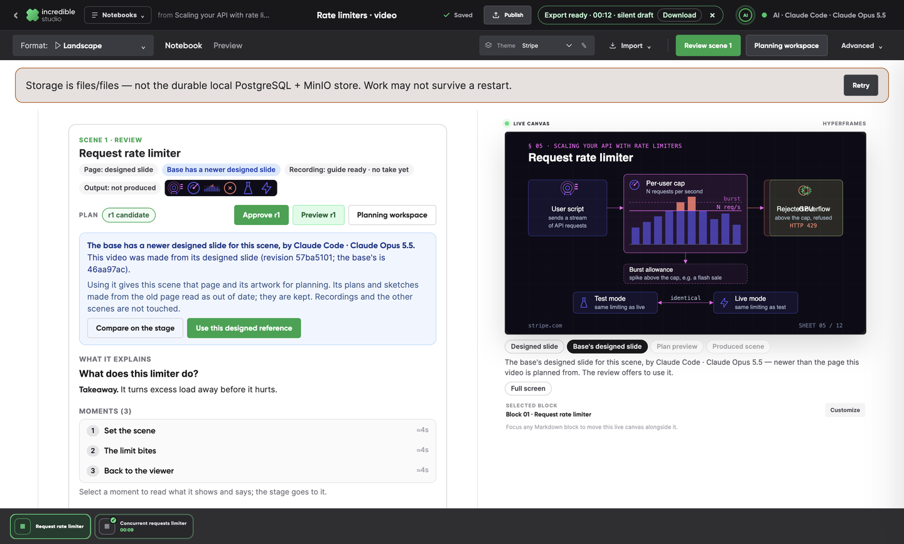

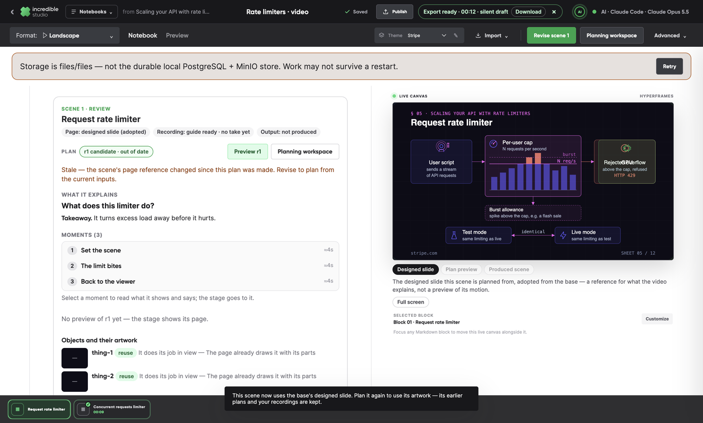

**F3. A GitHub document is read as a document.** A public GitHub file, or a repository root's README, is read from the host's raw contents at the commit its ref names. It is read as Markdown: headings, prose, tables and code. The host's navigation and colours are left out of the brand, and the owner's avatar is offered as the mark.

Every read reports what it read: the words, headings, an excerpt, where it came from, and how sure it is. The brand step shows this under "What was read". A thin read (under 150 words, likely a page's navigation) is not outlined until the creator either pastes the text instead or chooses to go on with what was read.

The review's own document, the fabric-lib technical page, now reads as 659 words and 12 headings at commit `1ed972e`.

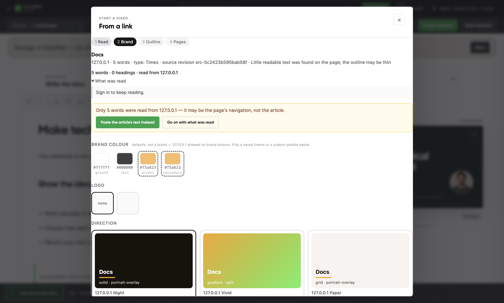

**F4. A refused link offers a way on.** A 403 now comes with three choices:

- "Paste the article instead": the link is kept as where the text came from, and is never fetched;
- "Try again";
- "Change the link".

With a link and pasted text both present, the step says which one it reads and lets the creator choose. `source-intake-check` drives this against a loopback site that refuses with 403.

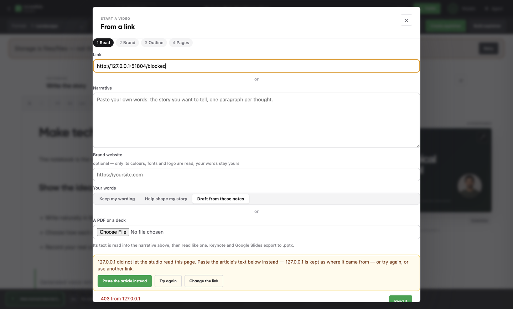

**F5. Colours say where they came from.** A palette is either read off a website, a default (with the reason), or chosen by hand. A browser's own link colours are not taken for a brand's. A theme saved from a read gets a short name, asked for where it is saved, and keeps its colours' provenance, shown again when the theme is reused ("· default colours").

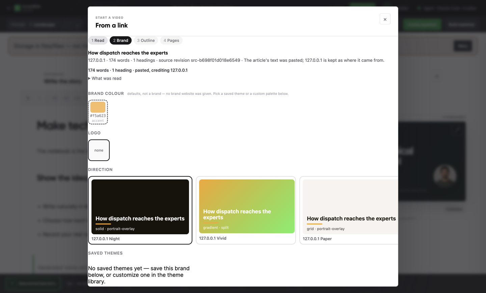

**F11. A station keeps its place when its output emerges.** The legacy planner read the page's "becomes" connector as the station turning into its product. So "Combine step" travelled into "Output tokens" and vanished, while the experts' routes still pointed at its empty place.

A becomes-connector now morphs its source into its target only when the source can be transformed: a thing drawn to move, or declared as data. It does not morph a station that other relations run through, a thing declared as a process or service, or one whose name says it does work (a step, an engine, a layer). Otherwise the connector is traced, the result emerges from the station (revealed if new, then emphasised), and the station stays on screen with its routes. Data still becomes data, as raw scores become attention weights.

The test reads the state on screen at the scene's end, not only the actions and their targets. A negative control shows it fails without the fix.

**F12. No camera headline when nobody is in frame.** The headline of a camera-led shot is now emitted only when someone is in frame and the stage at that moment is the presenter's. That is read from the same stage track the scene plays, so a generated scene with no camera or take shows the page alone, and its narration is not doubled.

The headline's fade follows the scene's own time rather than a CSS transition, so seeking to a moment and playing into it draw the same frame. It is held inside the frame's safe area. The test covers a presenter in frame, nobody in frame, and a content-picture stage.

**F9. Publish says which blocks will be silent.** Publish now says, block by block, what each will sound like:

- a recorded take;
- a recorded voice, or a generated one;
- silent by choice;
- words with no voice or take;
- no words at all.

It also sums them up. When any included block will be silent, the action says so: "Export with 2 silent blocks", or "Export silent draft" when nothing is voiced. The finished export says it is a silent draft, and each export job records the same readiness, block by block. In `scene-review-check`:

> Audio: no block has a take or a voice — this exports a silent draft. 2 blocks have words that are not voiced.

The button reads "Export silent draft".

**F8. A notebook finds its export again.** Each export job is indexed by its notebook, and the renderer's own progress is kept on the job: its stage, percent and frames. The top bar shows the notebook's latest export every time the notebook opens:

- "Exporting · stage N%", with Cancel;
- "Export ready", with Download;
- failed or stalled, with Retry, which re-runs the stored manifest.

A dismissed notice stays dismissed for that job. No time estimate is promised. `export-recovery-check` covers:

- a reload mid-render finds the same job ("Exporting · Compiling composition 5%");
- the job finishes with its MP4 (81,699 bytes, `video/mp4`), rendered once;
- another notebook shows no export;
- coming back finds the export again;
- a dismissed notice stays dismissed.

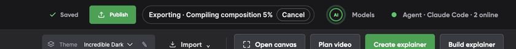

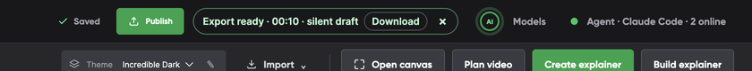

**F6. The scene review sets its own type and scans as a list.** The review had inherited the notebook's document type (15 px / 1.75, list indents) and laid itself out by the window's width. So in the notebook column beside the stage its moments clipped, and seven of them took several screens. Now:

- the document's paragraph and list rules stop at a scene review, at the same specificity;
- the review is laid out by its own column, through a container query;
- long chips and text wrap.

The moments are a compact list, one line each. The selected moment opens under its own line with its purpose, what is on screen, the narration and what to watch, and steps to its neighbours. The stage still follows the selected moment.

The plan has one control: its revision pills, or the plan's state before any revision exists. The approval action appears only while the shown revision can be approved.

`review-layout-check` plans a seven-moment scene of long prose and long chips, like the review's fabric-lib plan. At 1440 × 900 and 1280 × 800 it confirms:

- the review's own type (13 px body, 15 px question);
- nothing clipped or sticking out, and nothing scrolling sideways;
- all seven moments in 230 px, under half the view;
- one moment open at a time, with the keyboard kept on Next;
- one control and one action;
- the notebook's own paragraphs keep their type.

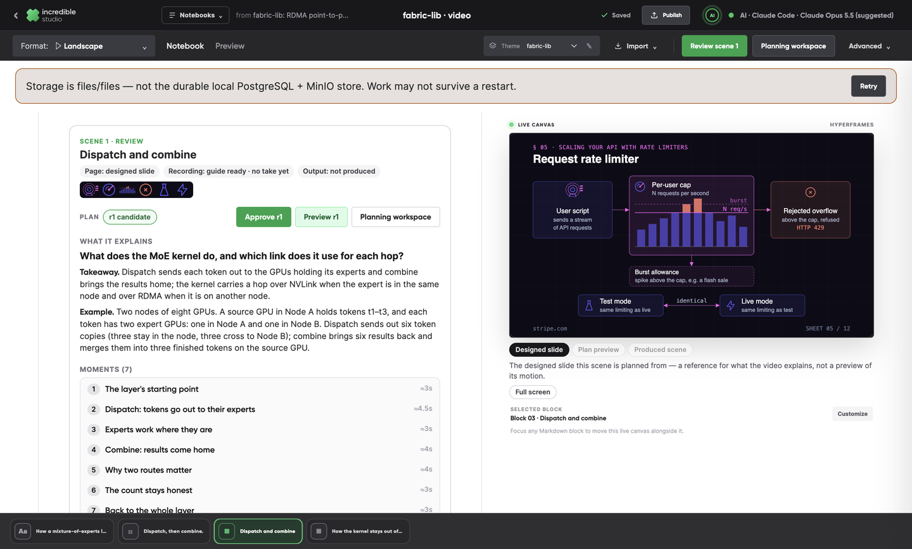

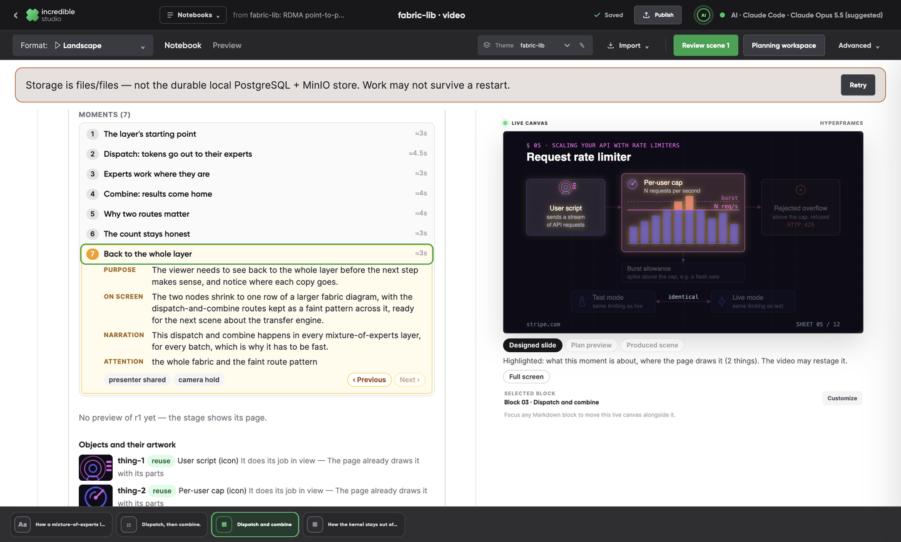

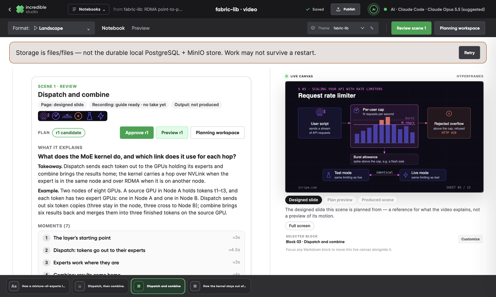

**F7. One AI settings screen says what each job runs on.** Models and Agent are now one top-bar entry, "AI · <harness · model>", which opens one dialog.

Its first table lists every AI job, what it runs on now, and how it stands:

- the four harness stages, each with the harness and model it resolves to, marked where a stage has its own choice, and with that stage's last run;
- motion assist;
- the direct API's jobs (writing help, frame checks, canvas programs, illustrations), with the provider, the model, the key's state and each task's last request.

Below it are the harness choices, with their per-stage overrides, then the direct API form, which says which features it serves.

Two more changes:

- **The environment key is never saved.** Saving direct API models used to copy `OPENAI_API_KEY` into the settings store. A key from the environment is now used, and never saved.
- **Messages point to the new screen.** Messages that sent creators to "Agent settings" or "Models in the top bar" now name AI settings.

Proofs:

- `agent-picker-check` confirms there is one entry, that every stage and direct-API job is named on one screen, and that a page-drawing override shows on its own row while video planning keeps the default.
- `model-gateway.test.ts` shows the environment key never reaches the store, with a negative control.

**The live check.** It used the creator's OpenAI key, read into the app's environment from their agents `.env`. The key was never printed or saved; the check scanned the store for it. The key lists `gpt-5.6-luna`, `gpt-5.6-sol` and `gpt-5.6-terra`; Astra is `gpt-6-astra`. With writing on `gpt-5.6-sol` and vision on `gpt-6-astra`:

- writing help answered on each, and the provider reported that same model;
- a scene edit with a picture of the frame answered on `gpt-6-astra`;
- the table read "Direct API · OpenAI · gpt-5.6-sol — Key from the environment · last request ok on gpt-5.6-sol".

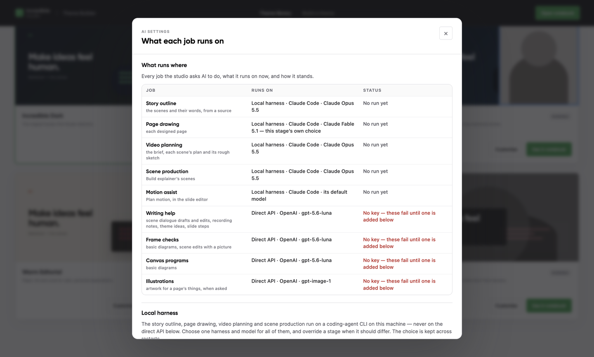

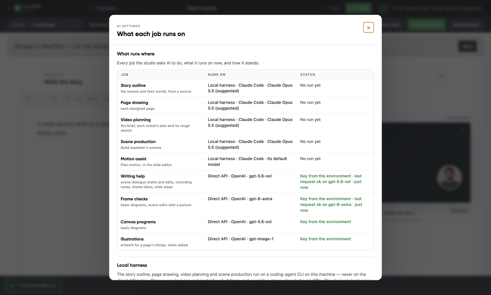

**F10. One next step leads each notebook.** A notebook now has one primary action, its next step:

- a base with a video: Open video;
- a base with pages and no video: Create video (the fork offer);
- a base with no pages: Create explainer.

In a video, the next step is the selected scene's, then the scenes after it:

1. prepare or update the brief;
2. plan or revise scene N;
3. review scene N;
4. record or re-record scene N;
5. Export draft, which says approved plans are not produced yet.

No step promises a production the build does not have.

Planning workspace is a named place beside the next step. Open canvas, Create explainer… and the older build (Build explainer, or Build whole notebook) are under Advanced, each saying what it is: the older build "does not use approved scene plans".

The title shows once. The lineage is one compact link to where the notebook comes from, and in a video, Publish steps back behind the next step. Command-bar menus now open on the viewport: the bar scrolls sideways in a narrow window and clipped them, Import's menu included.

The checks follow a creator's route:

- a lone base leads with Create video to its fork offer;
- in the video, the next step is Plan scene 2, then Review scene 2, then Record scene 2, and it is the only primary action;
- a base with a video leads with Open video;
- at 1280 and 1440 nothing in either bar is clipped, and the Advanced and Import menus show whole.

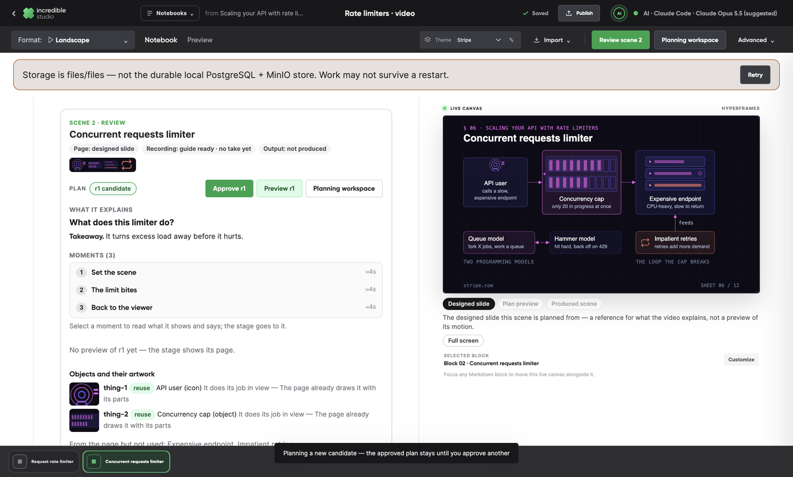

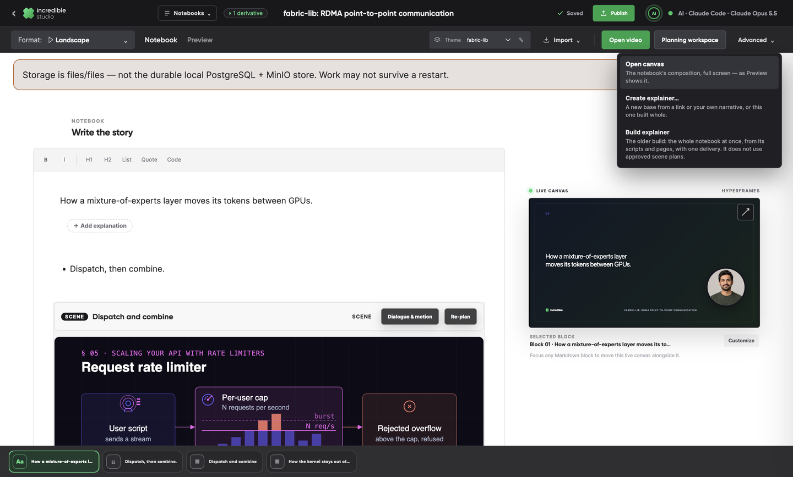

## The designed-slide reference proposal

Built, for F1:

- the choice before forking;
- the scene's page reference with its kind, revision and adoption;
- a comparison on the stage;
- explicit adoption;
- a cast revision that includes the adopted artwork by object id;
- invalidation of that scene's plans and sketches alone;
- recordings and earlier plans kept.

Built since, in [the follow-up](./2026-09-26-production-follow-up.md):

- **Both references side by side.** The schematic stays beside the adopted designed slide, on the stage and in the planning packet (`b9f3648d`).
- **A decision for each object.** Use, adapt, replace or omit, shown per object. On a designed slide a plan that leaves one undecided is refused (`b9f3648d`).
- **Only the affected lines, again.** A newer plan's changed lines are recorded as a pickup, and the scene is produced from the take and the pickup together (`879a937e`).

## Checks

- Every check named above passed on the final build.
- The unit suites passed: studio-v2, 297 tests in 34 files; markdown-composition; the typechecks.
- The release suite on `bc186efa` passed 52 of 54 (2 unit gates and 52 desktop checks). Two failed:
  - `skill-references-check`: 132 unresolved links inside the vendored Hyperframes skill bundle. It predates this work and is unchanged.
  - `review-layout-check`: one assertion at 1280 × 800 lost keyboard focus after Next. The focus was put back on the next frame, and a window that was not painting in the middle of the suite never drew that frame.
- `afdaf4c3` puts focus back as soon as the review redraws. After it, `review-layout-check` passed twice in a row, and `scene-review-check` and `plan-preview-check` passed again. A full rerun of the suite on the final build follows the push; its result is added to the PR.

## Limits

- **Production from approved plans** was not implemented at this answer. It is built since: P4–P6 in [the follow-up](./2026-09-26-production-follow-up.md).
- **Stored motion kept its morph.** Scenes whose motion was planned before F11 are repaired since, when their notebook opens (`6d892a3a`).
- **The end-to-end run was not repeated.** The review's step 6 (an accessible article through import, design, fork, a changed reference, plan revision, preview, a human recording, narration and MP4) needs the harness's model budget and a human take. The fixes are proven by the checks above, not by a new film.
