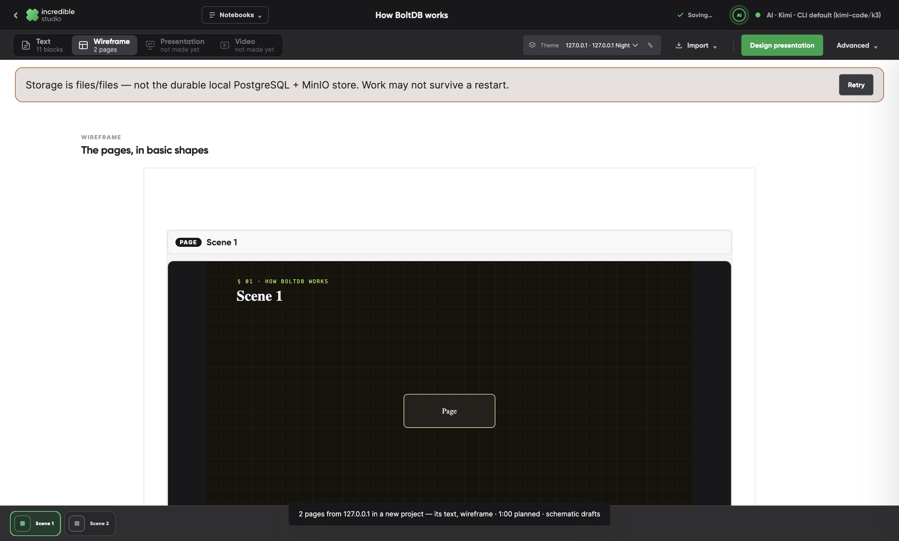
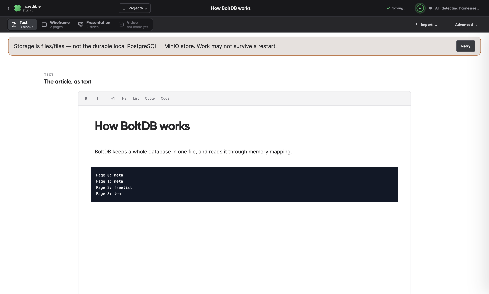
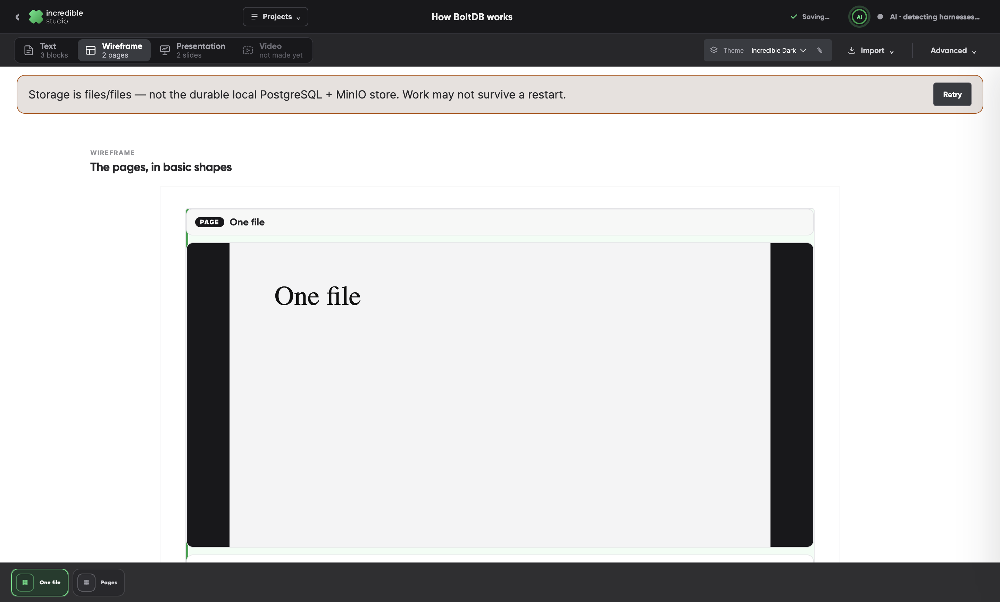
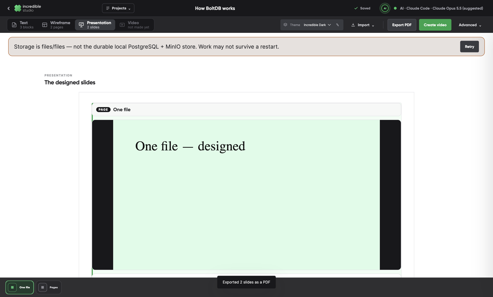
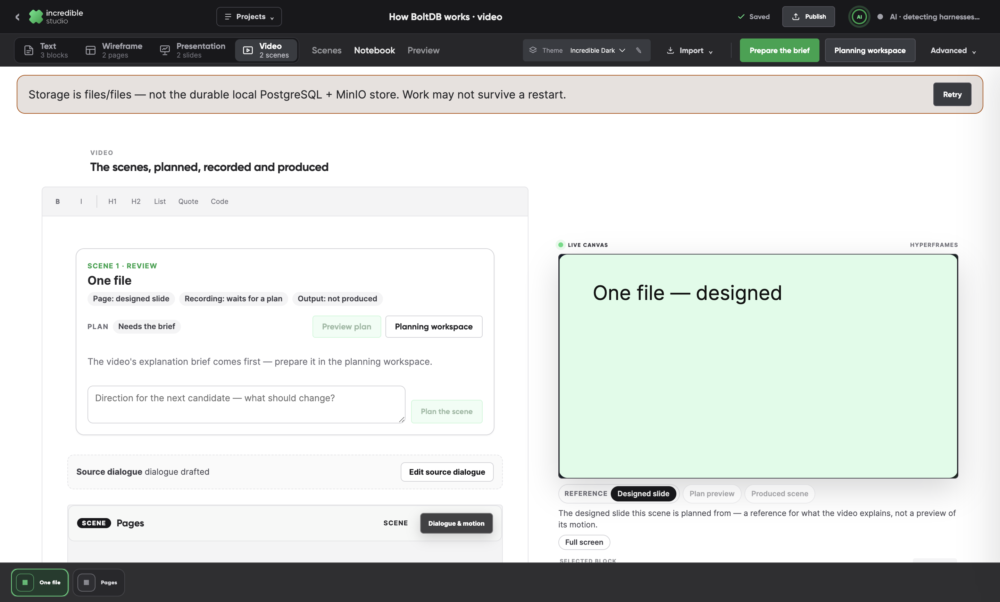
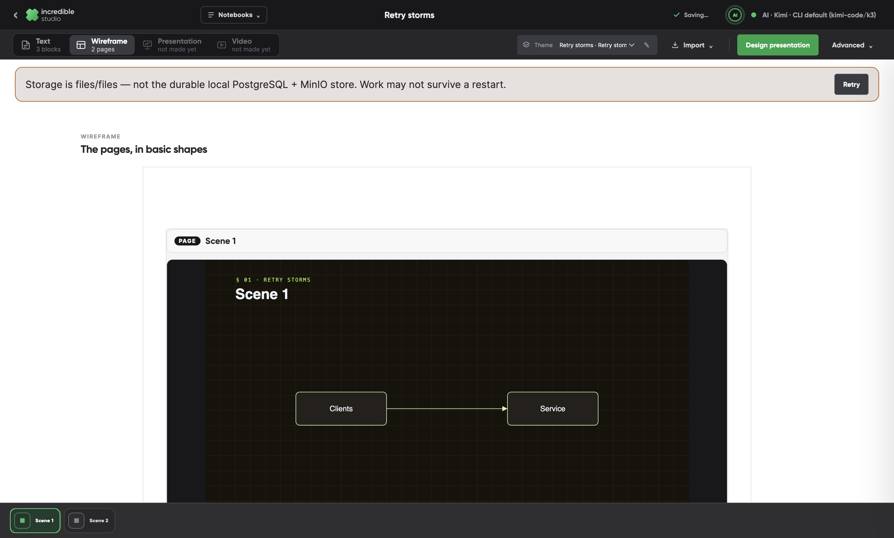
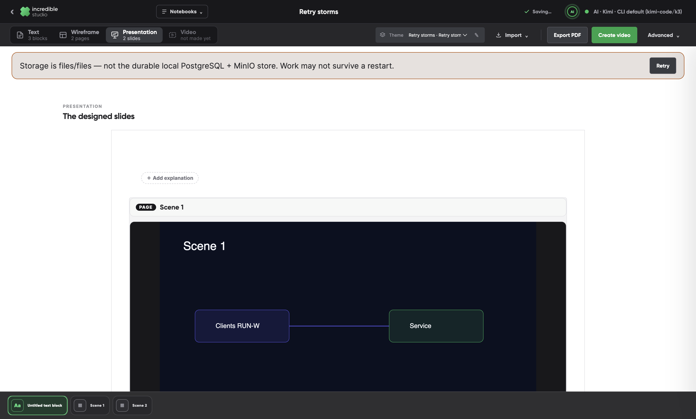
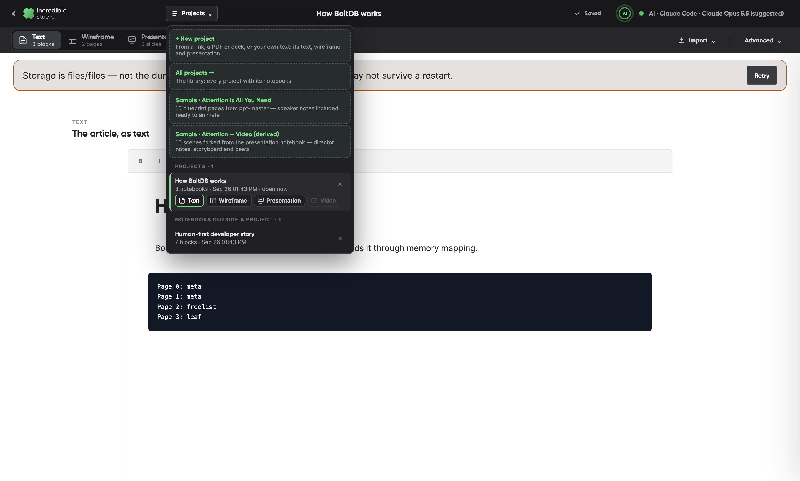

# PR #16 BoltDB review: what was fixed, and how it is proven

This responds to the BoltDB end-to-end review, `docs/reviews/2026-09-26-boltdb-e2e-review.md` (commit `8149a31c` on `feat/hyperframes-markdown-mvp`, committed locally). The review found eleven bugs, B01–B11, and two quality gaps, Q01–Q02. It also required per-scene chaining and proposed a four-artifact workflow.

All thirteen findings are addressed on `claude/scene-review-loop`, one verified commit each, following the review's implementation sequence:

1. The correctness repairs came first: B10, B09, B01, B06, B02, B11 and B03.
2. Then progress, the timeline, timing, claims and type: B05, B08, Q02, B07 and Q01.
3. Then per-scene chaining.
4. B04 closed the sequence.

After B04, the creator set the direction for the four-artifact proposal. A project is a container of notebooks — text, wireframe, presentation and video — each with its own tools and its own model, and an icon switch moves between them. That model is built and described below.

B05 is fixed only in part, and the model has open work; both are listed under "Limits". Every proof below is a unit test or a scripted check in the desktop app, run on a throwaway store with stub harnesses. No page, plan, sketch or video was written by hand in a harness's place.

## Findings

| | Finding | Commit | Proven by |
| --- | --- | --- | --- |
| B10 | Export keeps the old slide clock and adds a blank tail | `d33d95fb` | `produced-scene.test.ts`; `production-check` (a produced scene exports at 10.400 s against its 10.394 s render) |
| B09 | Publish from Scenes leaves a black stage and inaccessible controls | `b64a8c24` | `production-check`, `scene-review-check`, `export-check` (one scene exported from Scenes: 4.400 s against 4.394 s) |
| B01 | Importing a new base leaves the previous video's workspace active | `38eb1486` | `source-destination-check`, flow D |
| B06 | Finished rich slides do not reach the saved base while Video is open | `64fbe07e` | `page-landing.test.ts`; `source-design-check`, flows 7 and 8 (landing with only the video open, and after a restart) |
| B02 | Source extraction loses tables and clips text diagrams | `a98d769b` | `server/source.test.ts`; `source-intake-check` (the BoltDB table and an 857-character diagram, whole, in the harness's inputs) |
| B11 | The live stage and the MP4 use different typography | `c33b9e38` | `type-faces.test.ts`; `production-check` (a label drawn 725 px wide, 730 px on the stage, 912 px in the producer's Inter) |
| B03 | Finishing a harness-made notebook requires a direct API | `98f3b551` | `source-intake-check` (no call to the direct writer, no provider prompt) |
| B05 | Long processing stays in the wizard, then loses its progress detail | `5b7f8819` (part) | `planning-progress-check`, `source-design-check` |
| B08 | The timeline hides the causal objects | `dbf090a6` | `scene-timeline-check` (nine layers, grouped by kind past six) |
| Q02 | Spoken duration squeezes the teaching time | `f8f48646` | `voice.test.ts`, `take-clock.test.ts` |
| B07 | A simplified source claim becomes an absolute claim | `a1356da6` | `claim-scope.test.ts`; `scene-review-check` |
| Q01 | Capability decisions need settling before production | `e57280ab` | `type-faces.test.ts`; `production-check` |
| — | Per-scene chaining | `00f0a22b` | `source-design-check`, flow 7 |
| B04 | The base shows the video workflow before a video exists | `c3087b42` | `source-intake-check` |
| — | Four notebooks in one project | `d38e188a`, `8f3953cc`, `363d7fd6`, `c03bee58` | `containers.test.ts`, `presentation-export.test.ts`; `project-switch-check` (local store and Postgres); `source-intake-check`; `source-design-check`, flow 9 |

Two supporting commits: `f0bffb1f` brings `planning-check`'s expected tool list up to date, and `e8cee459` gives the app's own start-up check twenty seconds for harness detection. On a loaded machine, five seconds made `scene-review-check`'s restart fail with no reason given.

## What changed, finding by finding

**B10. A produced scene exports on its own clock, measured.** A scene played from its produced MP4 no longer carries the slide's motion and captions on top. Captions end with the scene. The export's duration is what the rendered file measures, not what the composition declared, and a render whose length differs from its scenes by more than a frame is refused, saying why.

**B09. Publish asks what to export first.** Publish from Scenes, or from the notebook, now opens on a choice: the whole video, or this scene. The walkthrough of junctions and the export dialog then stay reachable over the stage. Cancelling the walk returns to Scenes.

**B01. A notebook made from a source opens as any notebook opens.** The studio reloads into the new notebook instead of swapping it under the video's views. The notice about what was made is shown after the reload.

**B06. Designed pages land in the worker, whichever notebook is open.** The app's worker sweeps the notebooks with a page still bound to a design run. It lands each finished page after the page check, and saves with a compare-and-swap so a concurrent edit is never overwritten. A notebook that is open takes the landed page into its editor. A landed page is planned when its notebook is next opened.

**B02. An article's tables and diagrams are read whole.** Tables become Markdown tables, cell for cell. Code and text diagrams keep up to 8,000 characters. Anything cut is said on the read step, and the outline is written from the full text.

**B11. A produced scene's type is set in faces the stage and the MP4 share.** A generic family written first (`serif`, `monospace`) is given the face the producer itself uses for that kind of type, and the producer's faces are embedded in the bundle. The stage and the render then draw the same glyphs. Any face that could not be had is said.

**B03. A harness-made base is finished with that harness alone.** An outline the local harness wrote keeps its lines as the scenes' notes. Nothing is sent to a direct model, and no toast asks for a provider the creator did not need.

**B05, in part. Long work says where it is.** A planning run reports reading its packet as a milestone. A page design run shows, in the notebook, how far it is and for how long it has worked. The review's larger fix is still open (see "Limits"): save the project when the brand is confirmed, and show the phases in the destination workspace.

**B08. Every layer of a scene is in its timeline.** Past six layers they are grouped by kind, each group expandable. The choice is kept, and each bar seeks to its moment.

**Q02. A moment is on screen long enough to see what changes in it.** A moment whose objects or camera change holds at least three quarters of its planned length, whatever its line's spoken length. The voice's clock pauses to hold it, and the review names each moment held.

**B07. What a plan claims more strongly than its sources is named.** An absolute word ("never", "always", "every") that the moment's evidence does not use is flagged before approval. So is a phrase the creator's direction asked to drop that a line still says.

**Q01. A scene's type, and its unproven recipes, are said before producing.** The planning overview lists each of the theme's families as available or not, and what each falls back to. Production then says the scene's type and any recipe not yet proven, before anything is produced.

**Per-scene chaining. A ready slide unlocks its scene as it lands.** A scene not yet planned takes its designed slide by itself when the slide lands, while other slides are still being designed. A scene already planned is offered the slide, and the scene on show stays the one the creator chose. An unfinished scene shows its run's progress.

**B04. A source's pages are shown without the video's staging.** A base made from a source now shows each page large, with what it explains, its notes and the source it rests on. Dialogue windows, motion, director notes, coach cues, the presenter, the live canvas with its clock, Preview and Publish are gone. Create video is its one way on. This became the page mode of the notebooks below.

## Four notebooks in one project

The creator's direction:

- The base is just the article's text.
- From it come a wireframe notebook, a high-fidelity presentation notebook with its own export, and a video notebook, each with the tools for its format.
- A project is the container that holds them, and icons switch between any two.
- A later kind, such as a live stream or a newsletter, must be addable without changing the storage.
- Each kind keeps its own model. A video holds takes, settings and exports that the other notebooks do not.

**The model** (`d38e188a`):

- **A project record.** A project has its own record: `studio_containers` (migration 015), and the same in the local store.
- **Membership.** Each notebook names its project, its kind and the notebook it was made from, as `container { id, kind, from }`. Which notebooks a project holds is read from them.
- **Video forks.** A video keeps `derivedFrom`, its pinned base, as before. Forking, staleness and page landing are unchanged, and the presentation is simply the video's base.
- **Kinds.** The kinds, and what each is made from, are one registry (`formats.ts`) with a summary per kind. A new kind is a new entry plus its tools. The storage does not change, and a project may hold several notebooks of one kind.
- **API.** `GET /api/containers/:id` lists a project's notebooks, each counted in what its kind holds, such as "3 of 14 designed". `DELETE` removes the project with its notebooks.

**The switch.** Every notebook of a project has the same switch: ▤ Text, ▦ Wireframe, ▧ Presentation, ▷ Video.

- Each tab carries its icon and state, and the open one is marked.
- A notebook not made yet is an outline that says what it is made from, and opens that notebook.
- While a notebook is being built, its tab follows it.

Each notebook shows only its own tools:

| Notebook | Its tools | What it leaves out |
| --- | --- | --- |
| Text | Reads as a document | Theme, spoken explanations, scene timeline |
| Wireframe, Presentation | Pages, with their notes | Text formatting and Markdown import |
| Video | Scenes, the stage, recording, production and Publish | — |

No notebook but the video shows staging or Publish.

**An import makes a project** (`8f3953cc`):

- **Text.** The article as read becomes a text notebook: headings, prose, lists and code, with each table kept whole as a fenced block.
- **Wireframe.** The pages keep their schematics, each with its idea, notes and sources.
- **Presentation.** When the pages are being designed, the presentation holds the same pages with the same ids, each bound to the run's page, and the designed slides land there.
- **Opening.** The import opens on the presentation, or on the wireframe if nothing is being designed.
- **Design presentation.** A wireframe with no presentation offers Design presentation. The drawing harness draws its pages, in their current order and words, into a new presentation notebook. The wireframe keeps its schematics.

**The presentation's own export** (`363d7fd6`). Export PDF prints the slides in order, one page per slide at the notebook's frame size. It uses the renderer's Chrome, with the renderer's type faces embedded. The PDF is kept in the object store and downloaded.

**The library** (`c03bee58`):

- The Projects menu and the library list each project once, with a chip per notebook kind.
- "+ New project" starts one from a link, a document or your own text.
- A project opens on the notebook worked on last, and deleting it removes its notebooks.

`project-switch-check` walks the model end to end, on the local store and on Postgres:

1. It saves a project's text, wireframe and presentation, and opens each from the switch.
2. It reads each notebook's tools.
3. It exports the presentation: two pages of 1440 × 810 pt.
4. It makes the video from the presentation, and goes back to the text from the video.
5. It reads the project in the menu and the library.
6. It removes the project with its notebooks.

`source-intake-check` checks what the BoltDB import makes. `source-design-check`, flow 9, designs a presentation from a wireframe.

## Limits

- **B05 is fixed in part.** Import is still a wizard: read, brand, outline, pages, then the project opens. The review's short import (link → brand → saved project, with the outline streaming into the wireframe) is the next step for the model.
- **No update prompts yet.** A notebook records what it was made from, but an edit upstream does not yet offer an update to the notebooks made from it (the review's step 6). Remaking the wireframe from an edited text, approving pages one by one before designing, PPTX export and library thumbnails are not built.
- **No migration.** Notebooks made before projects are not moved into projects; the creator asked to start over. They still open, listed as notebooks outside a project.
- **Pages without the video's staging, in older notebooks.** A standalone base made from a source still hides the staging. Advanced › Show video staging brings it back there, the older way.

## An open question

When a link is read, the brand step opens on "From a website", reading the article's own site. The plan says a link with no brand website should open on saved themes first. Which should it be?
