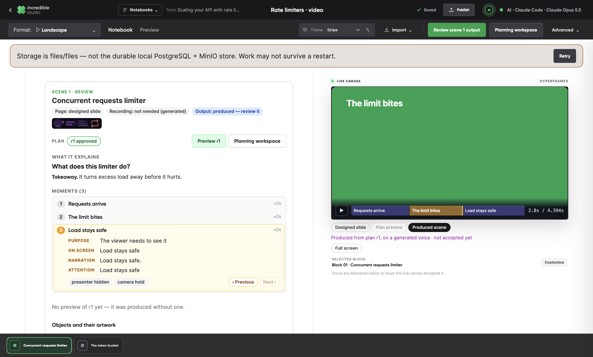
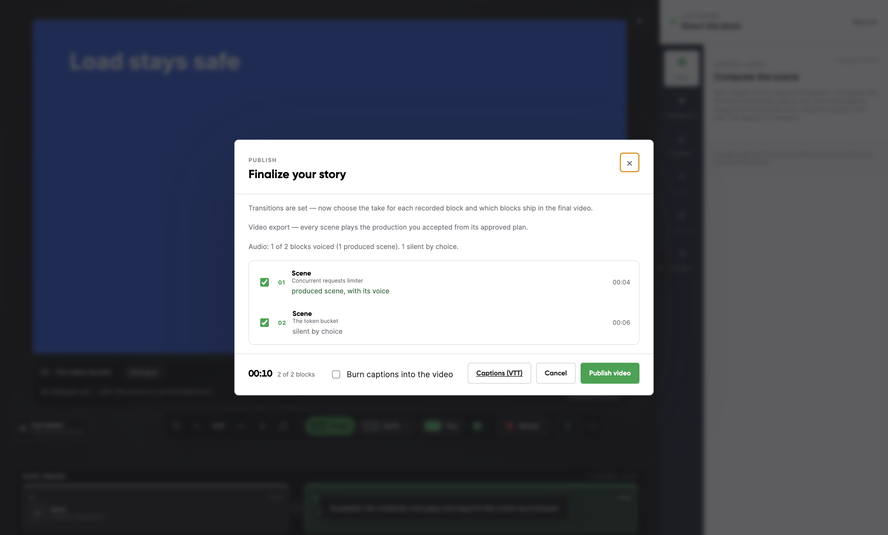
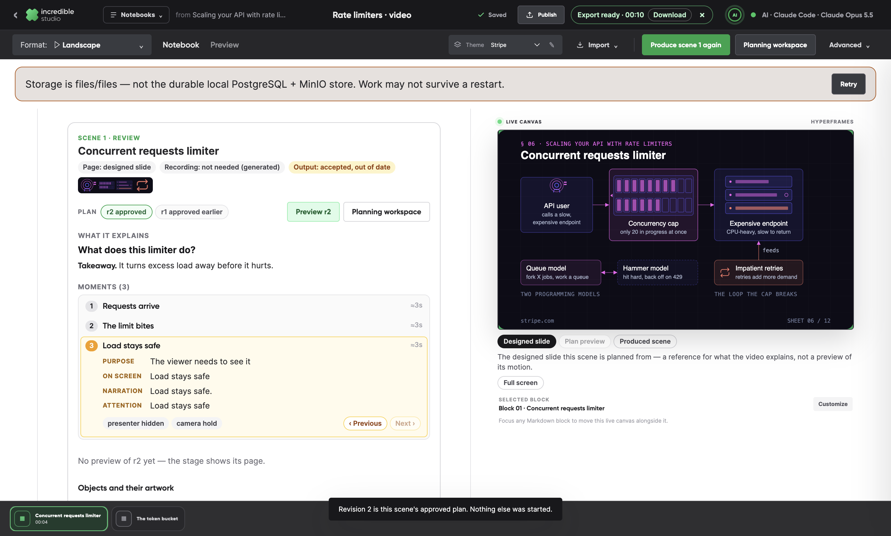
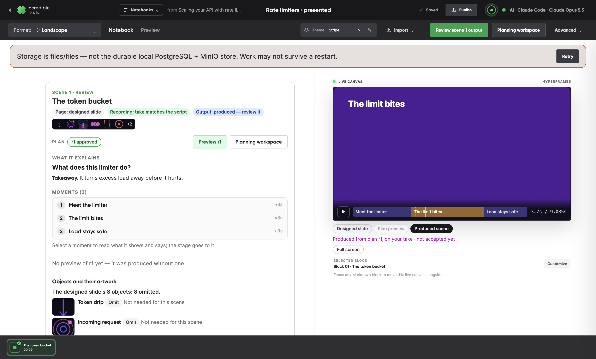
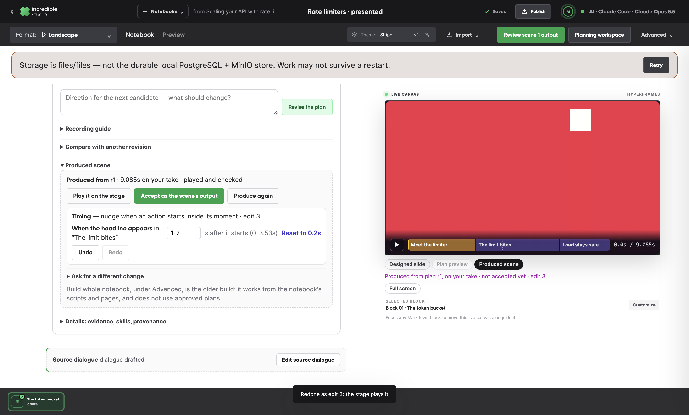
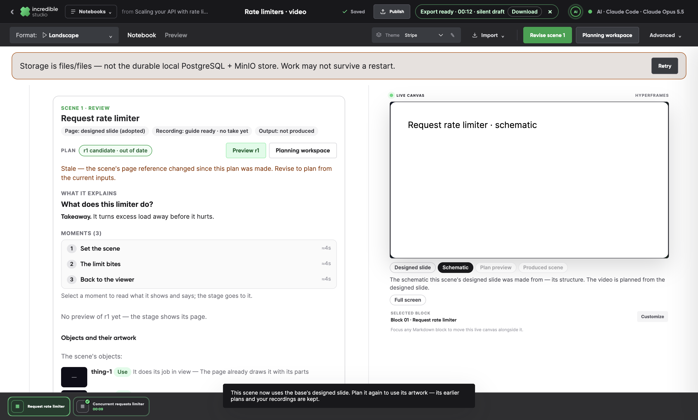
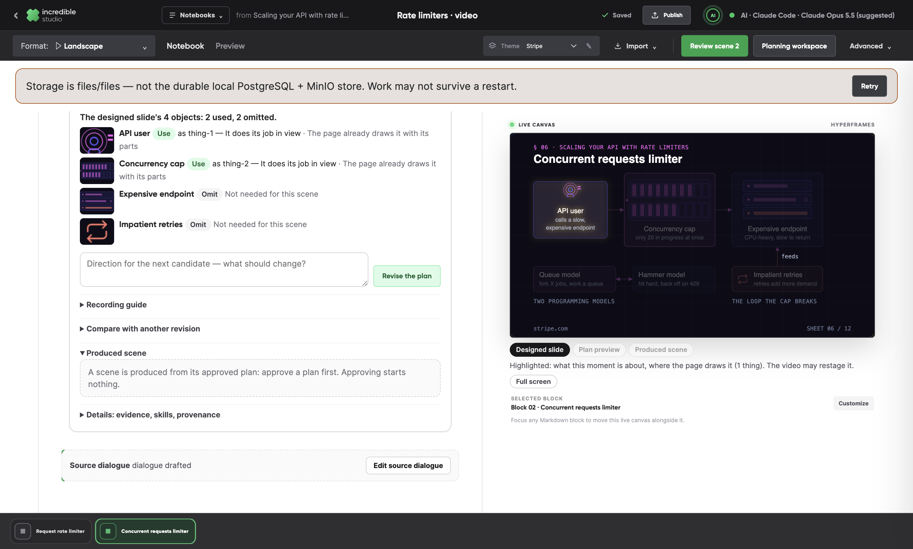
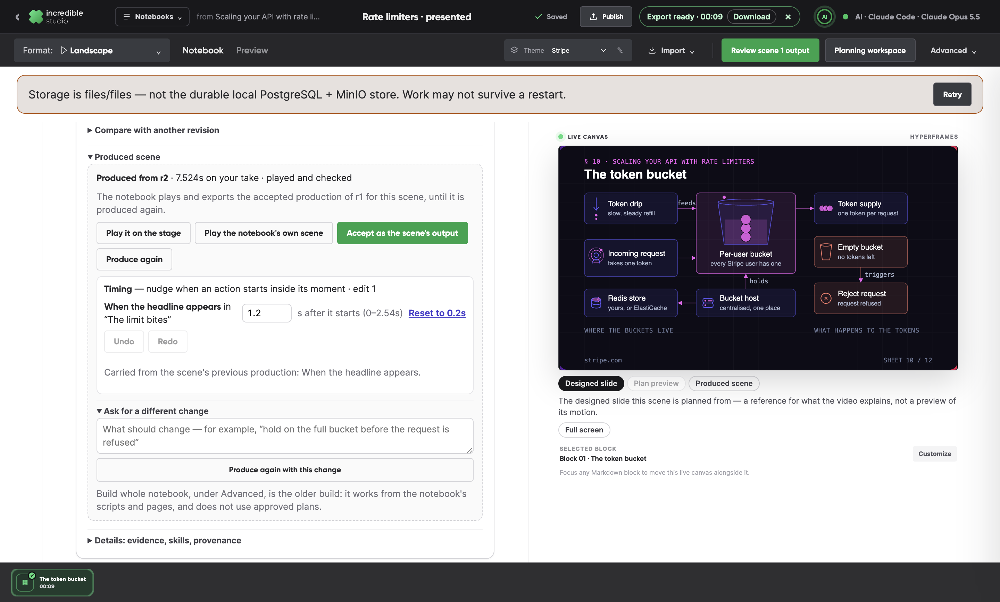

# Production from approved plans, and the rest of the designed-slide proposal

This follows [the answer to the Perplexity review](./2026-09-25-perplexity-e2e-response.md). That answer left several things unbuilt:
- producing a scene from its approved plan (P4–P6 of [the scene review plan](../plans/scene-creative-review-and-production.md));
- the repair of motion stored before F11;
- three parts of the designed-slide proposal.

All of them are now built on `claude/scene-review-loop` (PR #16). Each commit is one verified slice:

| Commit | What it does |
| --- | --- |
| `6d892a3a` | Motion stored before the F11 fix is repaired when its notebook opens. |
| `95ef5e09` | P4, server side: a scene is produced on its real clock, checked, and rendered on acceptance. |
| `8d949641` | P4 in the notebook. The next step produces a scene, and the stage plays it. Accepting makes it the scene's output, and the export is the video. |
| `c791262e` | P5: a scene you present is produced from your take. P6: its timing can be nudged, with undo, redo and a re-render. |
| `b9f3648d` | The schematic stays beside a designed slide, and every object on the slide gets a decision. |
| `879a937e` | When a newer plan changes some lines, only those lines are recorded again, as a pickup. |

The harness in every check below is a stub. The checks prove the product's machinery, never the quality of a production. A real harness run is [the last section](#a-live-run).

## P4 · Produce an approved scene

Producing is the creator's own step, and approving a plan never starts it.

**The clock comes first.** The product makes the scene's clock before the run:
- **Generated voice:** it speaks the approved narration moment by moment, measures each clip, and joins them into one track.
- **Silent by choice:** it keeps the plan's estimates.
- **Presented by you:** your take sets the clock (P5).

**The harness builds the scene on that clock.** The run uses the "Scene production" harness with the `scene-producer` skill. It gets no shell, only three tools: `produce_context`, `produce_assets` and `produce_submit_scene`.

**The product checks each submission.** A submission is refused, with the reason, when any of these holds:
- a moment is off the clock, or the composition is too short or long;
- the sound is missing, not played, or played more than once;
- a layer is a placeholder;
- a presenter layer has no take to show;
- an object the plan asked to enrich is neither drawn nor named as unmet;
- the pinned lint fails, or the pinned player plays it wrongly. The player's check now waits for video seeks before it reads a frame.

**The stage plays it.** The stage's **Produced scene** mode plays the bundle on its real clock. Moments seek it, and the note says what it plays on and whether it is accepted.

**Accepting renders it.** Accepting renders the bundle once, with the pinned producer. The notebook then plays that render in the scene's place: no take, camera or old narration plays over it, and a silent production adds no sound. The creator can put the notebook's own scene back and take the production again without a new render.

**The export follows.** Once every scene plays an accepted production, the next step is **Export video**. Until then it is **Export draft**, and the draft says which scenes play their production. Publish counts produced scenes.

**A new plan makes it out of date, not gone.** A newly approved plan, or a new direction, marks the accepted production out of date and says why. It keeps playing until the scene is produced again.

## P5 · A scene you present

**Your take sets the clock.** Your selected camera take, recorded against the approved plan's lines, is the scene's clock:
- The product normalizes it once into a seekable WebM.
- The pinned aligner (faster-whisper through uv) finds each line in it.
- A moment starts where its words are heard. A moment without words gets the pause the take leaves it.
- A line the take does not say is named, never invented. The take is never stretched or cut.

**The product supplies the take.** It is `media/take.webm` in every production of the scene. It is pinned by the record, served with byte ranges, and never stored in the bundle.

**Your voice plays whole, your picture stays in step.** The composition plays your voice once, whole, from the start. Your picture plays muted, in step with the voice, in one presenter layer. That layer's framing follows the plan: full frame, beside the graphics, or out of view while the voice carries on. A picture that keeps its own sound, or runs out of step, is refused.

## P6 · Timing edits

**What a creator can nudge.** A production may expose **offset** controls: when one of a moment's actions starts, inside its moment. The code reads each control where it places that action. Its range keeps the action inside its moment, so a nudge can never put an effect before its cause or change the clock. A hold is not a control: the creator asks for it instead.

**How an edit is saved and played.** Edits are saved per production, against the revision they were made on. They are applied the same way on the stage, in the check and in the render. The review has a timing panel with numeric nudges, reset, undo and redo (⌘Z, ⇧⌘Z). The stage reloads at the nudged moment and marks where each nudged action starts. An accepted production is accepted again to render newer edits.

**Edits survive a new production.** A new production of the scene takes the edits that still fit, and lists the rest as conflicts. A change the controls cannot make goes to the producer as a note, with a new production of the same plan.

## The designed-slide proposal, completed

**Both references.** When a designed page lands on a base scene, the scene keeps the schematic it replaces. Adopting the base's designed slide carries that schematic into the video. The stage's Reference offers **Designed slide** and **Schematic**, with the slide first. The planning packet ships both.

**A decision for each object.** A plan decides every verified object of its scene's page: use, adapt, replace or omit, with the reason. On a designed slide, a plan that leaves one undecided is refused, with the list. The review shows each object with its decision, and a tally.

**Only the affected lines, again.** When a newer plan changes some of a scene's lines:
- The review asks for only those lines, and the camera opens on them alone.
- The pickup is kept beside your take, which stays selected.
- Producing the scene takes each line from your take where it says it, and from the pickup where it does not. The runs are cut in the pauses between lines and joined.

## Checks

New and extended checks, all run on the final build:

| Check | Checks | What it drives |
| --- | --- | --- |
| `production-check` (new) | 49 | Two scenes, generated voice and silent, through produce, stage, accept, the notebook's composition, and a two-scene Publish export. It compares the export's frames, voice and silence to each accepted production, then covers the release toggle and a new plan making the production out of date. |
| `presented-production-check` (new) | 44 | A scene you present, on a spoken take through the real aligner. It covers the refused unmuted picture; stage playback; an edit, then undo and redo; acceptance and export; reopening; the carried edit; and the change request. It also asserts that no sketch run starts unasked. The pickup part: only the changed line is asked for, the camera opens on it, and the joined take's frames are checked. It skips without uv. |
| `motion-repair-check` (new) | — | A plan stored before F11 is repaired when its notebook opens. |
| `scene-review-check` | 69 | Now also: a decision for each of the slide's objects, the kept schematic on the stage, and both references in the next plan's packet. |
| `plan-preview-check`, `review-layout-check`, `planning-check` | pass | Their stub plans now decide every object on the slide. |

**Unit tests:**
- studio-v2: 319 tests in 37 files. They include the take clock through the real aligner, producing from a take and from a take plus a pickup, the edit revisions and carry-over, and the object decisions.
- markdown-composition: 108 tests, including a produced scene in the notebook's composition.
- Typechecks pass. The one known pre-existing error in `derive.test.ts` remains.

**Release suite:**
- On `8d949641` it passed 55 of 56. The one failure is the known `skill-references-check`: unresolved links inside the vendored Hyperframes skill bundle, which predate this work.
- A rerun on the final head follows the push.
- `take-workflow-check` failed three steps in one run, around the dialog closing after Keep, and passed when run again. It passed in the full suite too, so this looks like a timing flake in the check itself.

## Limits

- **The takes in the checks are synthesized.** The macOS voice speaks over a painted picture. They prove alignment, composition and export, not a presenter's performance. No human take was recorded for this work.
- **Controls are offsets only.** Holds and anything else that changes the clock go to the producer as a request.
- **Edits are single values.** There is no keyframe editing.
- **The [video scene workspace](../plans/video-scene-workspace-ui.md) (U1–U6) is not started.** It is the central-stage redesign committed to `feat/hyperframes-markdown-mvp` as `380cbbf5`. The production and reference work here plugs into the same records and stage it plans to reorganize.

## A live run

The review's step 6 is: an accessible article → designed slides → fork → a changed reference → plan revision → preview → narration → MP4, on the real local harness. It follows this push, and its result is added to the PR.
