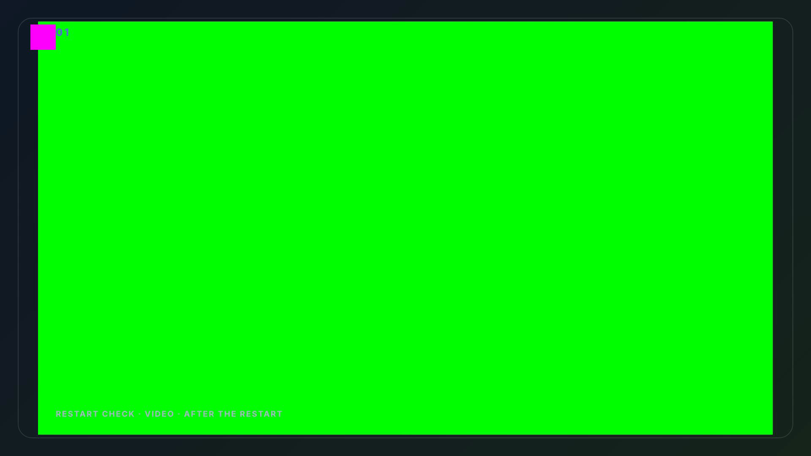
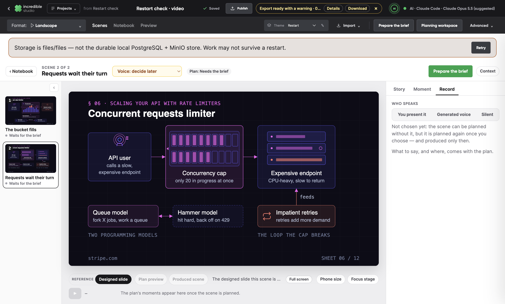
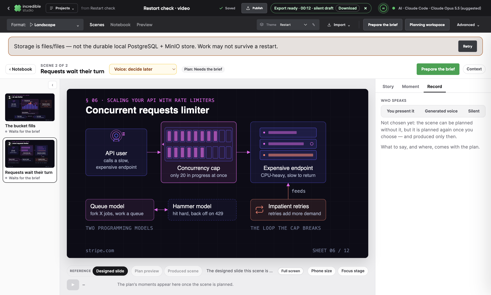
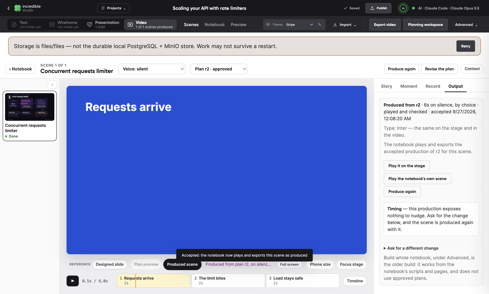
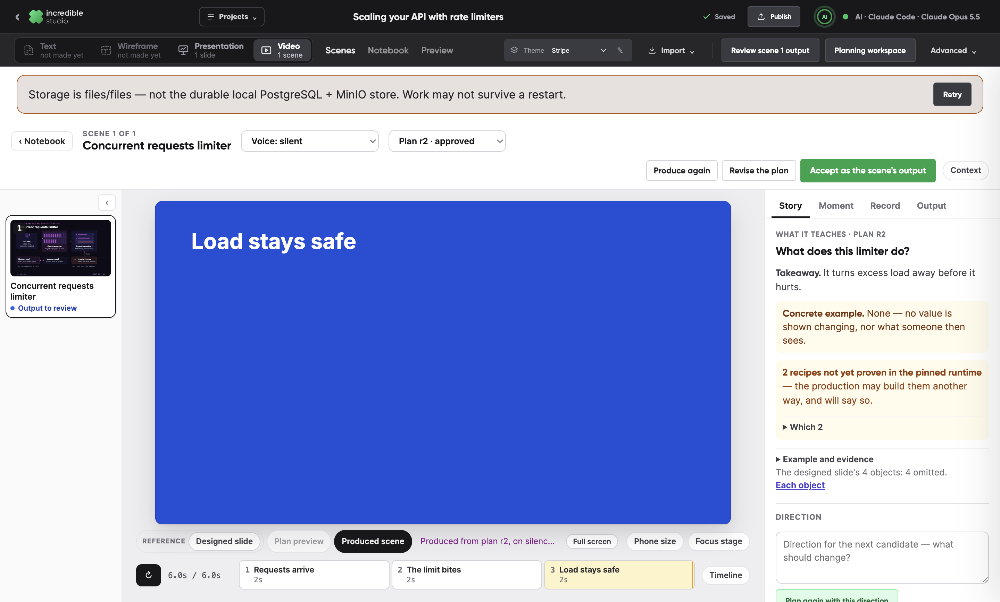
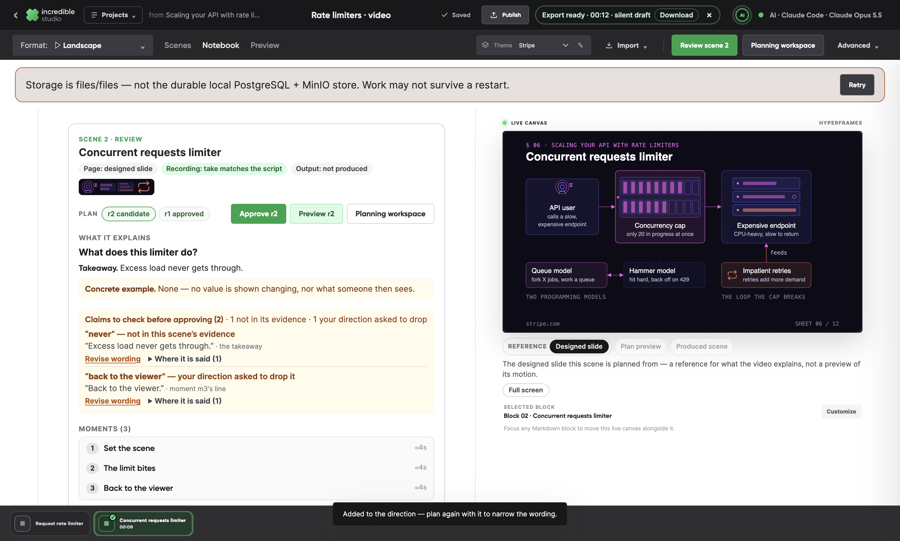
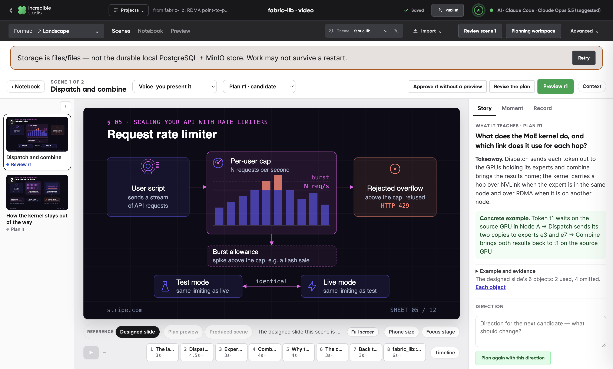

# PR #16 fix verification: what was fixed, and how it is proven

This responds to the verification of the R01–R10 repairs, `docs/reviews/2026-09-26-project-flow-fix-verification.md` (review-only commit `ddfbd208`, not pushed). It reviewed `4a9decd7` and found seven issues, F01–F07: one P1 and six P2. It also made two quality notes, Q01 and Q02. Its evidence showed one R10 residual: both live scenes were refused once by the font lint over `sfmono-regular`, a fallback family behind the embedded JetBrains Mono.

All seven are addressed on `claude/scene-review-loop`, in the review's repair order:

1. **Durable artifacts independent of the worker's port:** F01 and F05.
2. **UI promises that match state transitions:** F02, F03, F06 and F07, with the delivery-change matrix including a failed save.
3. **The focused scene workspace:** F04, "Next: plan scene N", and a run's details behind a disclosure.
4. **A teaching-quality gate:** Q01, with Q02's guidance for the producer.

The font-lint residual is fixed too. Step 5, proving the remaining paths live, is not part of this pass; see "Limits".

Every proof below is a unit test or a scripted check in the desktop app, run on a throwaway store with stub harnesses. The restart check quits the app and starts it again on a new port. No page, plan, sketch or video was written by hand in a harness's place.

## Findings

| | Finding | Commit | Proven by |
| --- | --- | --- | --- |
| F01 | A download after a restart can blank the app | `59d79323`, `e817adfd` | `studio-refs.test.ts`, `export-jobs.test.ts`; `restart-check` |
| F05 | The export misses a local brand asset and drops the warning | `59d79323` | `export-jobs.test.ts`, `produced-scene.test.ts`; `restart-check`, `export-check` |
| F03 | A restart loses the selected scene and inspector | `e817adfd` | `restart-check` |
| F02 | Changing a completed plan's voice promises work it does not start | `863c26b9` | `scene-state.test.ts`; `scene-flow-check` |
| F06 | The Video tab's produced count stays stale after acceptance | `9010ac55` | `scene-flow-check` |
| F07 | Natural playback ends on an empty stage with Pause shown | `995ad9d2` | `stage-clock.test.ts`; `production-check`, `scene-flow-check` |
| F04 | Claim warnings become a wall of repeated prose | `e30075b7` | `claim-scope.test.ts`; `scene-review-check` |
| — | The next step is read as the open scene's, and run mechanics fill the status | `091c49c6` | `next-step.test.ts`, `progress.test.ts`; `planning-progress-check` |
| R10 | A fallback family behind an embedded face is refused | `54899e0a` | `type-faces.test.ts`, `planning-service.test.ts` |
| Q01 | The example stops at structure | `9d9938c9` | `planning.test.ts`, `planning-service.test.ts`; `scene-workspace-check` |

`9498661b` holds the scene-flow and production checks for F02, F06 and F07.

`c343bd1a` fixes a regression that `59d79323` introduced, found by the full battery: once a take was named by its path, the planning service could not find its object, so a presented scene asked for its take again instead of being produced. `6c688142` and `2c3b7736` refine `e817adfd` and `59d79323`; see F03 and F01.

## Step 1: durable artifacts independent of the worker's port

**The cause, shared by F01 and F05.** The desktop's worker takes a new port at every start. The studio wrote its own files by absolute address, such as `http://127.0.0.1:58827/objects/…`, and read them back in two different ways:

- An address from an earlier start was dead after a restart.
- The renderer read a root-relative `/objects/…` path as someone else's file.

The fix is one reading of a reference, in `src/studio-refs.ts`. A root-relative path, or an address on any loopback port, that names an object in the store or a file in the worker's assets is the studio's own. The renderer, the Download button, the MCP tools and the notebook all read it the same way.

- **New files are named by path.** Voices, uploads, illustrations, recordings, accepted productions and exports all get root-relative addresses.
- **Older ones are healed when read.** On open, a notebook's media (tracks, takes, produced scenes, the theme logo, block sources, page artwork) is named by path again, and its next save keeps that. Words are never touched: a link or code sample that names a local address stays as the author wrote it. Hydrated takes and a stored export's result are healed the same way.
- **The Vite proxy serves `/objects`,** so paths work in the web dev server too.
- **One reading, everywhere.** The first full check battery found one place still reading a take's address the old way: the planning service took a take's object key only from an absolute URL, so a take named by its path read as missing and `presented-production-check` asked for the take again. It now uses the same reading (`c343bd1a`), and the take-production test names its take by path.

**F01. A download never replaces the studio.**

- The export result is named by its stored object. An older result, stored as an absolute address on the old port, is named by path when read.
- Download asks for the file on the app's own origin first. `/objects` now answers `HEAD`, and a missing object is a 404 rather than the app's page, with one look at the store per request (`2c3b7736`).
- On the desktop, the file is saved through Electron's own download, with a save dialog that suggests the notebook's title. The window is never navigated to the file.
- A file that is gone keeps the studio and the notice, and says why: "Download failed — The file is no longer in the studio's store", with "Retry download".
- The desktop window refuses any navigation off the app origin. Links to other sites open in the browser. A page that fails to load anything but the app goes back to the studio.

`restart-check` covers this across a real restart:

1. It exports a video, then quits the app.
2. It puts the stored result back the way older builds kept it: an absolute address on the first port.
3. It starts the app again, on a new port.
4. The notice offers the export on the new origin, and Download saves the same bytes (SHA-256 compared) through the desktop's download. The studio stays at `/studio`.
5. With the file deleted from the store, Download says so, with a retry, and the studio stays.

**F05. The render packages every file the video shows, and says what it could not.**

- **Every file is staged.** The render reads the composition's own markup for addresses, so a logo, an SVG image, a take or a produced scene is staged into the job whichever field named it. Both root-relative and loopback forms are read.
- **A missing file the video shows stops the export,** before anything renders, and names the file.
- **The theme logo is decorative.** When it is missing, the video goes without it and says so.
- **A finished render's warnings are kept with its result.** The notice reads "Export ready with a warning", with Details, and the Publish result line says it too. A content file that failed to load in the render is no success.
- **Unused decorative files are left out.** A scene that a take or a produced render covers no longer asks for its logo; its chrome is hidden under the video.

The same check found a layering bug: the corner logo drew under a full page. `9568a0eb` had grouped it with the scene's chrome, so it fell into the scene's grid, and a designed page covered all but a sliver of it. It is absolutely positioned above the page again.

`restart-check` exports after the restart. The frames show the magenta logo, named by path, and the green page artwork, named on the dead first port. The render asks for no local file it did not have. A missing artwork file stops the export, named; a missing logo exports with the warning the notice reads.

## Step 2: UI promises that match state transitions

**F03. The studio reopens where it was left, on any port.** Web storage belongs to an origin, port included, so after a restart the open notebook, its scene and inspector tab, and any unsaved draft all read as gone.

- **Where the copy lives.** The desktop keeps the app's own copy of its web storage in the worker's data folder, `web-storage.json`.
- **How it comes back.** The preload hands it back before the page's first script runs, once per app start, so a reload keeps what the page wrote since.
- **When it is kept.** The page's own writes to its storage announce themselves: the preload wraps them in the page's world. The copy is kept a second after the writes stop, at least every five seconds while they go on, and synchronously as the page goes. A notebook's drafts can be megabytes, so nothing is copied on the page's thread unless something was written; a first version that compared everything every 1.5 s was replaced before this was pushed (`6c688142`).
- **Scope and first page.** Only the studio's window reads or writes it. The window opens on the page it was on: the studio, or its themes page.

`restart-check` leaves the video on its second scene's Record tab and quits. It starts the app on a new port and finds the studio at `/studio`, on the same notebook, scene and tab.

**F02. Changing who speaks plans the scene again once it is saved.** One decision, `deliveryChangeOf` in `scene-state.ts`, reads the scene as it stands and returns four things: the question to ask, the plan to stop, whether to plan again, and what to say afterwards.

- **Whenever there is a plan.** A scene with any plan is planned again as its next revision: while one is being made, a candidate, approved or produced. The question names that revision and says what is kept out of date. It says an approval stays until the new plan is approved, and what becomes of a production, made or accepted.
- **Only after a successful save.** The choice is saved first, and only a saved choice stops a plan in progress and plans again. A save that fails changes nothing and says so.
- **With no plan,** the choice is only saved.

For example, after approval with an accepted production:

> Change who speaks in this scene to a generated voice? The scene is planned again as r3 with a generated voice. The approved plan r2, made for no voice, stays approved, out of date, until you approve r3. Its accepted production still plays in the video until you accept one made again. Other scenes are unchanged.

`scene-flow-check` runs the matrix and reads every question word for word:

1. **During planning:** r1 is held in progress; the change stops it, keeps it, and plans r2.
2. **After a failed save:** the store refuses the save; the reason is said, the delivery is unchanged, and no plan is stopped or started.
3. **After approval with an accepted production:** r3 is planned by itself, and r2 stays approved.
4. **After a candidate:** r4 is planned by itself.

**F06. The Video tab counts what is produced as it changes.** The switch followed the notebook's words. Accepting or releasing a production changes the notebook's state, not its words. Every change saved through `syncProject` now redraws the switch on the next frame, including an acceptance and a release.

`scene-flow-check` gives its base a project, so the video has the project's switch. When the scene is accepted, the Video tab says "1 of 1 scenes produced", the rail says it is done, and Publish says every scene plays the accepted production. When it is released, they no longer count it. There is no reload in between.

**F07. A scene played to its end holds its last frame.** The player sends `ended` only when frame ÷ fps reaches the duration. A generated voice's clock need not be a whole number of frames: for a 31.204 s scene the last frame is 31.2 s, so `ended` never came. The half-open clip interval then drew nothing at the clock's exact end.

The stage now also reads the end from the clock, within one frame (`stage-clock.ts`). A scene playing at its last frame finishes: paused, on the last frame anything is drawn on, with Replay on offer.

- `production-check` plays a generated-voice scene of 4.375 s, which is not a whole number of frames, to its natural end. It holds at 4.367 s with its last moment drawn, offers Replay, and replays from the start.
- `scene-flow-check` does the same for a whole-frame 6 s scene, from the workspace's own transport.

## Step 3: the focused scene workspace

**F04. One claim is one thing to check.** Flags are grouped by what they claim and by why they are flagged. "Without locks" and "no locks" are one claim.

- **Why it is flagged.** Each group says one of three things: "not in this scene's evidence", "quoted from the source — check what it holds for", or "your direction asked to drop it". Unsupported claims come first.
- **In view.** The claim, the exact clause it is said in, where it is said, and **Revise wording**. A short sentence shows whole; a long one is cut to the clause around the claim.
- **On demand.** The full sentences and the source's words.
- **Revise wording** adds "Do not say “…”: say only what this scene shows." to the direction and focuses it. The next plan's check reads those words, and nothing is planned until the creator asks.

`scene-review-check` reads the grouped items, and finds the narrowing line in the focused direction with no new plan started. In `claim-scope.test.ts`, a plan like the review's example, with five flags and a long takeaway repeated, reads as three items.

**"Next: plan scene 10".** When the one next step is for another scene than the open one, it says so, and so cannot be read as the open scene's own action. A step for the open scene reads as before.

**A run's details on demand.** The status keeps what the creator can use: the phases, what comes next, and how long it has taken. The harness's own mechanics ("The harness read its packet"), who runs it, how often its result was refused, and its last word move into a closed **Run details** disclosure, both under the stage and in the inspector. `planning-progress-check` reads the phase, the line about what comes next, and the closed details.

## The font-lint residual

Both live scenes were refused once over `sfmono-regular`: `'JetBrains Mono', SFMono-Regular, Menlo, monospace`, with JetBrains Mono embedded. A family named after a face the bundle carries is never drawn. The type pass now reports those families as `fallbacks`, and the lint's "used without @font-face" finding is no refusal when every family it names is a fallback or a face that cannot be had.

`planning-service.test.ts` submits that stack. The preview and the production are accepted on the first submission. Without the change, the same test is refused.

## Step 4: a teaching-quality gate (Q01, Q02)

**A concrete example, planned, shown and kept.**

- **In the plan.** It carries `demonstration.example`: `before` (what is there, with its value), `action`, `after`, `unchanged` (what stays as it was), `observed` (what someone then sees), and `later` (what belongs to another scene, named as such).
- **In the contract.** The planner is required to give one when a scene explains how state changes, and to show its values where they change. The product refuses a partial example.
- **In the review.** The example reads as one line under the takeaway, before → action → observed; for instance, "A reader sees balance 10 → A writer writes 20 in a copy → The reader still sees 10". A plan without one says "None — no value is shown changing, nor what someone then sees", for the creator to judge. Its parts are in Example and evidence.
- **Across revisions.** The newest plan's example, reviewed or not, is in the next revision's packet. It is kept unless the direction changes it, so revisions can be compared.
- **At a small size.** **Phone size** beside Focus stage draws the stage at a phone's width, 390 px, so key moments can be checked small.
- **Q02 guidance.** The producer is told to put the example's values on screen where they change, to make the result the frame's focus, and to keep labels at least the pinned typography's in-feed sizes.

`scene-workspace-check` plans a scene with an example and reads its line. It turns Phone size on and off.

## Limits

- **Step 5, the live paths.** Nothing here ran on live models. A human-presented scene with full, shared and hidden presenter moments, a repaired reseek with its frames kept, and a short multi-scene export are still to be proven live. As the review says, one generated-voice success does not make the product release-ready.
- **Plans and productions read stale.** The planner's contract and the producer skill changed (Q01, Q02), and the whole skill folder is one pinned input. Existing briefs, plans and previews therefore read "the planning skills changed" and must be prepared again, and existing productions read as out of date.
- **Q01 is a review gate, not a judgement.** The product does not decide whether a scene explains a state change. The planner is told to give an example when one does, and the review says when a plan has none. Phone size is a view for the creator; there is no automatic legibility check.
- **F03.**
  - Web storage is kept a second after it is written and as the page goes, so a crash can lose the last seconds of changes. `sessionStorage` is not kept.
  - The first start on this build has no saved copy yet, so it opens as before. Starts after that restore where the creator left off.
- **F01.**
  - A notebook's absolute media addresses are healed when it opens, and saved at its next save; a notebook never opened again keeps them.
  - The web app downloads with the browser's own download, which a browser may still open in place for some file types.
- **F05.**
  - The renderer checks only HTML images and videos for load failures. An SVG `<image>` is covered by staging: a missing studio file stops the export. A remote SVG image that fails to load is not noticed.
  - Slow media and sound that could not be mixed are warnings, not refusals.
  - The corner logo now draws over a full page's top-left corner. A logo wider than about 60 px can meet the scene index.
- **F07.** Playback ends within one frame of the clock. A seek into the last frame while playing therefore ends playback.
- **F04.** Wordings of locks, blocking, waiting and contention are grouped as one claim each. Other synonyms remain separate claims.
- **F02.** A scene is planned again from the start when who speaks changes. Reusing work that does not depend on the delivery is not built.
- **Carried over.** These are unchanged from the rereview response:
  - the Text notebook's reading width and navigation;
  - offers to update what is made from edited Text or Wireframe notebooks;
  - `live-workspace-run.mjs` and `live-review-loop.mjs` still drive the import's old steps;
  - Georgia still maps to EB Garamond as its fallback face.

## Verification

- **Unit suites.** Studio has 430 tests in 53 files; markdown-composition has 110. Both typechecks pass.
- **The full battery.** 19 desktop checks ran one at a time on a build with every fix except the take fix and the two refinements.
  - Passed (16): `planning`, `source-design`, `scene-workspace`, `scene-review`, `production`, `preview-exhausted`, `planning-progress`, `plan-preview`, `scene-timeline`, `review-layout`, `project-switch`, `scene-flow`, `presentation-export`, `restart`, `export` and `local-store`.
  - `presented-production-check` failed. That is the regression fixed in `c343bd1a`.
  - `skill-references-check` failed with the 132 unresolved links inside the vendored Hyperframes bundle, as before.
  - `skills-install-check` failed on a stale expectation: it lists six vendored skills, and there have been nine since before `4a9decd7`. It is not in the release suite, and it is left for a separate change.
- **On the final code.** After the take fix and the refinements, seven checks ran again: `presented-production`, `restart`, `export`, `local-store`, `scene-workspace` (with the Q01 steps), `scene-review` and `scene-flow`. All passed. `presented-production-check` passed after `d93ed474`, which makes it wait for Undo to be enabled before clicking it. The review's poll could put an edit on the stage before the edit's save had come back, while Undo was still, rightly, disabled. The captures in the evidence folder come from that run.
- **Not repeated:** the full release suite, and a live run.

## An open question, still open

When a link is read, the brand step opens on "From a website", reading the article's own site. The plan says a link with no brand website should open on saved themes first. Which should it be?
