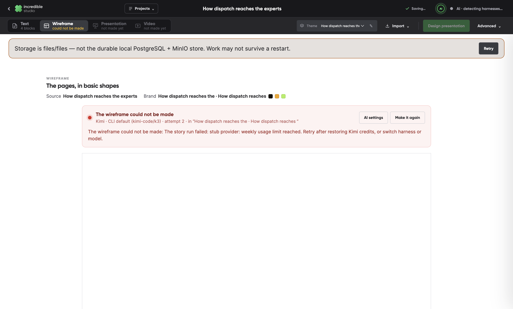
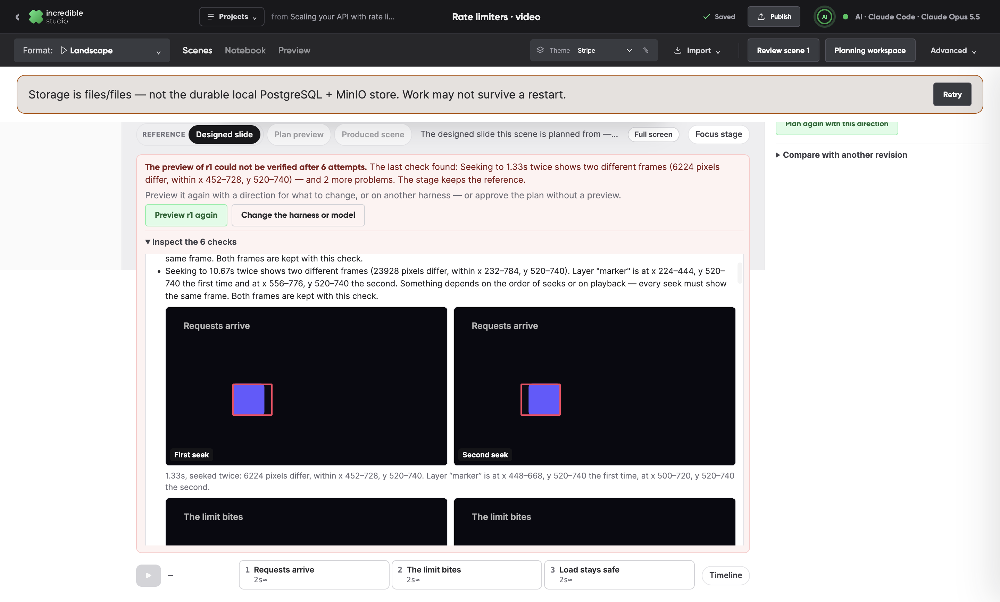
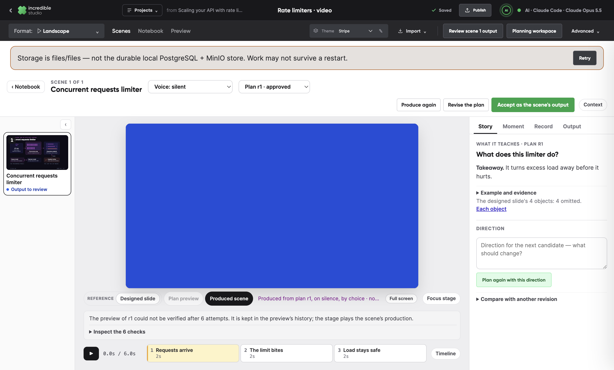
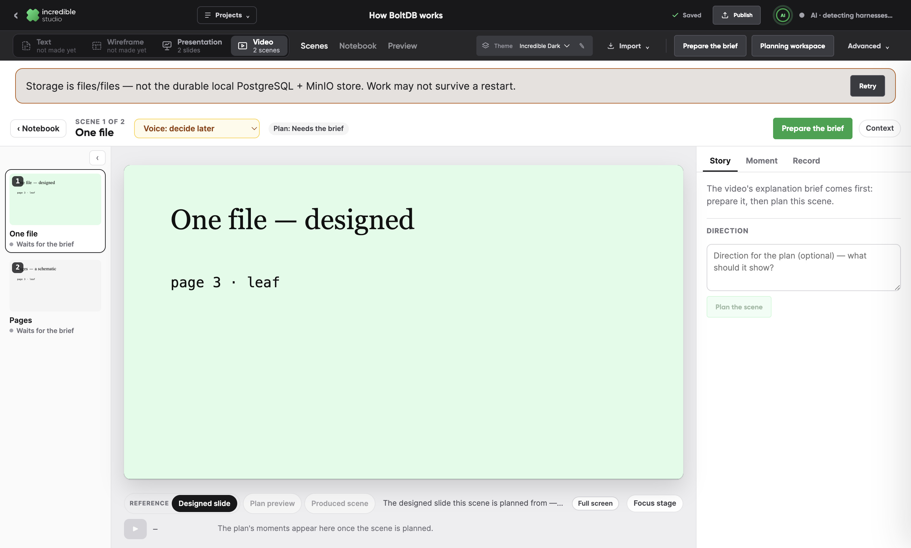
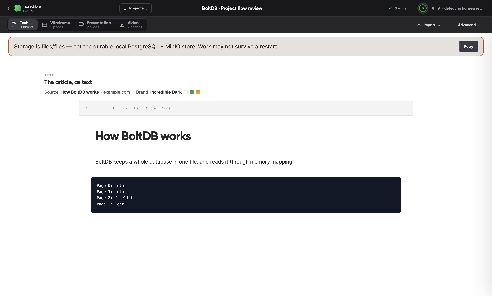
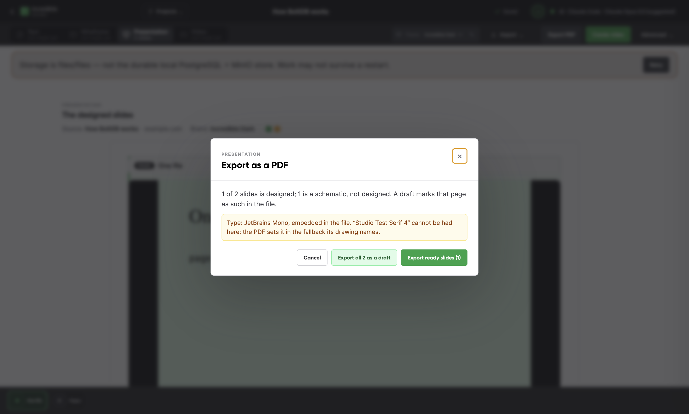
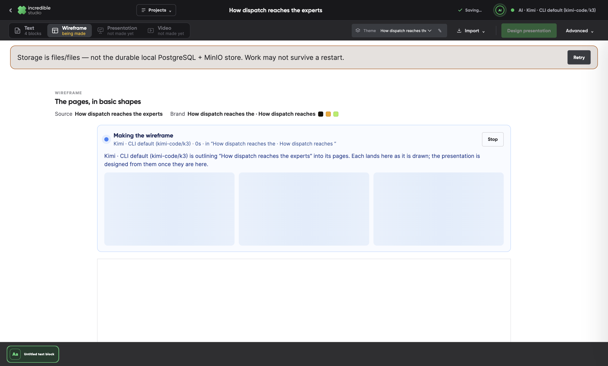
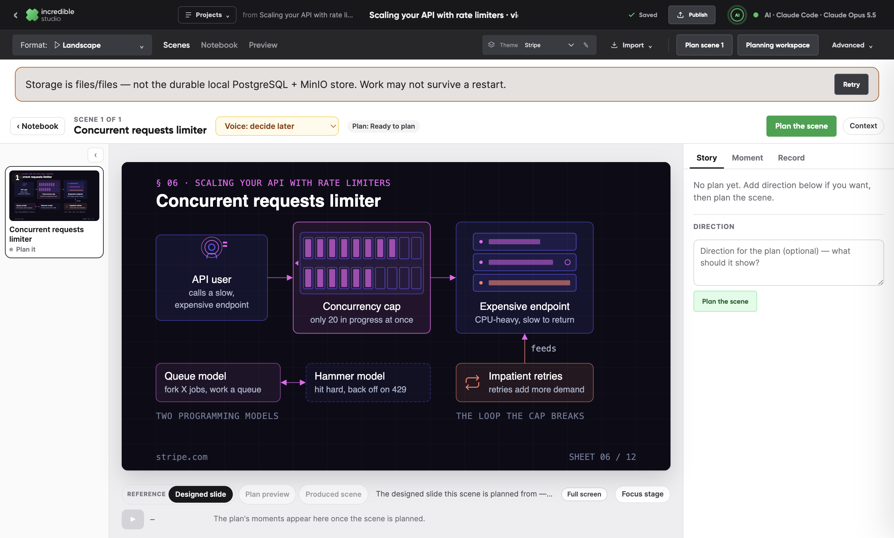
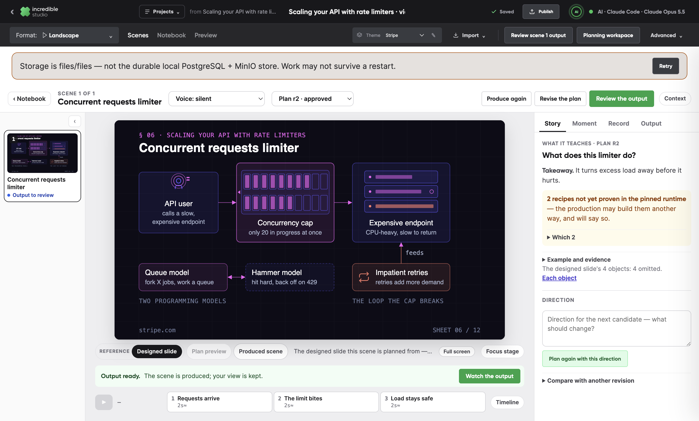

# PR #16 project-flow rereview: what was fixed, and how it is proven

This responds to the project-flow rereview, `docs/reviews/2026-09-26-project-flow-rereview.md` (commit `e9fe47fe` on `feat/hyperframes-markdown-mvp`, committed locally). It reviewed `51bfa6fd` and found ten issues, R01–R10: two P1 and eight P2.

All ten are addressed on `claude/scene-review-loop`, in the review's repair order:

1. Recovery and contracts: R01, R07 and R09.
2. Artifact identity and export fidelity: R03, R04, R05 and R10.
3. One task-oriented workspace: R02, R06 and R08.

The review's other observations are also covered: a Text notebook showing its source, brand and running jobs, and Publish naming a scene as Scenes does. Step 4 of the repair order, visual acceptance on live runs, is not part of this pass; see "Limits".

Every proof below is a unit test or a scripted check in the desktop app, run on a throwaway store with stub harnesses. No page, plan, sketch or video was written by hand in a harness's place.

## Findings

| | Finding | Commit | Proven by |
| --- | --- | --- | --- |
| R01 | A stopped or failed wireframe cannot be made again | `adc8052a` | `wireframe-attempt.test.ts`, `routes.test.ts`; `wireframe-retry-check` |
| R07 | A save conflict asks the direct model for the outline again | `adc8052a` | `wireframe-build.test.ts` (one provider call through a conflict; a retry never takes an older attempt's outline) |
| R09 | Six refused previews end as "without submitting a result", their checks lost | `df542e71` | `planning-service.test.ts`, `sketch-runtime.test.ts`; `preview-exhausted-check` |
| R05 | SVG font attributes are ignored, and the PDF is set in Times | `8ae7663a`, `6252e0e0`, `4847b0d8` | `type-faces.test.ts`, `font-families.test.ts`, `presentation-export.test.ts` (fonts read with `pdffonts`); `presentation-export-check` |
| R10 | The lint runs before the faces are supplied | `8ae7663a` | `planning-service.test.ts` (a preview and a production accepted first time, the face embedded) |
| R03 | The header renames only the open notebook | `4847b0d8` | `project-switch-check` |
| R04 | The PDF exports schematic placeholders as a finished deck | `4847b0d8`, `fc11f628` | `presentation-export.test.ts`; `presentation-export-check` (pages, marks and fonts read with poppler) |
| R02 | A wireframe being made looks like an empty notebook | `d023006a` | `wireframe-retry-check` |
| R06 | The planning window covers the new video's scene workspace | `d180717e` | `scene-flow-check`, `planning-check`, `source-design-check` |
| R08 | Who speaks is found too late, after it has spoiled a plan | `d180717e` | `scene-flow-check` |

`6252e0e0` fixes a regression that `8ae7663a` introduced; it is described under R05. `faf55da1` gives the planning service's tests 30 seconds each: two passed alone in one to three seconds, but timed out when run beside the desktop checks.

## What changed, finding by finding

**R01. A wireframe is made again from the article as it was stored.** The retry read `{ source }` from `GET /api/source/revisions/:id`, a second handler the server never reached: the route already answered `{ revision }`. Every retry said the article could not be found.

- The duplicate route is gone. The studio's retry and the server's builder read the article through one shape, `storedArticleOf`, from the one route.
- `routes.test.ts` fails on any method and path the server handles twice.
- Each start and each retry is an attempt of its own, recorded on the build with its id, its count, and the harness and model it runs on.
- A retry runs on whichever story harness the creator chooses now.
- A provider's failure keeps the provider's own recovery steps. The panel says them and opens AI settings to switch harness.

`wireframe-retry-check` drives it through the app:

1. The story run is stopped.
2. It is made again on a provider that is out of credits.
3. The story stage is switched to Claude Code, and it is made again.

The result is three runs, each given the stored article, and one wireframe with its pages. Nothing is imported twice.

**R07. The direct model is asked once per attempt.** Its outline is kept under the attempt until the pages made from it are saved. A save that loses to the creator's edit is made again, on the edit, from the same outline. An attempt made again never takes an older attempt's outline, because they are keyed apart. The tests reproduce the review's probe:
- one provider call through a conflict, with the note kept;
- a retry that waits for its own answer while an older one lands.

**R09. Every refused check is kept, with what the player saw.**

- **What is kept.** Each refused submission of a brief, plan, sketch or production is kept on its record (migration 016): the attempt, the bundle's hash, the problems, and for a moment seeked twice, both frames. It also keeps where the frames differ and which marked layers were drawn in another place. The frames are stored assets.
- **What the harness is told.** The same evidence reaches the harness: the frames are written beside its run, and the refusal says to look at them first and how many submissions are left. At the sixth refusal it is told to stop, not to submit again.
- **How the record ends.** It reads "The preview could not be verified after 6 attempts", with Inspect, preview again and approve without a preview as the ways on. A run that gives up earlier says how many submissions it made, never "without submitting a result".
- **What a retry gets.** A preview asked for again is given the last check and its frames in its packet.
- **What the scene shows.** It shows this under the stage: the last check in a line, then every attempt newest first, each seek's two frames side by side with where they differ outlined.
- **After production.** Once the scene is produced, or its production is playing, the notice turns into the preview's history. It no longer says "the stage keeps the reference".
- **The live pattern.** `preview-exhausted-check` drives it with a stub whose marker moves by timer, not timeline: six refusals, a reload, approval without a preview and a production. A retry given the last check puts the same move on the timeline and passes the unchanged check first time.
- **Tests.** `sketch-runtime.test.ts` checks the evidence of a drifting title, and that the repair passes without loosening the threshold.

**R05. A drawing is set in the faces it names.** There were two causes.

- **Unread attributes.** Neither our type pass nor the producer read SVG `font-family` attributes, which is how a slide sets its text. The type pass now reads them and names each family to the producer, so its face is embedded. A face that cannot be had is reported, never an empty list.
- **Unparseable lists.** The live slides named faces bare: `font-family="Source Serif 4, Segoe UI, sans-serif"`. CSS cannot read a bare name with a word that starts with a number, so the whole list was dropped. The PDF fell to Chrome's default serif (Times), and the stage fell to the studio's sans-serif, which is the mismatch the review saw. Such a list is now quoted, in SVG and in style sheets.
- **The stage.** It quotes the same lists when it draws a page live, and loads the faces a page names. That loader existed but had no caller.
- **Tests.** `presentation-export.test.ts` prints a slide whose attributes set a title, a body and a mono face, reads the PDF's fonts with `pdffonts`, and finds Inter and JetBrains Mono and no Times.
- **In the app.** `presentation-export-check` reads the same in the app's PDFs and in the stage's live SVG.

A regression, and its fix: `8ae7663a` began loading a page's faces as the studio opens. A notebook with no content at all, such as a wireframe still being made, threw there, and the studio never finished opening it. `wireframe-retry-check` caught it on its next run, and `6252e0e0` fixes it.

**R10. The type is prepared before anything checks it.**

- **The old order.** Previews and productions were linted as handed in; production prepared its faces only afterwards, and previews never did. A face the packet promised was refused as undeclared on the first submission. The lint's own hint then told the model to declare it with `src: local()`, which the live producer did.
- **The new order.** The faces are supplied first, and the lint, the checks, the player and the render all read the prepared bundle.
- **`src: local()` alone.** A face declared that way is no longer counted as embedded. It is set aside so the face itself is embedded, and a face this machine has is captured into the bundle.
- **A face that cannot be had.** It is stated with its fallback, alike on the stage and in the video. It is not charged to the run as a refusal, and the refusal no longer suggests `local()`.
- **The test.** Offline, a preview and a production are each accepted first time: one names the renderer's face with a `local()`-only declaration, and one names a face nobody has. Each accepted bundle carries the face as data.

**R03. The header names the project.** In a project, the header shows the project's name and edits it through the project's own route. The name is read back as each notebook opens, so every tab, the Projects menu, the library and a reload show it. Each notebook keeps its own title, as a detail of the artifact. The video's fork, the design run's inputs and the PDF are named by the project. `project-switch-check` renames in the text, then reads the name in all four tabs, the menu, the library and after a reload, with each notebook's own title unchanged.

**R04. A deck is exported by choice, and a draft says so in the file.** Export PDF first says what the file would hold:
- each slide's state: designed, still being designed, or a schematic;
- the type: the faces embedded, and any face that cannot be had.

A finished deck in faces it has is exported at once. Otherwise the creator chooses "Export ready slides (N)" or "Export all N as a draft".

- **Marked in the file.** In a draft, each page not yet designed carries its mark on the page, and the file's name and title say it is a draft.
- **Refused unchosen.** The server refuses an export of an unfinished deck that names no choice.
- **Named by revision.** The export's answer names each slide it took by revision. The file holds the slides as they were when it was asked for, whatever lands afterwards.

`presentation-export-check` exports a deck of one designed slide and one schematic both ways. It reads the pages, the draft mark and the fonts of each PDF with poppler. `fc11f628` sets the mark's own type in longhand, so its face is embedded too; see [the draft PDF's fonts](2026-09-26-project-flow-rereview-response-evidence/pdf-fonts.txt).

**R02. A notebook being made shows its job.** A notebook of a project is made by the project, so it never shows the empty-notebook starter. A wireframe being made shows its job where its pages will be:
- who makes it and for how long, by the second, and in which brand;
- the article it outlines, and the harness's last word;
- placeholder pages, and Stop;
- when it fails, why, with AI settings and Make it again.

Design presentation waits for the pages and says why.

Each notebook of a project also shows a strip with the project's source, its brand, and every notebook of it still being made. Each running job opens its notebook from there. So the text says what is being made after its notice has gone, which the review asked for. The source is named, not linked: the desktop app opens nothing from the web.

`wireframe-retry-check` opens the building wireframe from the text's strip. It checks the job, its placeholders and the waiting Design presentation, and that no starter is shown.

**R06. The video opens in Scenes.**

- **Entry.** A video made from a base opens in Scenes, on the scene chosen in the base, with its reference on the stage. It prepares its brief there. The planning window no longer opens by itself; it stays a tool the creator opens. Prepare-the-brief as the next step also works in Scenes.
- **Caveats.** The plan's runtime caveats read as one status, such as "2 recipes not yet proven in the pinned runtime", with the list on demand.
- **Output.** A production that finishes for the scene on show comes onto the stage. If the creator chose another view, or is busy with the stage, it is offered instead: "Output ready. The scene is produced; your view is kept. Watch the output".
- **Stage size.** The stage keeps a useful height with the timeline and inspector open. The timeline was already collapsed by default.
- **Publish naming.** Publish names a scene as Scenes does ("Scene 1"), not by its block number.

`scene-flow-check` makes a video from a base and checks the steps in turn:
1. No window opens over Scenes, the chosen scene is selected, and the brief is prepared.
2. It plans, approves without a preview, and produces, all in Scenes.
3. The output comes onto the stage.
4. The page view is chosen and the scene produced again; the output is offered, and Watch plays it.
5. Publish names the scene.

`planning-check` and `source-design-check` now assert that no window opens over the new video.

**R08. Who speaks is chosen beside the scene's title.** A Voice control beside the title reads "Voice: decide later" until it is chosen. It says what deciding later costs: the scene is planned again once you choose, and produced only then. Record chooses through the same path.

Changed while a plan is being made, it says so first. For example: "Plan r1 is being made for who speaks still undecided: changing it now would leave that plan out of date the moment it finishes. Stop r1, and plan the scene again with silent?" It then stops that plan, keeps it, saves the choice and plans the scene again. Other scenes are unchanged.

`scene-flow-check` changes the voice while r1 is held in flight. It reads that warning, finds r1 stopped and kept, and finds r2 planned for the new voice.

## Limits

- **Live acceptance (the review's step 4).** Nothing here was run on live models. The review asks that a real scene reach an accepted, playable preview before the preview route is called release-ready; that needs a live run. The pixel difference in the live BoltDB preview was not isolated either. The player's threshold is unchanged, and the next live run now leaves the frames and the region to look at.
- **R07 across a restart.** The direct model's outline is held in memory until its pages are saved. A restart in that window asks the provider again, as it did before.
- **R05 on thumbnails and fallbacks.** The stage draws a page live, in the faces it names where this machine or Google Fonts has them. The notebook's page thumbnails are pictures, and a picture's text cannot use the page's web fonts.
- **R05 fallback faces.** When a named face cannot be had, the stage and the PDF fall to the same next family. But the renderer maps some system families to its own faces (Georgia to EB Garamond), and the stage uses the system's: both serif, not the same face.
- **Font shorthand.** A face set only through the `font:` shorthand is not read by the lint, the producer or our type pass, so it is not embedded.
- **R04.** There is no PPTX export. The exported revisions are named in the export's answer, not kept as a record of their own.
- **R08.** Changing who speaks plans the scene again from the start. Reusing its delivery-independent work is not built.
- **The Text notebook** has its source, brand and jobs strip, but not the reading width and article navigation the review proposed.
- **The live proof scripts.** `live-workspace-run.mjs` and `live-review-loop.mjs` still drive the import's old steps, as before.

## Verification

Unit suites: 404 Studio tests in 51 files and 109 composition tests pass, and the desktop typecheck passes.

The desktop checks were run on the build of each slice:

- **New checks:** `wireframe-retry-check`, `preview-exhausted-check`, `presentation-export-check` and `scene-flow-check`.
- **Existing checks:**
  - Import, project and design: `source-intake`, `source-design`, `project-switch`.
  - Planning, preview and production: `planning`, `planning-progress`, `plan-preview`, `production`, `presented-production`.
  - Scene review and workspace: `scene-review`, `scene-workspace`, `scene-timeline`, `review-layout`.

On the final code (`d180717e`, then `fc11f628` for the export), eight of these ran again: `wireframe-retry`, `preview-exhausted`, `presentation-export`, `scene-flow`, `project-switch`, `source-intake`, `production` and `scene-review`. All passed, and the evidence captures come from that run. Full release gates and a live run were not repeated.

## An open question, still open

When a link is read, the brand step opens on "From a website", reading the article's own site. The plan says a link with no brand website should open on saved themes first. Which should it be?
